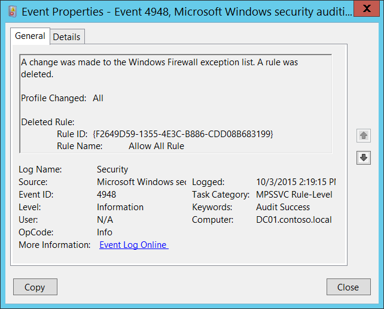

# 4948(S): Windows ファイアウォールの例外リストが変更されました。ルールが削除されました。




***サブカテゴリ:***&nbsp;[MPSSVC ルールレベルのポリシー変更の監査](audit-mpssvc-rule-level-policy-change.md)

***イベントの説明:***

このイベントは、Windows ファイアウォールのルールが削除されたときに生成されます。

このイベントは、グループ ポリシーを介してルールが削除された場合には生成されません。

> **注**&nbsp;&nbsp;推奨事項については、このイベントの[セキュリティ監視の推奨事項](#security-monitoring-recommendations)を参照してください。

<br clear="all">

***イベント XML:***
```
- <Event xmlns="http://schemas.microsoft.com/win/2004/08/events/event">
- <System>
 <Provider Name="Microsoft-Windows-Security-Auditing" Guid="{54849625-5478-4994-A5BA-3E3B0328C30D}" /> 
 <EventID>4948</EventID> 
 <Version>0</Version> 
 <Level>0</Level> 
 <Task>13571</Task> 
 <Opcode>0</Opcode> 
 <Keywords>0x8020000000000000</Keywords> 
 <TimeCreated SystemTime="2015-10-03T21:19:15.646187500Z" /> 
 <EventRecordID>1050934</EventRecordID> 
 <Correlation /> 
 <Execution ProcessID="500" ThreadID="528" /> 
 <Channel>Security</Channel> 
 <Computer>DC01.contoso.local</Computer> 
 <Security /> 
 </System>
- <EventData>
 <Data Name="ProfileChanged">All</Data> 
 <Data Name="RuleId">{F2649D59-1355-4E3C-B886-CDD08B683199}</Data> 
 <Data Name="RuleName">Allow All Rule</Data> 
 </EventData>
 </Event>

```

***必要なサーバー ロール:*** なし。

***最小 OS バージョン:*** Windows Server 2008, Windows Vista。

***イベント バージョン:*** 0。

***フィールドの説明:***

**変更されたプロファイル** \[タイプ = UnicodeString\]**:** 削除されたルールが適用されたプロファイルのリスト。例:

-   すべて

-   ドメイン、パブリック

-   ドメイン、プライベート

-   プライベート、パブリック

-   パブリック

-   ドメイン

-   プライベート

**削除されたルール:**

-   **ルール ID** \[タイプ = UnicodeString\]: 削除されたファイアウォール ルールの一意の識別子。

    ルールの一意の ID を確認するには、レジストリ キー “**HKEY\_LOCAL\_MACHINE\\SYSTEM\\CurrentControlSet\\Services\\SharedAccess\\Parameters\\FirewallPolicy\\FirewallRules”** に移動し、パラメーター付きの Windows ファイアウォール ルール ID (名前列) のリストを確認します:


-   **ルール名** \[タイプ = UnicodeString\]: 削除されたルールの名前。Windows ファイアウォールのルール名は、Windows ファイアウォールの詳細セキュリティ管理コンソール (**wf.msc**) を使用して、「名前」列を確認することで確認できます:


## セキュリティ監視の推奨事項

4948(S): Windows ファイアウォールの例外リストが変更されました。ルールが削除されました。

-   このイベントは、ローカルで行われたファイアウォールルールの削除をすべて監視したい場合に役立ちます。
