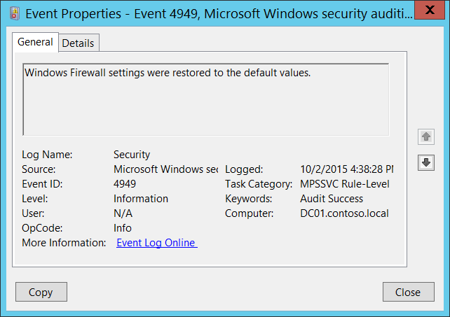

# 4949(S): Windows Firewall の設定がデフォルト値に復元されました。




***サブカテゴリ:***&nbsp;[MPSSVC ルールレベル ポリシー変更の監査](audit-mpssvc-rule-level-policy-change.md)

***イベントの説明:***

このイベントは、Windows Firewall の設定がローカルでデフォルトの構成に復元されたときに生成されます。

> **注**&nbsp;&nbsp;推奨事項については、このイベントの[セキュリティ監視の推奨事項](#security-monitoring-recommendations)を参照してください。

<br clear="all">

***イベント XML:***
```
- <Event xmlns="http://schemas.microsoft.com/win/2004/08/events/event">
- <System>
 <Provider Name="Microsoft-Windows-Security-Auditing" Guid="{54849625-5478-4994-A5BA-3E3B0328C30D}" /> 
 <EventID>4949</EventID> 
 <Version>0</Version> 
 <Level>0</Level> 
 <Task>13571</Task> 
 <Opcode>0</Opcode> 
 <Keywords>0x8020000000000000</Keywords> 
 <TimeCreated SystemTime="2015-10-02T23:38:28.804003300Z" /> 
 <EventRecordID>1049926</EventRecordID> 
 <Correlation /> 
 <Execution ProcessID="500" ThreadID="3768" /> 
 <Channel>Security</Channel> 
 <Computer>DC01.contoso.local</Computer> 
 <Security /> 
 </System>
 <EventData /> 
 </Event>

```

***必要なサーバー ロール:*** なし。

***最小 OS バージョン:*** Windows Server 2008、Windows Vista。

***イベント バージョン:*** 0。

## セキュリティ監視の推奨事項

4949(S): Windows Firewall の設定がデフォルト値に復元されました。

-   通常の Windows Firewall 操作中にこのイベントが表示されることはありません。これはユーザーまたはソフトウェアによって意図的に行われるべきです。このイベントは常に監視され、特に重要なコンピューターやデバイスではアラートがトリガーされるべきです。

-   このイベントは、特にデフォルトの構成に復元されたローカルで行われた Firewall ルールのすべての変更を監視したい場合に役立ちます。
