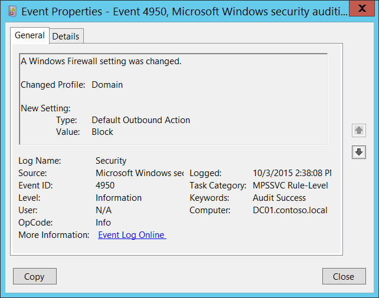
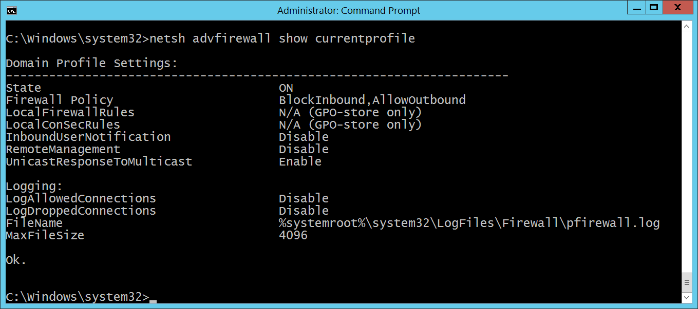

# 4950(S): Windowsファイアウォールの設定が変更されました。



***サブカテゴリ:***&nbsp;[MPSSVCルールレベルポリシー変更の監査](audit-mpssvc-rule-level-policy-change.md)

***イベントの説明:***

このイベントは、Windowsファイアウォールのローカル設定が変更されたときに生成されます。

このイベントは、グループポリシーを介してWindowsファイアウォールの設定が変更された場合には生成されません。

> **注**&nbsp;&nbsp;推奨事項については、このイベントの[セキュリティ監視の推奨事項](#security-monitoring-recommendations)を参照してください。

<br clear="all">

***イベントXML:***
```
- <Event xmlns="http://schemas.microsoft.com/win/2004/08/events/event">
- <System>
 <Provider Name="Microsoft-Windows-Security-Auditing" Guid="{54849625-5478-4994-A5BA-3E3B0328C30D}" /> 
 <EventID>4950</EventID> 
 <Version>0</Version> 
 <Level>0</Level> 
 <Task>13571</Task> 
 <Opcode>0</Opcode> 
 <Keywords>0x8020000000000000</Keywords> 
 <TimeCreated SystemTime="2015-10-03T21:38:08.086908400Z" /> 
 <EventRecordID>1050944</EventRecordID> 
 <Correlation /> 
 <Execution ProcessID="500" ThreadID="924" /> 
 <Channel>Security</Channel> 
 <Computer>DC01.contoso.local</Computer> 
 <Security /> 
 </System>
- <EventData>
 <Data Name="ProfileChanged">Domain</Data> 
 <Data Name="SettingType">Default Outbound Action</Data> 
 <Data Name="SettingValue">Block</Data> 
 </EventData>
 </Event>

```

***必要なサーバーロール:*** なし。

***最小OSバージョン:*** Windows Server 2008, Windows Vista。

***イベントバージョン:*** 0。

***フィールドの説明:***

**変更されたプロファイル** \[タイプ = UnicodeString\]**:** 設定が変更されたプロファイルの名前。可能な値は以下の通りです:

-   パブリック

-   ドメイン

-   プライベート

**新しい設定:**

-   **タイプ** \[タイプ = UnicodeString\]: 変更された設定の名前。Windowsファイアウォールの設定を表示または設定するには、“**netsh advfirewall**”コマンドを使用できます。例えば、現在の\\アクティブなWindowsファイアウォールプロファイルの設定を表示するには、“**netsh advfirewall show currentprofile**”コマンドを実行する必要があります:



-   **値** \[タイプ = UnicodeString\]: 変更された設定の新しい値。

## セキュリティ監視の推奨事項

4950(S): Windowsファイアウォールの設定が変更されました。

-   Windowsファイアウォール設定の標準またはベースラインが定義されている場合、このイベントを監視し、イベントで報告された設定が標準またはベースラインと同じであるかどうかを確認してください。

-   このイベントは、ローカルで行われたWindowsファイアウォール設定のすべての変更を監視したい場合に役立ちます。
