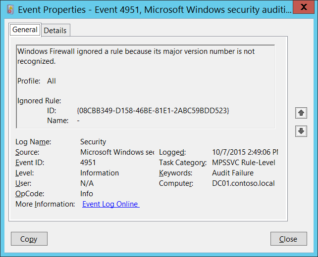

# 4951(F): ルールが無視されました。Windows ファイアウォールによってメジャーバージョン番号が認識されなかったためです。



***サブカテゴリ:***&nbsp;[MPSSVC ルールレベル ポリシー変更の監査](audit-mpssvc-rule-level-policy-change.md)

***イベントの説明:***

Windows ファイアウォールのルールを作成または編集する際に、含めることができる設定は、ルールを作成する際に使用する Windows のバージョンに依存します。新しい設定が後のバージョンの Windows または既存の Windows バージョンのサービス パックに追加されると、ルール処理エンジンのバージョン番号が更新され、そのバージョン番号がそのバージョンの Windows を使用して作成されたルールにスタンプされます。たとえば、Windows Vista はバージョン "v2.0" でスタンプされたファイアウォール ルールを生成します。将来のバージョンの Windows は、それぞれマイナーまたはメジャーな変更や追加を示すために "v2.1" や "v3.0" を使用する可能性があります。

新しいバージョンの Windows で、以前のバージョンの Windows では利用できないファイアウォール設定を参照するファイアウォール ルールを作成し、そのルールを以前のバージョンの Windows を実行しているコンピューターに展開しようとすると、ファイアウォール エンジンはこのエラーを生成して、ルールを処理できないことを示します。

唯一の解決策は、互換性のないルールを削除し、互換性のあるルールを展開することです。

> **注**&nbsp;&nbsp;このイベントに関する推奨事項については、[セキュリティ監視の推奨事項](#security-monitoring-recommendations) を参照してください。

<br clear="all">

***イベント XML:***
```xml
- <Event xmlns="http://schemas.microsoft.com/win/2004/08/events/event">
- <System>
 <Provider Name="Microsoft-Windows-Security-Auditing" Guid="{54849625-5478-4994-A5BA-3E3B0328C30D}" /> 
 <EventID>4951</EventID> 
 <Version>0</Version> 
 <Level>0</Level> 
 <Task>13571</Task> 
 <Opcode>0</Opcode> 
 <Keywords>0x8010000000000000</Keywords> 
 <TimeCreated SystemTime="2015-10-07T21:49:06.951537900Z" /> 
 <EventRecordID>1052309</EventRecordID> 
 <Correlation /> 
 <Execution ProcessID="524" ThreadID="556" /> 
 <Channel>Security</Channel> 
 <Computer>DC01.contoso.local</Computer> 
 <Security /> 
 </System>
- <EventData>
 <Data Name="Profile">All</Data> 
 <Data Name="RuleId">{08CBB349-D158-46BE-81E1-2ABC59BDD523}</Data> 
 <Data Name="RuleName">-</Data> 
 </EventData>
 </Event>

```

***必要なサーバーロール:*** なし。

***最小OSバージョン:*** Windows Server 2008, Windows Vista。

***イベントバージョン:*** 0。

***フィールドの説明:***

**プロファイル** \[型 = UnicodeString\]**:** 無視されたルールのプロファイル名。考えられる値は以下の通りです:

-   All

-   Domain, Public

-   Domain, Private

-   Private, Public

-   Public

-   Domain

-   Private

**無視されたルール:**

-   **ID** \[型 = UnicodeString\]: 無視されたファイアウォールルールの一意の識別子。

    ルールの一意のIDを確認するには、レジストリキー “**HKEY\_LOCAL\_MACHINE\\SYSTEM\\CurrentControlSet\\Services\\SharedAccess\\Parameters\\FirewallPolicy\\FirewallRules”** に移動し、WindowsファイアウォールルールのID（名前列）とパラメータのリストを確認します:


-   **名前** \[型 = UnicodeString\]: 無視されたルールの名前。Windowsファイアウォールのルール名は、Windowsファイアウォールの詳細設定管理コンソール（**wf.msc**）を使用して、「名前」列で確認できます:


## セキュリティ監視の推奨事項

4951(F): ルールが無視されたのは、そのメジャーバージョン番号がWindowsファイアウォールによって認識されなかったためです。

-   このイベントは、ソフトウェアの問題、Windowsファイアウォールのレジストリエラーや破損、またはグループポリシー設定の誤設定の兆候である可能性があります。このイベントを監視し、その原因を調査することをお勧めします。通常、このイベントは構成の問題を示しており、セキュリティの問題を示しているわけではありません。
