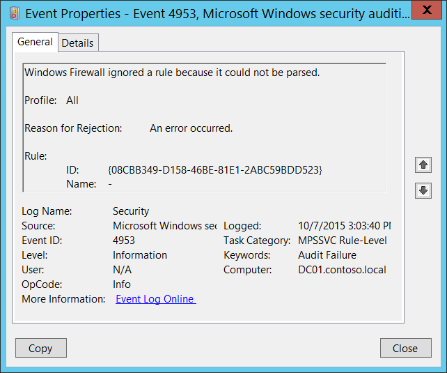

# 4953(F): Windows Firewall がルールを無視しました。解析できなかったためです。



***サブカテゴリ:***&nbsp;[MPSSVC ルールレベルのポリシー変更の監査](audit-mpssvc-rule-level-policy-change.md)

***イベントの説明:***

何らかの理由で Windows Firewall が Windows Firewall ルールを解析できなかった場合にこのイベントが生成されます。

Windows Firewall ルールのレジストリエントリが破損している場合に発生することがあります。

> **注**&nbsp;&nbsp;推奨事項については、このイベントの[セキュリティ監視の推奨事項](#security-monitoring-recommendations)を参照してください。

<br clear="all">

***イベント XML:***
```
- <Event xmlns="http://schemas.microsoft.com/win/2004/08/events/event">
- <System>
 <Provider Name="Microsoft-Windows-Security-Auditing" Guid="{54849625-5478-4994-A5BA-3E3B0328C30D}" /> 
 <EventID>4953</EventID> 
 <Version>0</Version> 
 <Level>0</Level> 
 <Task>13571</Task> 
 <Opcode>0</Opcode> 
 <Keywords>0x8010000000000000</Keywords> 
 <TimeCreated SystemTime="2015-10-07T22:03:40.261507200Z" /> 
 <EventRecordID>1052340</EventRecordID> 
 <Correlation /> 
 <Execution ProcessID="524" ThreadID="5088" /> 
 <Channel>Security</Channel> 
 <Computer>DC01.contoso.local</Computer> 
 <Security /> 
 </System>
- <EventData>
 <Data Name="Profile">All</Data> 
 <Data Name="ReasonForRejection">An error occurred.</Data> 
 <Data Name="RuleId">{08CBB349-D158-46BE-81E1-2ABC59BDD523}</Data> 
 <Data Name="RuleName">-</Data> 
 </EventData>
 </Event>

```

***必要なサーバーの役割:*** なし。

***最小 OS バージョン:*** Windows Server 2008, Windows Vista。

***イベントバージョン:*** 0。

***フィールドの説明:***

**プロファイル** \[型 = UnicodeString\]**:** 無視されたルールのプロファイル名。考えられる値は次のとおりです:

-   All

-   Domain, Public

-   Domain, Private

-   Private, Public

-   Public

-   Domain

-   Private

**拒否の理由** \[型 = UnicodeString\]**:** ルールが無視された理由。

**ルール:**

-   **ID** \[型 = UnicodeString\]: 無視されたファイアウォールルールの一意の識別子。

    ルールの一意の ID を確認するには、「**HKEY\_LOCAL\_MACHINE\\SYSTEM\\CurrentControlSet\\Services\\SharedAccess\\Parameters\\FirewallPolicy\\FirewallRules**」レジストリキーに移動すると、パラメーター付きの Windows Firewall ルール ID (名前列) のリストが表示されます:


-   **名前** \[タイプ = UnicodeString\]: 無視されたルールの名前です。Windows ファイアウォールのルール名は、Windows ファイアウォールと高度なセキュリティ管理コンソール (**wf.msc**) を使用して確認できます。「名前」列を確認してください:


## セキュリティ監視の推奨事項

4953(F): Windows ファイアウォールがルールを無視した理由は、解析できなかったためです。

-   このイベントは、ソフトウェアの問題、Windows ファイアウォールのレジストリエラーや破損、またはグループポリシー設定の誤設定の兆候である可能性があります。このイベントを監視し、状態の原因を調査することをお勧めします。通常、このイベントは構成の問題を示しており、セキュリティの問題ではありません。
