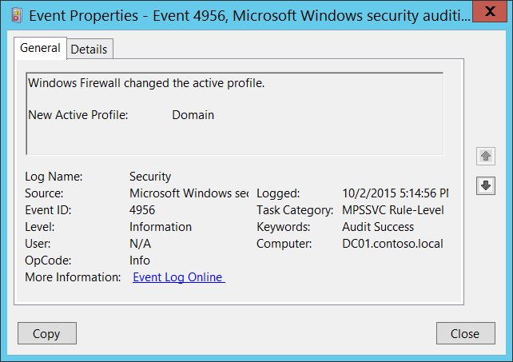

# 4956(S): Windows Firewall がアクティブプロファイルを変更しました。




***サブカテゴリ:***&nbsp;[MPSSVC ルールレベルのポリシー変更の監査](audit-mpssvc-rule-level-policy-change.md)

***イベントの説明:***

このイベントは、Windows Firewall がアクティブプロファイルを変更したときに生成されます。

> **注**&nbsp;&nbsp;推奨事項については、このイベントの[セキュリティ監視の推奨事項](#security-monitoring-recommendations)を参照してください。

<br clear="all">

***イベント XML:***
```
- <Event xmlns="http://schemas.microsoft.com/win/2004/08/events/event">
- <System>
 <Provider Name="Microsoft-Windows-Security-Auditing" Guid="{54849625-5478-4994-A5BA-3E3B0328C30D}" /> 
 <EventID>4956</EventID> 
 <Version>0</Version> 
 <Level>0</Level> 
 <Task>13571</Task> 
 <Opcode>0</Opcode> 
 <Keywords>0x8020000000000000</Keywords> 
 <TimeCreated SystemTime="2015-10-03T00:14:56.676017600Z" /> 
 <EventRecordID>1050811</EventRecordID> 
 <Correlation /> 
 <Execution ProcessID="500" ThreadID="2216" /> 
 <Channel>Security</Channel> 
 <Computer>DC01.contoso.local</Computer> 
 <Security /> 
 </System>
- <EventData>
 <Data Name="ActiveProfile">Domain</Data> 
 </EventData>
 </Event>

```

***必要なサーバー役割:*** なし。

***最小 OS バージョン:*** Windows Server 2008, Windows Vista。

***イベントバージョン:*** 0。

***フィールドの説明:***

**新しいアクティブプロファイル** \[タイプ = UnicodeString\]**:** 新しいアクティブプロファイルの名前。可能な値は次の通りです:

-   ドメイン

-   パブリック

-   プライベート

## セキュリティ監視の推奨事項

4956(S): Windows Firewall がアクティブプロファイルを変更しました。

-   通常、このイベントは情報提供を目的としています。

-   ドメインに参加しているマシンの場合、**新しいアクティブプロファイル** が **「ドメイン」** ではないすべてのイベントを監視することができます。これは、コンピューターが別の非ドメインネットワークに接続されたことを示します。
