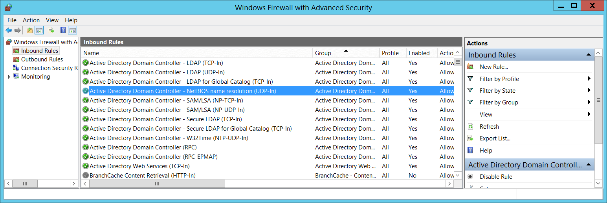

# 4957(F): Windows ファイアウォールは次のルールを適用しませんでした。


***サブカテゴリ:***&nbsp;[MPSSVC ルールレベルのポリシー変更の監査](audit-mpssvc-rule-level-policy-change.md)

***イベントの説明:***

このイベントは、Windows ファイアウォールが起動または新しいルールを適用し、そのルールが何らかの理由で適用できなかったときに生成されます。

> **注**&nbsp;&nbsp;推奨事項については、このイベントの[セキュリティ監視の推奨事項](#security-monitoring-recommendations)を参照してください。

<br clear="all">

***イベント XML:***
```xml
- <Event xmlns="http://schemas.microsoft.com/win/2004/08/events/event">
- <System>
 <Provider Name="Microsoft-Windows-Security-Auditing" Guid="{54849625-5478-4994-A5BA-3E3B0328C30D}" /> 
 <EventID>4957</EventID> 
 <Version>0</Version> 
 <Level>0</Level> 
 <Task>13571</Task> 
 <Opcode>0</Opcode> 
 <Keywords>0x8010000000000000</Keywords> 
 <TimeCreated SystemTime="2015-10-02T23:13:14.496678500Z" /> 
 <EventRecordID>1049892</EventRecordID> 
 <Correlation /> 
 <Execution ProcessID="500" ThreadID="2284" /> 
 <Channel>Security</Channel> 
 <Computer>DC01.contoso.local</Computer> 
 <Security /> 
 </System>
- <EventData>
 <Data Name="RuleId">CoreNet-Teredo-In</Data> 
 <Data Name="RuleName">Core Networking - Teredo (UDP-In)</Data> 
 <Data Name="RuleAttr">Local Port</Data> 
 </EventData>
 </Event>

```

***必要なサーバー ロール:*** なし。

***最小 OS バージョン:*** Windows Server 2008, Windows Vista。

***イベント バージョン:*** 0。

***フィールドの説明:***

**ルール情報:**

-   **ID** \[タイプ = UnicodeString\]: 適用されなかったファイアウォール ルールの一意の識別子。

    ルールの一意の ID を確認するには、「**HKEY\_LOCAL\_MACHINE\\SYSTEM\\CurrentControlSet\\Services\\SharedAccess\\Parameters\\FirewallPolicy\\FirewallRules**」レジストリ キーに移動し、パラメーター付きの Windows ファイアウォール ルール ID (名前列) のリストを確認します。


-   **名前** \[タイプ = UnicodeString\]: 適用されなかったルールの名前。Windows ファイアウォールのルールの名前は、Windows ファイアウォールの詳細設定管理コンソール (**wf.msc**) を使用して、「名前」列を確認することで確認できます。



**エラー情報:**

-   **理由** \[Type = UnicodeString\]: ルールが適用されなかった理由。

## セキュリティ監視の推奨事項

4957(F): Windows ファイアウォールが次のルールを適用しませんでした。

-   このイベントは、ソフトウェアの問題、Windows ファイアウォールのレジストリエラーや破損、またはグループポリシー設定の誤設定の兆候である可能性があります。このイベントを監視し、その原因を調査することをお勧めします。通常、このイベントは構成の問題を示しており、セキュリティの問題ではありません。
