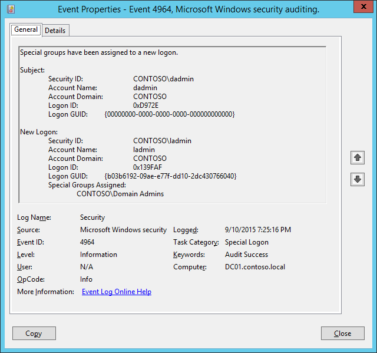

# 4964(S): 特別なグループが新しいログオンに割り当てられました。



***サブカテゴリ:***&nbsp;[特別なログオンの監査](audit-special-logon.md)

***イベントの説明:***

このイベントは、定義された[特別なグループ](https://techcommunity.microsoft.com/t5/ask-the-directory-services-team/special-groups-auditing-via-group-policy-preferences/ba-p/395095)のメンバーであるアカウントがログオンしたときに発生します。

> **注**&nbsp;&nbsp;推奨事項については、このイベントの[セキュリティ監視の推奨事項](#security-monitoring-recommendations)を参照してください。

<br clear="all">

***イベント XML:***
```
- <Event xmlns="http://schemas.microsoft.com/win/2004/08/events/event">
- <System>
 <Provider Name="Microsoft-Windows-Security-Auditing" Guid="{54849625-5478-4994-A5BA-3E3B0328C30D}" /> 
 <EventID>4964</EventID> 
 <Version>0</Version> 
 <Level>0</Level> 
 <Task>12548</Task> 
 <Opcode>0</Opcode> 
 <Keywords>0x8020000000000000</Keywords> 
 <TimeCreated SystemTime="2015-09-11T02:25:16.236443300Z" /> 
 <EventRecordID>238923</EventRecordID> 
 <Correlation /> 
 <Execution ProcessID="504" ThreadID="5008" /> 
 <Channel>Security</Channel> 
 <Computer>DC01.contoso.local</Computer> 
 <Security /> 
 </System>
- <EventData>
 <Data Name="SubjectUserSid">S-1-5-21-3457937927-2839227994-823803824-1104</Data> 
 <Data Name="SubjectUserName">dadmin</Data> 
 <Data Name="SubjectDomainName">CONTOSO</Data> 
 <Data Name="SubjectLogonId">0xd972e</Data> 
 <Data Name="LogonGuid">{00000000-0000-0000-0000-000000000000}</Data> 
 <Data Name="TargetUserSid">S-1-5-21-3457937927-2839227994-823803824-500</Data> 
 <Data Name="TargetUserName">ladmin</Data> 
 <Data Name="TargetDomainName">CONTOSO</Data> 
 <Data Name="TargetLogonId">0x139faf</Data> 
 <Data Name="TargetLogonGuid">{B03B6192-09AE-E77F-DD10-2DC430766040}</Data> 
 <Data Name="SidList">%{S-1-5-21-3457937927-2839227994-823803824-512}</Data> 
 </EventData>
 </Event>

```

***必要なサーバーの役割:*** なし。

***最小 OS バージョン:*** Windows Server 2008, Windows Vista。

***イベントバージョン:*** 0。

> **注**&nbsp;&nbsp;特別なグループは、Windows Vista および Windows Server 2008 の新機能です。特別なグループ機能を使用すると、管理者は特定のグループのメンバーがコンピューターにログオンしたときにそれを確認できます。特別なグループ機能を使用すると、管理者はレジストリにグループのセキュリティ識別子 (SID) のリストを設定できます。

&gt; 特別なグループを追加するには、次の操作を行います:

&gt; 1. レジストリエディタを開きます。

&gt; 2. 次のレジストリサブキーを見つけてクリックします: HKEY\_LOCAL\_MACHINE\\System\\CurrentControlSet\\Control\\Lsa\\Audit

&gt; 3. 編集メニューで、新規作成をポイントし、文字列値をクリックします。

&gt; 4. SpecialGroups と入力し、ENTER キーを押します。

&gt; 5. SpecialGroups を右クリックし、修正をクリックします。

&gt; 6. 値のデータ ボックスにグループ SID を入力し、OK をクリックします。

&gt; セミコロン文字 (;) を使用して SID リストを区切ることができます。たとえば、次のような文字列を使用して、セミコロンで 2 つの SID を区切ることができます:

&gt; S-1-5-32-544;S-1-5-32-123-54-65

&gt; 詳細については、<https://blogs.technet.com/b/askds/archive/2008/03/11/special-groups-auditing-via-group-policy-preferences.aspx> を参照してください。

***フィールドの説明:***

**サブジェクト:**

-   **セキュリティID** \[タイプ = SID\]**:** **新しいログオン**アカウントのログオンを要求したアカウントのSID。イベントビューアーは自動的にSIDを解決し、アカウント名を表示しようとします。SIDが解決できない場合、イベントにはソースデータが表示されます。

> **注**&nbsp;&nbsp;**セキュリティ識別子 (SID)** は、トラスティ (セキュリティプリンシパル) を識別するために使用される可変長の一意の値です。各アカウントには、Active Directoryドメインコントローラーなどの権限によって発行され、セキュリティデータベースに保存される一意のSIDがあります。ユーザーがログオンするたびに、システムはデータベースからそのユーザーのSIDを取得し、そのユーザーのアクセス トークンに配置します。システムは、アクセス トークン内のSIDを使用して、以降のすべてのWindowsセキュリティとのやり取りでユーザーを識別します。ユーザーまたはグループの一意の識別子としてSIDが使用された場合、それは他のユーザーまたはグループを識別するために再利用されることはありません。SIDの詳細については、[セキュリティ識別子](/windows/access-protection/access-control/security-identifiers) を参照してください。

-   **アカウント名** \[タイプ = UnicodeString\]**:** **新しいログオン**アカウントのログオンを要求したアカウントの名前。

-   **アカウント ドメイン** \[タイプ = UnicodeString\]**:** サブジェクトのドメインまたはコンピュータ名。形式はさまざまで、以下を含みます:

    -   ドメイン NETBIOS 名の例: CONTOSO

    -   小文字の完全なドメイン名: contoso.local

    -   大文字の完全なドメイン名: CONTOSO.LOCAL

    -   LOCAL SERVICE や ANONYMOUS LOGON などの[よく知られたセキュリティプリンシパル](/windows/security/identity-protection/access-control/security-identifiers)の場合、このフィールドの値は「NT AUTHORITY」となります。

    -   ローカルユーザーアカウントの場合、このフィールドにはこのアカウントが属するコンピュータまたはデバイスの名前が含まれます。例: 「Win81」。

-   **ログオンID** \[タイプ = HexInt64\]**:** このイベントを、同じログオンIDを含む最近のイベントと関連付けるのに役立つ16進数の値。例: 「[4624](event-4624.md): アカウントが正常にログオンされました。」

-   **ログオン GUID** \[タイプ = GUID\]: この GUID は、このイベントを他の同じ **ログオン GUID** を含む可能性のあるイベントと関連付けるのに役立ちます。例えば、ドメイン コントローラーでの「[4769](event-4769.md)(S, F): Kerberos サービス チケットが要求されました」イベント。

    また、4964 イベントと、同じコンピューター上で同じ **ログオン GUID** を含む可能性のある他のいくつかのイベント（例えば、「[4648](event-4648.md)(S): 明示的な資格情報を使用してログオンが試行されました」および「[4624](event-4624.md)(S): アカウントが正常にログオンされました」）との関連付けにも使用できます。

    このパラメーターはイベントでキャプチャされない場合があり、その場合は「{00000000-0000-0000-0000-000000000000}」として表示されます。

> **注**&nbsp;&nbsp;**GUID** は「Globally Unique Identifier（グローバル一意識別子）」の略です。リソース、アクティビティ、またはインスタンスを識別するために使用される 128 ビットの整数です。

**新しいログオン:**

-   **セキュリティ ID** \[タイプ = SID\]**:** ログオンを実行したアカウントの SID。イベント ビューアーは自動的に SID を解決してアカウント名を表示しようとします。SID を解決できない場合、イベントにはソース データが表示されます。

-   **アカウント名** \[タイプ = UnicodeString\]**:** ログオンを実行したアカウントの名前。

-   **アカウント ドメイン** \[タイプ = UnicodeString\]**:** サブジェクトのドメインまたはコンピューター名。形式はさまざまで、以下のようなものがあります:

    -   ドメイン NETBIOS 名の例: CONTOSO

    -   小文字の完全ドメイン名: contoso.local

    -   大文字の完全ドメイン名: CONTOSO.LOCAL

    -   LOCAL SERVICE や ANONYMOUS LOGON などの[よく知られたセキュリティ プリンシパル](/windows/security/identity-protection/access-control/security-identifiers)の場合、このフィールドの値は「NT AUTHORITY」となります。

    -   ローカル ユーザー アカウントの場合、このフィールドにはこのアカウントが属するコンピューターまたはデバイスの名前が含まれます。例えば、「Win81」。

-   **ログオン ID** \[タイプ = HexInt64\]**:** このイベントを最近のイベントと関連付けるのに役立つ 16 進数値。例えば、「[4624](event-4624.md): アカウントが正常にログオンされました」など。

-   **ログオン GUID** \[タイプ = GUID\]: この GUID は、このイベントを他のイベントと関連付けるのに役立ちます。同じ **ログオン GUID** を含む可能性のある別のイベントと関連付けることができます。例えば、ドメイン コントローラー上の “[4769](event-4769.md)(S, F): Kerberos サービス チケットが要求されました” イベントです。

    また、4964 イベントと同じコンピューター上の他のいくつかのイベント（同じ **ログオン GUID** を含む可能性のあるイベント）との相関にも使用できます。例えば、“[4648](event-4648.md)(S): 明示的な資格情報を使用してログオンが試行されました” や “[4624](event-4624.md)(S): アカウントが正常にログオンされました” です。

    このパラメーターはイベントでキャプチャされない場合があり、その場合は “{00000000-0000-0000-0000-000000000000}” と表示されます。

-   **割り当てられた特別なグループ** \[タイプ = UnicodeString\]: **新しいログオン\\セキュリティ ID** がメンバーである特別なグループ SID のリストです。

## セキュリティ監視の推奨事項

4964(S): 新しいログオンに特別なグループが割り当てられました。

-   一般的に言えば、すべての [4964](event-4964.md) イベントを監視する必要があります。特別なグループの目的は、重要または重要なグループ（ドメイン管理者、エンタープライズ管理者、サービス アカウント グループなど）のリストを定義し、これらのグループのメンバーがコンピューターにログオンするたびにイベントをトリガーすることです。例えば、非管理者ワークステーションへのドメイン管理者のログオンを監視することができます。
