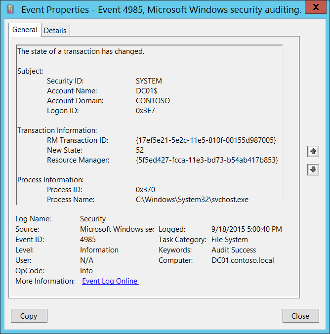

# 4985(S): トランザクションの状態が変更されました。



***サブカテゴリ:***&nbsp;[ファイル システムの監査](audit-file-system.md)、[非機密特権使用の監査](audit-non-sensitive-privilege-use.md)、[その他の特権使用イベントの監査](audit-other-privilege-use-events.md)、および[機密特権使用の監査](audit-sensitive-privilege-use.md)

***イベントの説明:***

これはファイル システムの[トランザクション マネージャー](/windows/win32/ktm/transaction-managers)からの情報イベントです。

> **注**&nbsp;&nbsp;推奨事項については、このイベントの[セキュリティ監視の推奨事項](#security-monitoring-recommendations)を参照してください。

<br clear="all">

***イベント XML:***
```xml
- <Event xmlns="http://schemas.microsoft.com/win/2004/08/events/event">
- <System>
 <Provider Name="Microsoft-Windows-Security-Auditing" Guid="{54849625-5478-4994-A5BA-3E3B0328C30D}" /> 
 <EventID>4985</EventID> 
 <Version>0</Version> 
 <Level>0</Level> 
 <Task>12800</Task> 
 <Opcode>0</Opcode> 
 <Keywords>0x8020000000000000</Keywords> 
 <TimeCreated SystemTime="2015-09-19T00:00:40.099093300Z" /> 
 <EventRecordID>274277</EventRecordID> 
 <Correlation /> 
 <Execution ProcessID="4" ThreadID="5048" /> 
 <Channel>Security</Channel> 
 <Computer>DC01.contoso.local</Computer> 
 <Security /> 
 </System>
- <EventData>
 <Data Name="SubjectUserSid">S-1-5-18</Data> 
 <Data Name="SubjectUserName">DC01$</Data> 
 <Data Name="SubjectDomainName">CONTOSO</Data> 
 <Data Name="SubjectLogonId">0x3e7</Data> 
 <Data Name="TransactionId">{17EF5E21-5E2C-11E5-810F-00155D987005}</Data> 
 <Data Name="NewState">52</Data> 
 <Data Name="ResourceManager">{5F5ED427-FCCA-11E3-BD73-B54AB417B853}</Data> 
 <Data Name="ProcessId">0x370</Data> 
 <Data Name="ProcessName">C:\\Windows\\System32\\svchost.exe</Data> 
 </EventData>
</Event>

```

***必要なサーバー ロール:*** なし。

***最小 OS バージョン:*** Windows Server 2008、Windows Vista。

***イベント バージョン:*** 0。

***フィールドの説明:***

**サブジェクト:**

-   **セキュリティ ID** \[タイプ = SID\]**:** トランザクションの状態が変更されたアカウントの SID。イベント ビューアーは自動的に SID を解決してアカウント名を表示しようとします。SID を解決できない場合、イベントにソース データが表示されます。

> **注**&nbsp;&nbsp;**セキュリティ識別子 (SID)** は、トラスティ (セキュリティ プリンシパル) を識別するために使用される可変長の一意の値です。各アカウントには、Active Directory ドメイン コントローラーなどの権限によって発行され、セキュリティ データベースに保存される一意の SID があります。ユーザーがログオンするたびに、システムはデータベースからそのユーザーの SID を取得し、そのユーザーのアクセス トークンに配置します。システムは、アクセス トークン内の SID を使用して、以降のすべての Windows セキュリティとのやり取りでユーザーを識別します。SID がユーザーまたはグループの一意の識別子として使用された場合、それは他のユーザーまたはグループを識別するために再利用されることはありません。SID の詳細については、[セキュリティ識別子](/windows/access-protection/access-control/security-identifiers)を参照してください。

-   **アカウント名** \[タイプ = UnicodeString\]**:** トランザクションの状態を変更したアカウントの名前。

-   **アカウントドメイン** \[タイプ = UnicodeString\]**:** ドメインまたはコンピュータ名。形式はさまざまで、以下のようなものがあります：

    -   ドメインのNETBIOS名の例: CONTOSO

    -   小文字の完全なドメイン名: contoso.local

    -   大文字の完全なドメイン名: CONTOSO.LOCAL

    -   LOCAL SERVICEやANONYMOUS LOGONなどの[よく知られたセキュリティプリンシパル](/windows/security/identity-protection/access-control/security-identifiers)の場合、このフィールドの値は「NT AUTHORITY」となります。

    -   ローカルユーザーアカウントの場合、このフィールドにはこのアカウントが属するコンピュータまたはデバイスの名前が含まれます。例: “Win81”。

-   **ログオンID** \[タイプ = HexInt64\]**:** 16進数の値で、同じログオンIDを含む最近のイベントとこのイベントを関連付けるのに役立ちます。例: “[4624](event-4624.md): アカウントが正常にログオンされました。”

**トランザクション情報:**

-   **RMトランザクションID** \[タイプ = GUID\]: 一意のGUIDの[トランザクション](/windows/win32/ktm/what-is-a-transaction)。このフィールドは、同じ**トランザクションID**を含む他のイベントとこのイベントを関連付けるのに役立ちます。例: “[4656](event-4656.md)(S, F): オブジェクトへのハンドルが要求されました。”

> **注**&nbsp;&nbsp;**GUID**は「Globally Unique Identifier」の略です。リソース、アクティビティ、またはインスタンスを識別するために使用される128ビットの整数です。

-   **新しい状態** \[タイプ = UInt32\]**:** [トランザクション](/windows/win32/ktm/what-is-a-transaction)の新しい状態の識別子。

-   **リソースマネージャ** \[タイプ = GUID\]**:** この[トランザクション](/windows/win32/ktm/what-is-a-transaction)に関連付けられた[リソースマネージャ](/windows/win32/ktm/resource-managers)の一意のGUID識別子。

**プロセス情報:**

-   **プロセスID** \[タイプ = Pointer\]: トランザクションの状態を変更したプロセスの16進数のプロセスID。プロセスID (PID) は、オペレーティングシステムがアクティブなプロセスを一意に識別するために使用する番号です。特定のプロセスのPIDを確認するには、例えばタスクマネージャー（詳細タブ、PID列）を使用できます。

    

    16進数の値を10進数に変換すると、タスクマネージャーの値と比較できます。

    このプロセスIDを他のイベントのプロセスIDと関連付けることもできます。例えば、"[4688](event-4688.md): 新しいプロセスが作成されました" **プロセス情報\\新しいプロセスID**。

-   **プロセス名** \[タイプ = UnicodeString\]**:** プロセスの実行可能ファイルのフルパスと名前。

## セキュリティ監視の推奨事項

4985(S): トランザクションの状態が変更されました。

-   このイベントは通常、セキュリティに関連性がなく、[トランザクションマネージャー](/windows/win32/ktm/transaction-managers)のトラブルシューティングに使用されます。
