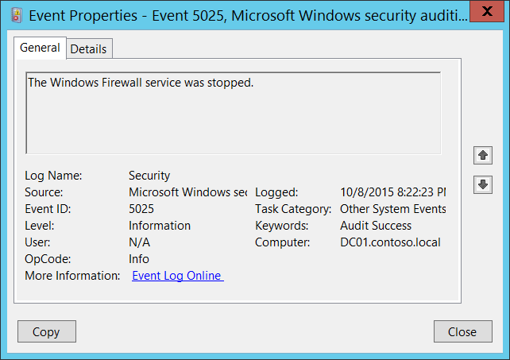

# 5025(S): Windows ファイアウォール サービスが停止されました。



***サブカテゴリ:***&nbsp;[その他のシステム イベントの監査](audit-other-system-events.md)

***イベントの説明:***

このイベントは、Windows ファイアウォール (MpsSvc) サービスが停止されたときに生成されます。

このイベントは通常、オペレーティング システムのシャットダウン プロセス中に記録されます。

> **注**&nbsp;&nbsp;推奨事項については、このイベントの[セキュリティ監視の推奨事項](#security-monitoring-recommendations)を参照してください。

<br clear="all">

***イベント XML:***
```
- <Event xmlns="http://schemas.microsoft.com/win/2004/08/events/event">
- <System>
 <Provider Name="Microsoft-Windows-Security-Auditing" Guid="{54849625-5478-4994-A5BA-3E3B0328C30D}" /> 
 <EventID>5025</EventID> 
 <Version>0</Version> 
 <Level>0</Level> 
 <Task>12292</Task> 
 <Opcode>0</Opcode> 
 <Keywords>0x8020000000000000</Keywords> 
 <TimeCreated SystemTime="2015-10-09T03:22:23.742965400Z" /> 
 <EventRecordID>1101606</EventRecordID> 
 <Correlation /> 
 <Execution ProcessID="508" ThreadID="3780" /> 
 <Channel>Security</Channel> 
 <Computer>DC01.contoso.local</Computer> 
 <Security /> 
 </System>
 <EventData /> 
 </Event>

```

***必要なサーバー ロール:*** なし。

***最小 OS バージョン:*** Windows Server 2008、Windows Vista。

***イベント バージョン:*** 0。

## セキュリティ監視の推奨事項

5025(S): Windows ファイアウォール サービスが停止されました。

-   通常、このイベントは情報提供を目的としています。オペレーティング システムのシャットダウン プロセス中に記録されます。

-   システムの起動後にこのイベントが表示されないはずなので、システムの起動プロセス外で発生した場合に監視することをお勧めします。
