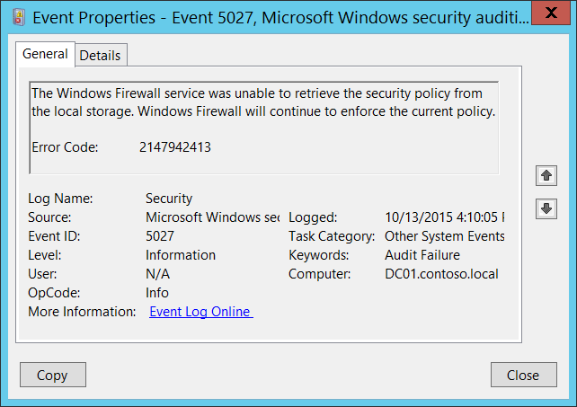

# 5027(F): Windows ファイアウォール サービスはローカル ストレージからセキュリティ ポリシーを取得できませんでした。サービスは現在のポリシーを引き続き適用します。




***サブカテゴリ:***&nbsp;[その他のシステム イベントの監査](audit-other-system-events.md)

***イベントの説明:***

このエラーは、メモリ リソースの不足または Windows ファイアウォール グループ ポリシー レジストリの破損のいずれかを示しています。

通常、このイベントが発生すると、Windows ファイアウォール サービスが開始できなかったことを示します。

通常、これは「[5028](event-5028.md)(S): Windows ファイアウォール サービスは新しいセキュリティ ポリシーを解析できませんでした。サービスは現在適用されているポリシーを続行します。」と一緒に発生します。

> **注**&nbsp;&nbsp;推奨事項については、このイベントの[セキュリティ監視の推奨事項](#security-monitoring-recommendations)を参照してください。

<br clear="all">

***イベント XML:***
```
- <Event xmlns="http://schemas.microsoft.com/win/2004/08/events/event">
- <System>
 <Provider Name="Microsoft-Windows-Security-Auditing" Guid="{54849625-5478-4994-A5BA-3E3B0328C30D}" /> 
 <EventID>5027</EventID> 
 <Version>0</Version> 
 <Level>0</Level> 
 <Task>12292</Task> 
 <Opcode>0</Opcode> 
 <Keywords>0x8010000000000000</Keywords> 
 <TimeCreated SystemTime="2015-10-13T23:10:05.318922900Z" /> 
 <EventRecordID>1101848</EventRecordID> 
 <Correlation /> 
 <Execution ProcessID="500" ThreadID="2000" /> 
 <Channel>Security</Channel> 
 <Computer>DC01.contoso.local</Computer> 
 <Security /> 
 </System>
- <EventData>
 <Data Name="ErrorCode">2147942413</Data> 
 </EventData>
 </Event>

```

***必要なサーバー ロール:*** なし。

***最小 OS バージョン:*** Windows Server 2008、Windows Vista。

***イベント バージョン:*** 0。

***フィールドの説明:***

**エラー コード** \[タイプ = UInt32\]**:** 一意のエラー コード。このイベントのエラー コードの意味については、<https://technet.microsoft.com/> またはその他の情報リソースを使用してください。

## セキュリティ監視の推奨事項

5027(F): Windows ファイアウォール サービスはローカル ストレージからセキュリティ ポリシーを取得できませんでした。サービスは現在のポリシーを引き続き適用します。

-   このイベントは、ソフトウェアやオペレーティングシステムの問題、Windowsファイアウォールのレジストリエラーや破損、またはグループポリシー設定の誤設定の兆候である可能性があります。このイベントを監視し、その原因を調査することをお勧めします。通常、このイベントは設定の問題を示しており、セキュリティの問題を示しているわけではありません。
