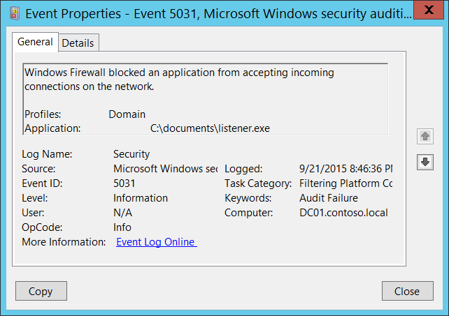

# 5031(F): Windowsファイアウォールサービスがネットワーク上で受信接続を受け入れるアプリケーションをブロックしました。



***サブカテゴリ:***&nbsp;[フィルタリングプラットフォーム接続の監査](audit-filtering-platform-connection.md)

***イベントの説明:***

このイベントは、[Windowsフィルタリングプラットフォーム](/windows/win32/fwp/windows-filtering-platform-start-page)によってアプリケーションがネットワーク上で受信接続を受け入れることがブロックされたときに生成されます。

特定のアプリケーションに対してWindowsファイアウォールにファイアウォールルール（許可または拒否）がない場合、デフォルトでこのレイヤーは受信接続を拒否するため、[Windowsフィルタリングプラットフォーム](/windows/win32/fwp/windows-filtering-platform-start-page)レイヤーからこのイベントが発生します。

> **注**&nbsp;&nbsp;このイベントに関する推奨事項については、[セキュリティ監視の推奨事項](#security-monitoring-recommendations)を参照してください。

<br clear="all">

***イベントXML:***
```xml
- <Event xmlns="http://schemas.microsoft.com/win/2004/08/events/event">
- <System>
 <Provider Name="Microsoft-Windows-Security-Auditing" Guid="{54849625-5478-4994-A5BA-3E3B0328C30D}" /> 
 <EventID>5031</EventID> 
 <Version>0</Version> 
 <Level>0</Level> 
 <Task>12810</Task> 
 <Opcode>0</Opcode> 
 <Keywords>0x8010000000000000</Keywords> 
 <TimeCreated SystemTime="2015-09-22T03:46:36.634473000Z" /> 
 <EventRecordID>304373</EventRecordID> 
 <Correlation /> 
 <Execution ProcessID="516" ThreadID="2976" /> 
 <Channel>Security</Channel> 
 <Computer>DC01.contoso.local</Computer> 
 <Security /> 
 </System>
- <EventData>
 <Data Name="Profiles">Domain</Data> 
 <Data Name="Application">C:\\documents\\listener.exe</Data> 
 </EventData>
 </Event>

```

***必要なサーバーロール:*** なし。

***最小OSバージョン:*** Windows Server 2008, Windows Vista。

***イベントバージョン:*** 0。

***フィールドの説明:***

-   **プロファイル** \[タイプ = UnicodeString\]: アプリケーションがブロックされたネットワークプロファイル。可能な値:

    -   ドメイン

    -   パブリック

    -   プライベート

-   **アプリケーション** \[タイプ = UnicodeString\]: ブロックされたアプリケーションの実行ファイルのフルパスとファイル名。

## セキュリティ監視の推奨事項

5031(F): Windowsファイアウォールサービスがネットワーク上で受信接続を受け入れるアプリケーションをブロックしました。

-   このイベントを使用して、Windowsファイアウォールルールが作成されていないアプリケーションを検出できます。

-   このイベントで報告された操作を実行するために使用されるべき事前定義されたアプリケーションがある場合、「**Application**」が定義されたアプリケーションと等しくないイベントを監視します。

-   「**Application**」が標準フォルダー（例えば、**System32** や **Program Files** ではない）にないか、制限されたフォルダー（例えば、**Temporary Internet Files**）にあるかを監視できます。

-   アプリケーション名に含まれる制限された部分文字列や単語の事前定義リスト（例えば、「**mimikatz**」や「**cain.exe**」）がある場合、「**Application**」にこれらの部分文字列が含まれているかを確認します。
