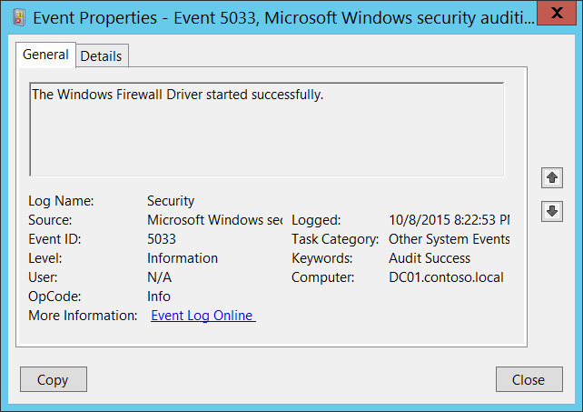

# 5033(S): Windows ファイアウォールドライバーが正常に開始されました。




***サブカテゴリ:***&nbsp;[その他のシステムイベントの監査](audit-other-system-events.md)

***イベントの説明:***

このイベントは、Windows ファイアウォールドライバー (Windows ファイアウォール認証ドライバーサービス) が正常に開始されたときに生成されます。

このイベントは通常、オペレーティングシステムの起動プロセス中に記録されます。

> **注**&nbsp;&nbsp;推奨事項については、このイベントの[セキュリティ監視の推奨事項](#security-monitoring-recommendations)を参照してください。

<br clear="all">

***イベント XML:***
```
- <Event xmlns="http://schemas.microsoft.com/win/2004/08/events/event">
- <System>
 <Provider Name="Microsoft-Windows-Security-Auditing" Guid="{54849625-5478-4994-A5BA-3E3B0328C30D}" /> 
 <EventID>5033</EventID> 
 <Version>0</Version> 
 <Level>0</Level> 
 <Task>12292</Task> 
 <Opcode>0</Opcode> 
 <Keywords>0x8020000000000000</Keywords> 
 <TimeCreated SystemTime="2015-10-09T03:22:53.526024800Z" /> 
 <EventRecordID>1101612</EventRecordID> 
 <Correlation /> 
 <Execution ProcessID="4" ThreadID="148" /> 
 <Channel>Security</Channel> 
 <Computer>DC01.contoso.local</Computer> 
 <Security /> 
 </System>
 <EventData /> 
 </Event>

```

***必要なサーバー役割:*** なし。

***最小 OS バージョン:*** Windows Server 2008, Windows Vista。

***イベントバージョン:*** 0。

## セキュリティ監視の推奨事項

5033(S): Windows ファイアウォールドライバーが正常に開始されました。

-   通常、このイベントは情報提供を目的としています。オペレーティングシステムの起動プロセス中に記録されます。

-   システム起動後にこのイベントが表示されないはずなので、システム起動プロセス外で発生した場合に監視することをお勧めします。
