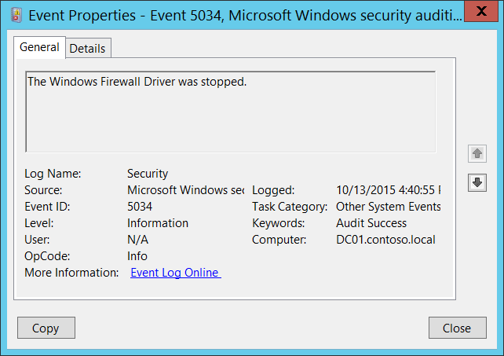

# 5034(S): Windows ファイアウォールドライバーが停止しました。




***サブカテゴリ:***&nbsp;[その他のシステムイベントの監査](audit-other-system-events.md)

***イベントの説明:***

このイベントは、Windows ファイアウォールドライバー (Windows ファイアウォール認証ドライバーサービス) が停止したときに生成されます。

このイベントは、オペレーティングシステムのシャットダウンプロセス中には記録されません。

> **注**&nbsp;&nbsp;推奨事項については、このイベントの[セキュリティ監視の推奨事項](#security-monitoring-recommendations)を参照してください。

<br clear="all">

***イベント XML:***
```
- <Event xmlns="http://schemas.microsoft.com/win/2004/08/events/event">
- <System>
 <Provider Name="Microsoft-Windows-Security-Auditing" Guid="{54849625-5478-4994-A5BA-3E3B0328C30D}" /> 
 <EventID>5034</EventID> 
 <Version>0</Version> 
 <Level>0</Level> 
 <Task>12292</Task> 
 <Opcode>0</Opcode> 
 <Keywords>0x8020000000000000</Keywords> 
 <TimeCreated SystemTime="2015-10-13T23:40:55.482270000Z" /> 
 <EventRecordID>1101856</EventRecordID> 
 <Correlation /> 
 <Execution ProcessID="4" ThreadID="140" /> 
 <Channel>Security</Channel> 
 <Computer>DC01.contoso.local</Computer> 
 <Security /> 
 </System>
 <EventData /> 
 </Event>

```

***必要なサーバーの役割:*** なし。

***最小 OS バージョン:*** Windows Server 2008, Windows Vista。

***イベントバージョン:*** 0。

## セキュリティ監視の推奨事項

5034(S): Windows ファイアウォールドライバーが停止しました。

-   このイベントは、オペレーティングシステムのシャットダウンプロセス中には記録されません。

-   通常のオペレーティングシステムの操作中にこのイベントが発生することはないため、発生した場合は Windows ファイアウォールドライバーが停止した理由を調査することをお勧めします。
