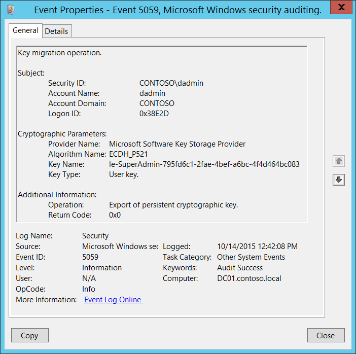
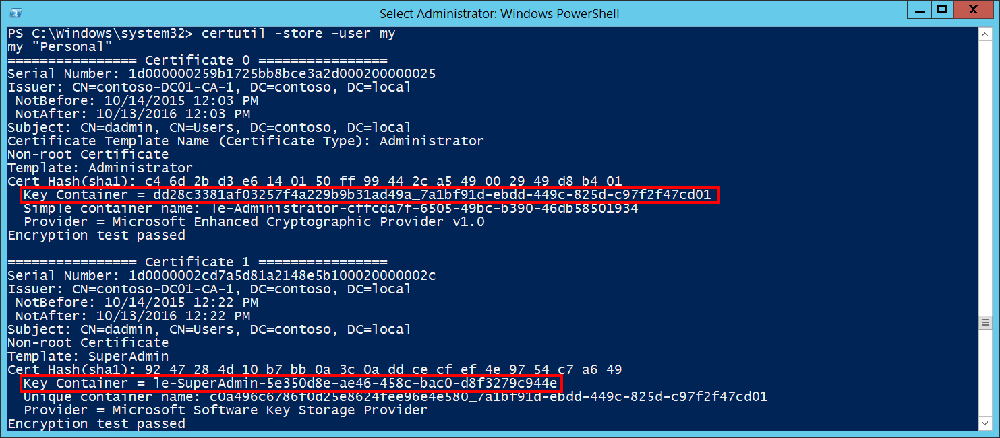

# 5059(S, F): キー移行操作



***サブカテゴリ:***&nbsp;[その他のシステム イベントの監査](audit-other-system-events.md)

***イベントの説明:***

このイベントは、[キー ストレージ プロバイダー](/windows/win32/seccertenroll/cng-key-storage-providers) (KSP) を使用して暗号化キーがエクスポートまたはインポートされたときに生成されます。このイベントは、次のいずれかの KSP が使用された場合にのみ生成されます。

- Microsoft ソフトウェア キー ストレージ プロバイダー

- Microsoft スマート カード キー ストレージ プロバイダー

> **注**&nbsp;&nbsp;推奨事項については、このイベントの[セキュリティ監視の推奨事項](#security-monitoring-recommendations)を参照してください。

<br clear="all">

***イベント XML:***
```
- <Event xmlns="http://schemas.microsoft.com/win/2004/08/events/event">
- <System>
 <Provider Name="Microsoft-Windows-Security-Auditing" Guid="{54849625-5478-4994-A5BA-3E3B0328C30D}" /> 
 <EventID>5059</EventID> 
 <Version>0</Version> 
 <Level>0</Level> 
 <Task>12292</Task> 
 <Opcode>0</Opcode> 
 <Keywords>0x8020000000000000</Keywords> 
 <TimeCreated SystemTime="2015-10-14T19:42:08.135265600Z" /> 
 <EventRecordID>1048447</EventRecordID> 
 <Correlation /> 
 <Execution ProcessID="520" ThreadID="3496" /> 
 <Channel>Security</Channel> 
 <Computer>DC01.contoso.local</Computer> 
 <Security /> 
 </System>
- <EventData>
 <Data Name="SubjectUserSid">S-1-5-21-3457937927-2839227994-823803824-1104</Data> 
 <Data Name="SubjectUserName">dadmin</Data> 
 <Data Name="SubjectDomainName">CONTOSO</Data> 
 <Data Name="SubjectLogonId">0x38e2d</Data> 
 <Data Name="ProviderName">Microsoft Software Key Storage Provider</Data> 
 <Data Name="AlgorithmName">ECDH\_P521</Data> 
 <Data Name="KeyName">le-SuperAdmin-795fd6c1-2fae-4bef-a6bc-4f4d464bc083</Data> 
 <Data Name="KeyType">%%2500</Data> 
 <Data Name="Operation">%%2464</Data> 
 <Data Name="ReturnCode">0x0</Data> 
 </EventData>
 </Event>

```

***必要なサーバー ロール:*** なし。

***最小 OS バージョン:*** Windows Server 2008、Windows Vista。

***イベント バージョン:*** 0。

***フィールドの説明:***

**サブジェクト:**

- **セキュリティ ID** \[タイプ = SID\]**:** キー移行操作を要求したアカウントの SID。イベント ビューアーは自動的に SID を解決してアカウント名を表示しようとします。SID を解決できない場合は、イベントにソース データが表示されます。

> **注**&nbsp;&nbsp;**セキュリティ識別子 (SID)** は、トラスティ (セキュリティ プリンシパル) を識別するために使用される可変長の一意の値です。各アカウントには、Active Directory ドメイン コントローラーなどの権限によって発行され、セキュリティ データベースに保存される一意の SID があります。ユーザーがログオンするたびに、システムはデータベースからそのユーザーの SID を取得し、そのユーザーのアクセス トークンに配置します。システムは、アクセス トークン内の SID を使用して、以降のすべての Windows セキュリティとのやり取りでユーザーを識別します。SID がユーザーまたはグループの一意の識別子として使用された場合、それは他のユーザーまたはグループを識別するために再利用されることはありません。SID の詳細については、[セキュリティ識別子](/windows/access-protection/access-control/security-identifiers)を参照してください。

-   **アカウント名** \[タイプ = UnicodeString\]**:** キー移行操作を要求したアカウントの名前。

-   **アカウントドメイン** \[タイプ = UnicodeString\]**:** サブジェクトのドメインまたはコンピュータ名。形式は以下のように異なります：

    -   ドメインのNETBIOS名の例: CONTOSO

    -   小文字の完全なドメイン名: contoso.local

    -   大文字の完全なドメイン名: CONTOSO.LOCAL

    -   LOCAL SERVICEやANONYMOUS LOGONなどの[よく知られたセキュリティプリンシパル](/windows/security/identity-protection/access-control/security-identifiers)の場合、このフィールドの値は「NT AUTHORITY」となります。

    -   ローカルユーザーアカウントの場合、このフィールドにはこのアカウントが属するコンピュータまたはデバイスの名前が含まれます。例: “Win81”。

-   **ログオンID** \[タイプ = HexInt64\]**:** 16進数の値で、最近のイベントと同じログオンIDを含む可能性のあるイベントとこのイベントを関連付けるのに役立ちます。例: “[4624](event-4624.md): アカウントが正常にログオンされました。”

**暗号化パラメータ:**

-   **プロバイダ名** \[タイプ = UnicodeString\]**:** 操作が実行されたKSPの名前。以下のいずれかの値を持つことができます：

    -   Microsoft Software Key Storage Provider

    -   Microsoft Smart Card Key Storage Provider

-   **アルゴリズム名** \[タイプ = UnicodeString\]: キーが使用またはアクセスされた暗号化アルゴリズムの名前。「ファイルから永続化されたキーを読み取る」操作の場合、通常は「**UNKNOWN**」の値を持ちます。以下のいずれかの値を持つこともあります：

    -   RSA – Ron Rivest、Adi Shamir、およびLeonard Adlemanによって作成されたアルゴリズム。

    -   DSA – デジタル署名アルゴリズム。

    -   DH – Diffie-Hellman。

    -   ECDH\_P521 – 512ビットキー長の楕円曲線Diffie-Hellmanアルゴリズム。

    -   ECDH\_P384 – 384ビットキー長の楕円曲線Diffie-Hellmanアルゴリズム。

    -   ECDH\_P256 – 256ビットキー長の楕円曲線Diffie-Hellmanアルゴリズム。

    -   ECDSA\_P256 – 256ビットキー長の楕円曲線デジタル署名アルゴリズム。

    -   ECDSA\_P384 – 384ビットキー長の楕円曲線デジタル署名アルゴリズム。

    -   ECDSA\_P521 – 521ビット鍵長の楕円曲線デジタル署名アルゴリズム。

-   **キー名** \[タイプ = UnicodeString\]: 操作が実行されたキー（キーコンテナ）の名前。例えば、ログインユーザーの証明書の**キー名**のリストを取得するには、「**certutil -store -user my**」コマンドを使用し、出力の**キーコンテナ**パラメータを確認します。以下は出力例です：



-   **キータイプ** \[タイプ = UnicodeString\]: 以下のいずれかの値を持つことができます：

    -   “ユーザーキー。” – ユーザーの暗号鍵。

    -   “マシンキー。” – マシンの暗号鍵。

**追加情報:**

-   **操作** \[タイプ = UnicodeString\]: 実行された操作。例：

    -   “**永続的な暗号鍵のエクスポート。**” – 通常、鍵の読み取り操作中に生成されます。これは、鍵が読み取り目的で取得されたことを意味します。しかし、実際の鍵エクスポート操作中（例えば、秘密鍵付き証明書のエクスポート）にも生成されます。

    -   “**永続的な暗号鍵のインポート。**” – 鍵のインポート操作が実行されました（例えば、秘密鍵付き証明書のインポート）。

-   **リターンコード** \[タイプ = HexInt32\]: 成功イベントの場合は“**0x0**”の値を持ちます。失敗イベントの場合は、16進数のエラーコード番号を提供します。

## セキュリティ監視の推奨事項

5059(S, F): キー移行操作。

-   通常、このイベントは暗号鍵に関連するKSP関連のアクションの詳細な監視に必要です。特定の暗号鍵（**“キー名”**）や特定の**“操作”**（例えば、**“永続的な暗号鍵のエクスポート”**）に関連するアクションを監視する必要がある場合、監視ルールを作成し、このイベントを情報源として使用します。

> **重要**&nbsp;&nbsp;このイベントについては、[付録A: 多くの監査イベントに対するセキュリティ監視の推奨事項](appendix-a-security-monitoring-recommendations-for-many-audit-events.md)も参照してください。
