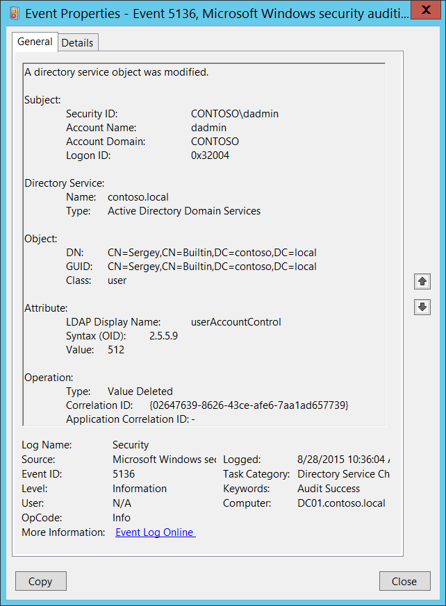

# 5136(S): ディレクトリ サービス オブジェクトが変更されました。



***サブカテゴリ:***&nbsp;[ディレクトリ サービスの変更の監査](audit-directory-service-changes.md)

***イベントの説明:***

このイベントは、Active Directory オブジェクトが変更されるたびに生成されます。

このイベントを生成するには、変更されたオブジェクトに [SACL](/windows/win32/secauthz/access-control-lists) に適切なエントリが必要です: 特定の属性に対する「**書き込み**」アクションの監査。

変更操作の場合、通常、1 つのアクションに対して 2 つの 5136 イベントが表示されます。**操作\\タイプ** フィールドが異なります: 「値が削除されました」と「値が追加されました」。 「値が削除されました」イベントには通常、以前の値が含まれ、「値が追加されました」イベントには新しい値が含まれます。

> **注**&nbsp;&nbsp;推奨事項については、このイベントの [セキュリティ監視の推奨事項](#security-monitoring-recommendations) を参照してください。

<br clear="all">

***イベント XML:***
```
- <Event xmlns="http://schemas.microsoft.com/win/2004/08/events/event">
- <System>
 <Provider Name="Microsoft-Windows-Security-Auditing" Guid="{54849625-5478-4994-A5BA-3E3B0328C30D}" /> 
 <EventID>5136</EventID> 
 <Version>0</Version> 
 <Level>0</Level> 
 <Task>14081</Task> 
 <Opcode>0</Opcode> 
 <Keywords>0x8020000000000000</Keywords> 
 <TimeCreated SystemTime="2015-08-28T17:36:04.129472600Z" /> 
 <EventRecordID>410204</EventRecordID> 
 <Correlation /> 
 <Execution ProcessID="516" ThreadID="4020" /> 
 <Channel>Security</Channel> 
 <Computer>DC01.contoso.local</Computer> 
 <Security /> 
 </System>
- <EventData>
 <Data Name="OpCorrelationID">{02647639-8626-43CE-AFE6-7AA1AD657739}</Data> 
 <Data Name="AppCorrelationID">-</Data> 
 <Data Name="SubjectUserSid">S-1-5-21-3457937927-2839227994-823803824-1104</Data> 
 <Data Name="SubjectUserName">dadmin</Data> 
 <Data Name="SubjectDomainName">CONTOSO</Data> 
 <Data Name="SubjectLogonId">0x32004</Data> 
 <Data Name="DSName">contoso.local</Data> 
 <Data Name="DSType">%%14676</Data> 
 <Data Name="ObjectDN">CN=Sergey,CN=Builtin,DC=contoso,DC=local</Data> 
 <Data Name="ObjectGUID">{4FE80A66-5F93-4F73-B215-68678058E613}</Data> 
 <Data Name="ObjectClass">user</Data> 
 <Data Name="AttributeLDAPDisplayName">userAccountControl</Data> 
 <Data Name="AttributeSyntaxOID">2.5.5.9</Data> 
 <Data Name="AttributeValue">512</Data> 
 <Data Name="OperationType">%%14675</Data> 
 </EventData>
 </Event>
```

***必要なサーバー ロール:*** Active Directory ドメイン コントローラー。

***最小 OS バージョン:*** Windows Server 2008。

***イベント バージョン:*** 0。

***フィールドの説明:***

**サブジェクト:**

-   **セキュリティ ID** \[タイプ = SID\]**:** 「オブジェクトの変更」操作を要求したアカウントの SID。イベント ビューアーは自動的に SID を解決し、アカウント名を表示しようとします。SID を解決できない場合、イベントにソース データが表示されます。

> **注**&nbsp;&nbsp;**セキュリティ識別子 (SID)** は、トラスティ (セキュリティ プリンシパル) を識別するために使用される可変長の一意の値です。各アカウントには、Active Directory ドメイン コントローラーなどの権限によって発行され、セキュリティ データベースに格納される一意の SID があります。ユーザーがログオンするたびに、システムはデータベースからそのユーザーの SID を取得し、そのユーザーのアクセス トークンに配置します。システムは、アクセス トークン内の SID を使用して、以降のすべての Windows セキュリティとのやり取りでユーザーを識別します。SID がユーザーまたはグループの一意の識別子として使用された場合、それが再び別のユーザーまたはグループを識別するために使用されることはありません。SID の詳細については、[セキュリティ識別子](/windows/access-protection/access-control/security-identifiers) を参照してください。

-   **アカウント名** \[タイプ = UnicodeString\]**:** 「オブジェクトの変更」操作を要求したアカウントの名前。

-   **アカウントドメイン** \[タイプ = UnicodeString\]**:** サブジェクトのドメインまたはコンピュータ名。形式はさまざまで、以下のものが含まれます：

    -   ドメインのNETBIOS名の例: CONTOSO

    -   小文字の完全なドメイン名: contoso.local

    -   大文字の完全なドメイン名: CONTOSO.LOCAL

    -   一部の[よく知られたセキュリティプリンシパル](/windows/security/identity-protection/access-control/security-identifiers)の場合、例えばLOCAL SERVICEやANONYMOUS LOGON、このフィールドの値は「NT AUTHORITY」となります。

    -   ローカルユーザーアカウントの場合、このフィールドにはこのアカウントが属するコンピュータまたはデバイスの名前が含まれます。例えば「Win81」のように。

-   **ログオンID** \[タイプ = HexInt64\]**:** 16進数の値で、最近のイベントと同じログオンIDを含む可能性のあるイベントとこのイベントを関連付けるのに役立ちます。例えば、「[4624](event-4624.md): アカウントが正常にログオンされました。」

**ディレクトリサービス:**

-   **名前** \[タイプ = UnicodeString\]: 変更されたオブジェクトが存在するActive Directoryドメインの名前。

-   **タイプ** \[タイプ = UnicodeString\]**:** このイベントの値は「**Active Directory Domain Services**」です。

**オブジェクト:**

-   **DN** \[タイプ = UnicodeString\]: 変更されたオブジェクトの識別名。

> **注**&nbsp;&nbsp;LDAP APIはLDAPオブジェクトをその**識別名 (DN)**で参照します。DNはカンマで接続された相対識別名 (RDN) のシーケンスです。
> 
> RDNは属性とその値の形式で、attribute=value; これらはRDN属性の例です：
> 
> • DC - domainComponent
> 
> • CN - commonName
> 
> • OU - organizationalUnitName
> 
> • O - organizationName

-   **GUID** \[タイプ = GUID\]**:** 各Active Directoryオブジェクトにはグローバルに一意の識別子 (GUID) があり、これはエンタープライズ内だけでなく世界中で一意の128ビットの値です。GUIDはActive Directoryによって作成されたすべてのオブジェクトに割り当てられます。各オブジェクトのGUIDはそのObject-GUID (**objectGUID**) プロパティに保存されます。

    Active Directoryは内部的にGUIDを使用してオブジェクトを識別します。例えば、GUIDはグローバルカタログに公開されるオブジェクトのプロパティの一つです。ユーザーオブジェクトのGUIDをグローバルカタログで検索すると、そのユーザーが企業内のどこかにアカウントを持っている場合に結果が得られます。実際、Object-GUIDでオブジェクトを検索することは、探しているオブジェクトを見つける最も信頼性の高い方法かもしれません。他のオブジェクトプロパティの値は変更される可能性がありますが、Object-GUIDは決して変更されません。オブジェクトにGUIDが割り当てられると、その値は一生保持されます。

    Event Viewerは**GUID**フィールドを自動的に実際のオブジェクトに解決します。

    このGUIDを翻訳するには、次の手順を使用します：

    -   LDP.exeツールを使用して次のLDAP検索を実行します：

        -   Base DN: CN=Schema,CN=Configuration,DC=XXX,DC=XXX

        -   Filter: (&(objectClass=\*)(objectGUID=GUID))

            -   検索リクエストで使用する前に、GUIDに対して次の操作を行います：

                -   検索するGUIDは次の通りです：a6b34ab5-551b-4626-b8ee-2b36b3ee6672

                -   最初の3つのセクションを取り出します：a6b34ab5-551b-4626

                -   これら3つのセクションの各バイトの順序を変更（反転）します：b54ab3a6-1b55-2646

                -   最後の2つのセクションを変換せずに追加します：b54ab3a6-1b55-2646-b8ee-2b36b3ee6672

                -   削除します：b54ab3a61b552646b8ee2b36b3ee6672

                -   バイトをバックスラッシュで区切ります：\\b5\\4a\\b3\\a6\\1b\\55\\26\\46\\b8\\ee\\2b\\36\\b3\\ee\\66\\72

            -   フィルターの例：(&(objectClass=\*)(objectGUID = \\b5\\4a\\b3\\a6\\1b\\55\\26\\46\\b8\\ee\\2b\\36\\b3\\ee\\66\\72))

        -   Scope: Subtree

        -   Attributes: objectGUID

<!-- -->

-   **Class** \[Type = UnicodeString\]: 変更されたオブジェクトのクラス。一般的なActive Directoryオブジェクトクラスのいくつか：

    -   container – コンテナ用。

    -   user – ユーザー用。

    -   group – グループ用。

    -   domainDNS – ドメインオブジェクト用。

    -   groupPolicyContainer – グループポリシーオブジェクト用。

        すべての可能な値については、Active Directory スキーマ スナップインを開きます (このスナップインを有効にする方法については、<https://technet.microsoft.com/library/Cc755885(v=WS.10).aspx> を参照)し、**Active Directory スキーマ\\クラス**に移動します。または、このドキュメントを使用します: <https://msdn.microsoft.com/library/cc221630.aspx>

**属性:**

-   **LDAP 表示名** \[タイプ = UnicodeString\]**:** 変更されたオブジェクト属性。

> **注**&nbsp;&nbsp;[LDAP 表示名](/windows/win32/adschema/a-ldapdisplayname) は、ADSI LDAP プロバイダーなどの LDAP クライアントが LDAP プロトコルを使用して属性を読み書きするために使用する名前です。

-   **構文 (OID)** \[タイプ = UnicodeString\]**:** 属性の構文は、ストレージ表現、バイト順序、およびプロパティ タイプの比較のための一致ルールを定義します。属性値が文字列、数値、または時間の単位である必要があるかどうかも定義されます。すべてのオブジェクトのすべての属性は、正確に 1 つの構文に関連付けられています。構文はスキーマ内のオブジェクトとして表されていませんが、Active Directory によって理解されるようにプログラムされています。Active Directory で許可される構文は事前定義されています。

| OID      | 構文名                                     | 説明                                                     |
|----------|--------------------------------------------|----------------------------------------------------------|
| 2.5.5.0  | 未定義                                     | 法的な構文ではありません。                               |
| 2.5.5.1  | オブジェクト(DN-DN)                        | ディレクトリ内のオブジェクトの完全修飾名。               |
| 2.5.5.2  | 文字列(オブジェクト識別子)                 | オブジェクト識別子。                                     |
| 2.5.5.3  | 大文字小文字を区別する文字列               | 一般的な文字列。                                         |
| 2.5.5.4  | 大文字小文字を区別しない文字列(Teletex)    | 大文字と小文字を区別します。                             |
| 2.5.5.5  | 文字列(印刷可能)、文字列(IA5)              | Teletex。大文字と小文字を区別しません。                 |
| 2.5.5.6  | 文字列(数値)                               | 印刷可能な文字列または IA5-文字列。                      |
| 2.5.5.7  | オブジェクト(DN-バイナリ)                  | 両方の文字セットは大文字小文字を区別します。             |
| 2.5.5.8  | ブール値                                   | 数字のシーケンス。                                       |
| 2.5.5.9  | 整数、列挙型                               | 識別名とバイナリ大規模オブジェクト。                     |
| 2.5.5.10 | 文字列(オクテット)                         | TRUE または FALSE の値。                                 |
| 2.5.5.11 | 文字列(UTC-時間)、文字列(一般化された時間) | 32 ビットの数値または列挙型。                            |
| 2.5.5.12 | 文字列(Unicode)                            | バイトの文字列。                                         |
| 2.5.5.13 | オブジェクト(プレゼンテーションアドレス)   | UTC 時間または一般化された時間。                         |
| 2.5.5.14 | オブジェクト(DN-文字列)                    | Unicode 文字列。                                         |
| 2.5.5.15 | 文字列(NT-Sec-Desc)                        | プレゼンテーションアドレス。                             |
| 2.5.5.16 | 大きな整数                                 | DN-文字列と Unicode 文字列。                             |
| 2.5.5.17 | 文字列(Sid)                                | Microsoft® Windows NT® セキュリティ記述子。              |

> 表10. LDAP属性構文OID。

-   **値** \[タイプ = UnicodeString\]: **Operation\\Type**フィールドに応じて、追加または削除された値。

**操作:**

-   **タイプ** \[タイプ = UnicodeString\]**:** 実行された操作のタイプ。

    -   **値が追加されました** – 新しい値が追加されました ('%%14674')

    -   **値が削除されました** – 値が削除されました ('%%14675', 通常「値が削除されました」は変更操作の一部です)。

<!-- -->

-   **相関ID** \[タイプ = GUID\]: 複数の変更がLDAPを介して1つの操作として実行されることがよくあります。この値を使用して、操作を構成するすべての変更イベントを相関させることができます。同じ**相関ID**を持つ現在のサブカテゴリからの他のイベントを探すだけです。例えば、「[5137](event-5137.md): ディレクトリサービスオブジェクトが作成されました。」および「[5139](event-5139.md): ディレクトリサービスオブジェクトが移動されました。」などです。

> **注**&nbsp;&nbsp;**GUID**は「Globally Unique Identifier」の略です。リソース、アクティビティ、またはインスタンスを識別するために使用される128ビットの整数です。

-   **アプリケーション相関ID** \[タイプ = UnicodeString\]: 常に「**-**」の値を持ちます。使用されていません。

## セキュリティ監視の推奨事項

5136(S): ディレクトリサービスオブジェクトが変更されました。

> **重要**&nbsp;&nbsp;このイベントについては、[付録A: 多くの監査イベントに対するセキュリティ監視の推奨事項](appendix-a-security-monitoring-recommendations-for-many-audit-events.md)も参照してください。

-   特定のActive Directoryオブジェクトの変更を監視する必要がある場合は、特定のオブジェクト名を持つ**DN**フィールドを監視してください。例えば、「**CN=AdminSDHolder,CN=System,DC=domain,DC=com**」オブジェクトのすべての変更を監視することをお勧めします。

-   特定のActive Directoryクラスの変更を監視する必要がある場合は、特定のクラス名を持つ**Class**フィールドを監視してください。例えば、**domainDNS**クラスのすべての変更を監視することをお勧めします。

-   特定のActive Directory属性の変更を監視する必要がある場合は、特定の属性名を持つ**LDAP表示名**フィールドを監視してください。

-   **Operation\\Type = Value Added**イベントを監視する方が良いです。なぜなら、属性の新しい値を見ることができるからです。同時に、同じ**相関ID**を持つ以前の**Operation\\Type = Value Deleted**イベントと相関させて、以前の値を見ることができます。

了解しました。翻訳するMarkdownコンテンツを入力してください。
