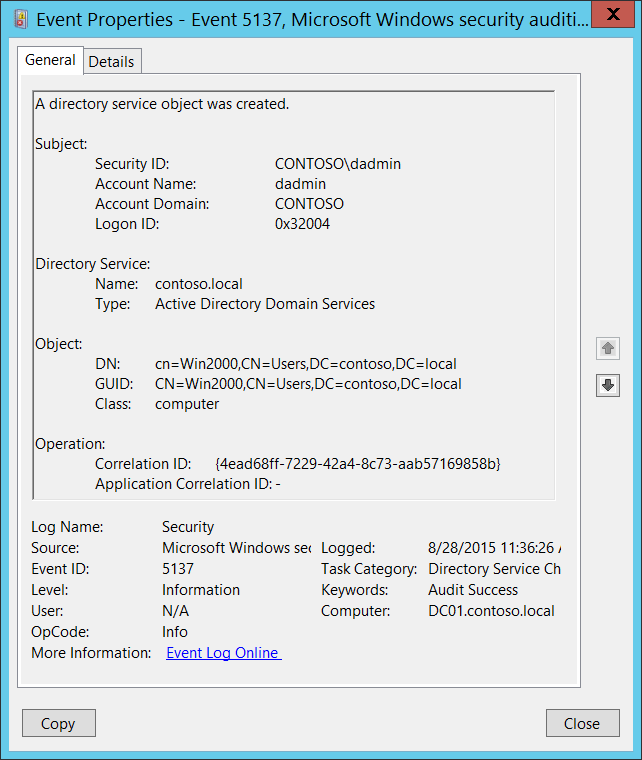

# 5137(S): ディレクトリ サービス オブジェクトが作成されました。



***サブカテゴリ:***&nbsp;[ディレクトリ サービスの変更の監査](audit-directory-service-changes.md)

***イベントの説明:***

このイベントは、Active Directory オブジェクトが作成されるたびに生成されます。

このイベントは、親オブジェクトが特定のエントリを [SACL](/windows/win32/secauthz/access-control-lists) に持っている場合にのみ生成されます: 「**作成**」アクション、特定のクラスまたはオブジェクトの監査。例としては、組織単位の「**コンピュータ オブジェクトの作成**」アクションの監査があります。

> **注**&nbsp;&nbsp;推奨事項については、このイベントの[セキュリティ監視の推奨事項](#security-monitoring-recommendations)を参照してください。

<br clear="all">

***イベント XML:***
```
- <Event xmlns="http://schemas.microsoft.com/win/2004/08/events/event">
- <System>
 <Provider Name="Microsoft-Windows-Security-Auditing" Guid="{54849625-5478-4994-A5BA-3E3B0328C30D}" /> 
 <EventID>5137</EventID> 
 <Version>0</Version> 
 <Level>0</Level> 
 <Task>14081</Task> 
 <Opcode>0</Opcode> 
 <Keywords>0x8020000000000000</Keywords> 
 <TimeCreated SystemTime="2015-08-28T18:36:26.048167500Z" /> 
 <EventRecordID>410737</EventRecordID> 
 <Correlation /> 
 <Execution ProcessID="516" ThreadID="3156" /> 
 <Channel>Security</Channel> 
 <Computer>DC01.contoso.local</Computer> 
 <Security /> 
 </System>
- <EventData>
 <Data Name="OpCorrelationID">{4EAD68FF-7229-42A4-8C73-AAB57169858B}</Data> 
 <Data Name="AppCorrelationID">-</Data> 
 <Data Name="SubjectUserSid">S-1-5-21-3457937927-2839227994-823803824-1104</Data> 
 <Data Name="SubjectUserName">dadmin</Data> 
 <Data Name="SubjectDomainName">CONTOSO</Data> 
 <Data Name="SubjectLogonId">0x32004</Data> 
 <Data Name="DSName">contoso.local</Data> 
 <Data Name="DSType">%%14676</Data> 
 <Data Name="ObjectDN">cn=Win2000,CN=Users,DC=contoso,DC=local</Data> 
 <Data Name="ObjectGUID">{41D5F7AF-64A2-4985-9A4B-70DAAFC7CCE6}</Data> 
 <Data Name="ObjectClass">computer</Data> 
 </EventData>
 </Event>
```

***必要なサーバー ロール:*** Active Directory ドメイン コントローラー。

***最小 OS バージョン:*** Windows Server 2008。

***イベント バージョン:*** 0。

***フィールドの説明:***

**サブジェクト:**

-   **セキュリティ ID** \[タイプ = SID\]**:** 「オブジェクトの作成」操作を要求したアカウントの SID。イベント ビューアーは自動的に SID を解決し、アカウント名を表示しようとします。SID を解決できない場合は、イベントにソース データが表示されます。

> **注**&nbsp;&nbsp;**セキュリティ識別子 (SID)** は、トラスティ (セキュリティ プリンシパル) を識別するために使用される可変長の一意の値です。各アカウントには、Active Directory ドメイン コントローラーなどの権限によって発行され、セキュリティ データベースに保存される一意の SID があります。ユーザーがログオンするたびに、システムはデータベースからそのユーザーの SID を取得し、そのユーザーのアクセス トークンに配置します。システムは、アクセス トークン内の SID を使用して、以降のすべての Windows セキュリティとのやり取りでユーザーを識別します。SID がユーザーまたはグループの一意の識別子として使用された場合、それは他のユーザーまたはグループを識別するために再利用されることはありません。SID の詳細については、[セキュリティ識別子](/windows/access-protection/access-control/security-identifiers)を参照してください。

-   **アカウント名** \[タイプ = UnicodeString\]**:** 「オブジェクト作成」操作を要求したアカウントの名前。

-   **アカウントドメイン** \[タイプ = UnicodeString\]**:** サブジェクトのドメインまたはコンピュータ名。形式は様々で、以下のようなものが含まれます：

    -   ドメインのNETBIOS名の例: CONTOSO

    -   小文字の完全ドメイン名: contoso.local

    -   大文字の完全ドメイン名: CONTOSO.LOCAL

    -   一部の[よく知られたセキュリティプリンシパル](/windows/security/identity-protection/access-control/security-identifiers)の場合、例えばLOCAL SERVICEやANONYMOUS LOGON、このフィールドの値は「NT AUTHORITY」となります。

    -   ローカルユーザーアカウントの場合、このフィールドにはこのアカウントが属するコンピュータまたはデバイスの名前が含まれます。例えば：「Win81」。

-   **ログオンID** \[タイプ = HexInt64\]**:** 16進数の値で、最近のイベントと同じログオンIDを含む可能性のあるイベントとこのイベントを関連付けるのに役立ちます。例えば、「[4624](event-4624.md): アカウントが正常にログオンされました。」

**ディレクトリサービス:**

-   **名前** \[タイプ = UnicodeString\]: 新しいオブジェクトが作成されたActive Directoryドメインの名前。

-   **タイプ** \[タイプ = UnicodeString\]**:** このイベントの値は「**Active Directory Domain Services**」です。

**オブジェクト:**

-   **DN** \[タイプ = UnicodeString\]: 作成されたオブジェクトの識別名。

> **注**&nbsp;&nbsp;LDAP APIはLDAPオブジェクトをその**識別名 (DN)**で参照します。DNはカンマで接続された相対識別名 (RDN) のシーケンスです。
> 
> RDNは属性とその値の形式で、attribute=value; です。これらはRDN属性の例です：
> 
> • DC - domainComponent
> 
> • CN - commonName
> 
> • OU - organizationalUnitName
> 
> • O - organizationName

-   **GUID** \[タイプ = GUID\]**:** 各Active Directoryオブジェクトにはグローバルに一意の識別子 (GUID) があり、これはエンタープライズ内だけでなく世界中で一意の128ビットの値です。GUIDはActive Directoryによって作成されたすべてのオブジェクトに割り当てられます。各オブジェクトのGUIDはそのObject-GUID (**objectGUID**) プロパティに格納されます。

    Active Directoryは内部的にGUIDを使用してオブジェクトを識別します。例えば、GUIDはグローバルカタログに公開されるオブジェクトのプロパティの一つです。ユーザーオブジェクトのGUIDをグローバルカタログで検索すると、そのユーザーが企業内のどこかにアカウントを持っている場合に結果が得られます。実際、Object-GUIDでオブジェクトを検索することは、探したいオブジェクトを見つける最も信頼性の高い方法かもしれません。他のオブジェクトプロパティの値は変更される可能性がありますが、Object-GUIDは決して変更されません。オブジェクトにGUIDが割り当てられると、その値は生涯保持されます。

    Event Viewerは**GUID**フィールドを自動的に実際のオブジェクトに解決します。

    このGUIDを翻訳するには、次の手順を使用します：

    -   LDP.exeツールを使用して次のLDAP検索を実行します：

        -   Base DN: CN=Schema,CN=Configuration,DC=XXX,DC=XXX

        -   Filter: (&(objectClass=\*)(objectGUID=GUID))

            -   検索リクエストで使用する前に、GUIDに対して次の操作を行います：

                -   検索するGUIDは次の通りです：a6b34ab5-551b-4626-b8ee-2b36b3ee6672

                -   最初の3つのセクションa6b34ab5-551b-4626を取り出します。

                -   これら3つのセクションの各バイトの順序を変更（反転）します：b54ab3a6-1b55-2646

                -   最後の2つのセクションを変換せずに追加します：b54ab3a6-1b55-2646-b8ee-2b36b3ee6672

                -   削除します：b54ab3a61b552646b8ee2b36b3ee6672

                -   バイトをバックスラッシュで区切ります：\\b5\\4a\\b3\\a6\\1b\\55\\26\\46\\b8\\ee\\2b\\36\\b3\\ee\\66\\72

            -   フィルターの例：(&(objectClass=\*)(objectGUID = \\b5\\4a\\b3\\a6\\1b\\55\\26\\46\\b8\\ee\\2b\\36\\b3\\ee\\66\\72))

        -   Scope: Subtree

        -   Attributes: objectGUID

-   **Class** \[Type = UnicodeString\]: 作成されたオブジェクトのクラス。一般的なActive Directoryオブジェクトクラスのいくつか：

    -   container – コンテナ用。

    -   user – ユーザー用。

    -   group – グループ用。

    -   domainDNS – ドメインオブジェクト用。

    -   groupPolicyContainer – グループポリシーオブジェクト用。

        すべての可能な値については、Active Directory スキーマ スナップインを開きます (このスナップインを有効にする方法については、<https://technet.microsoft.com/library/Cc755885(v=WS.10).aspx> を参照) し、**Active Directory スキーマ\\クラス**に移動します。または、このドキュメントを使用します: <https://msdn.microsoft.com/library/cc221630.aspx>

**操作:**

-   **相関 ID** \[タイプ = GUID\]: 複数の変更が LDAP を介して 1 つの操作として実行されることがよくあります。この値を使用すると、操作を構成するすべての変更イベントを相関させることができます。同じ**相関 ID**を持つ現在のサブカテゴリからの他のイベントを探すだけです。たとえば、「[5136](event-5136.md): ディレクトリ サービス オブジェクトが変更されました。」および「[5139](event-5139.md): ディレクトリ サービス オブジェクトが移動されました。」などです。

> **注**&nbsp;&nbsp;**GUID**は「グローバルに一意の識別子」の頭字語です。これは、リソース、アクティビティ、またはインスタンスを識別するために使用される 128 ビットの整数です。

-   **アプリケーション相関 ID** \[タイプ = UnicodeString\]: 常に「**-**」の値を持ちます。使用されていません。

## セキュリティ監視の推奨事項

5137(S): ディレクトリ サービス オブジェクトが作成されました。

> **重要**&nbsp;&nbsp;このイベントについては、[付録 A: 多くの監査イベントに対するセキュリティ監視の推奨事項](appendix-a-security-monitoring-recommendations-for-many-audit-events.md)も参照してください。

-   特定のクラスを持つ Active Directory オブジェクトの作成を監視する必要がある場合は、特定のクラス名を持つ**クラス**フィールドを監視します。たとえば、すべての新しいグループ ポリシー オブジェクトの作成を監視することをお勧めします: **groupPolicyContainer**クラス。

-   [5137](event-5137.md) を取得するには、Active Directory コンテナー内の特定のクラスに対して正しい監査アクセス リスト (SACL) を設定する必要があります。すべての種類の Active Directory オブジェクトのすべての作成イベントを監査する理由はありません。最も重要な場所 (組織単位、フォルダーなど) を見つけて、特定のクラス (ユーザー、コンピューター、グループなど) の作成のみを監視します。
