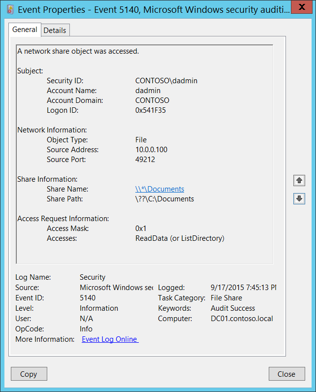

# 5140(S, F): ネットワーク共有オブジェクトがアクセスされました。



***サブカテゴリ:***&nbsp;[監査ファイル共有](audit-file-share.md)

***イベントの説明:***

このイベントは、ネットワーク共有オブジェクトがアクセスされるたびに生成されます。

このイベントは、最初のアクセス試行が行われたときに、セッションごとに一度生成されます。

> **注**&nbsp;&nbsp;推奨事項については、このイベントの[セキュリティ監視の推奨事項](#security-monitoring-recommendations)を参照してください。

<br clear="all">

***イベント XML:***
```
- <Event xmlns="http://schemas.microsoft.com/win/2004/08/events/event">
- <System>
 <Provider Name="Microsoft-Windows-Security-Auditing" Guid="{54849625-5478-4994-A5BA-3E3B0328C30D}" /> 
 <EventID>5140</EventID> 
 <Version>1</Version> 
 <Level>0</Level> 
 <Task>12808</Task> 
 <Opcode>0</Opcode> 
 <Keywords>0x8020000000000000</Keywords> 
 <TimeCreated SystemTime="2015-09-18T02:45:13.581231400Z" /> 
 <EventRecordID>268495</EventRecordID> 
 <Correlation /> 
 <Execution ProcessID="4" ThreadID="772" /> 
 <Channel>Security</Channel> 
 <Computer>DC01.contoso.local</Computer> 
 <Security /> 
 </System>
- <EventData>
 <Data Name="SubjectUserSid">S-1-5-21-3457937927-2839227994-823803824-1104</Data> 
 <Data Name="SubjectUserName">dadmin</Data> 
 <Data Name="SubjectDomainName">CONTOSO</Data> 
 <Data Name="SubjectLogonId">0x541f35</Data> 
 <Data Name="ObjectType">File</Data> 
 <Data Name="IpAddress">10.0.0.100</Data> 
 <Data Name="IpPort">49212</Data> 
 <Data Name="ShareName">\\\\\*\\Documents</Data> 
 <Data Name="ShareLocalPath">\\??\\C:\\Documents</Data> 
 <Data Name="AccessMask">0x1</Data> 
 <Data Name="AccessList">%%4416</Data> 
 </EventData>
 </Event>
```

***必要なサーバー役割:*** なし。

***最小 OS バージョン:*** Windows Server 2008, Windows Vista。

***イベントバージョン:***

-   0 - Windows Server 2008, Windows Vista。

***フィールドの説明:***

**サブジェクト:**

-   **セキュリティ ID** \[タイプ = SID\]**:** ネットワーク共有オブジェクトへのアクセスを要求したアカウントの SID。イベントビューアーは自動的に SID を解決し、アカウント名を表示しようとします。SID を解決できない場合、イベントにソースデータが表示されます。

> **注**&nbsp;&nbsp;**セキュリティ識別子 (SID)** は、トラスティ (セキュリティプリンシパル) を識別するために使用される可変長の一意の値です。各アカウントには、Active Directory ドメインコントローラーなどの権限によって発行され、セキュリティデータベースに保存される一意の SID があります。ユーザーがログオンするたびに、システムはデータベースからそのユーザーの SID を取得し、そのユーザーのアクセス トークンに配置します。システムは、アクセス トークン内の SID を使用して、以降のすべての Windows セキュリティとのやり取りでユーザーを識別します。SID がユーザーまたはグループの一意の識別子として使用された場合、それは他のユーザーまたはグループを識別するために再利用されることはありません。SID の詳細については、[セキュリティ識別子](/windows/access-protection/access-control/security-identifiers)を参照してください。

-   **アカウント名** \[タイプ = UnicodeString\]**:** ネットワーク共有オブジェクトへのアクセスを要求したアカウントの名前。

-   **アカウントドメイン** \[タイプ = UnicodeString\]**:** サブジェクトのドメインまたはコンピュータ名。形式はさまざまで、以下のものが含まれます：

    -   ドメインのNETBIOS名の例: CONTOSO

    -   小文字の完全なドメイン名: contoso.local

    -   大文字の完全なドメイン名: CONTOSO.LOCAL

    -   一部の[よく知られたセキュリティプリンシパル](/windows/security/identity-protection/access-control/security-identifiers)の場合、例えばLOCAL SERVICEやANONYMOUS LOGON、このフィールドの値は「NT AUTHORITY」となります。

    -   ローカルユーザーアカウントの場合、このフィールドにはこのアカウントが属するコンピュータまたはデバイスの名前が含まれます。例えば、「Win81」。

-   **ログオンID** \[タイプ = HexInt64\]**:** 16進数の値で、最近のイベントと同じログオンIDを含む可能性のあるイベントとこのイベントを関連付けるのに役立ちます。例えば、「[4624](event-4624.md): アカウントが正常にログオンされました。」

**ネットワーク情報:**

-   **オブジェクトタイプ** \[タイプ = UnicodeString\]: 操作中にアクセスされたオブジェクトのタイプ。このイベントでは常に「**File**」。

    以下の表は、最も一般的な**オブジェクトタイプ**のリストを含んでいます：

| ディレクトリ           | イベント      | タイマー             | デバイス      |
|-------------------------|--------------|----------------------|--------------|
| ミュータント            | タイプ        | ファイル             | トークン      |
| スレッド                | セクション    | ウィンドウステーション | デバッグオブジェクト |
| フィルター通信ポート    | イベントペア  | ドライバー           | IoCompletion |
| コントローラー          | シンボリックリンク | WmiGuid            | プロセス      |
| プロファイル            | デスクトップ  | キードイベント       | アダプター    |
| キー                    | 待機可能ポート | コールバック         | セマフォ      |
| ジョブ                  | ポート        | フィルター接続ポート | ALPCポート    |

-   **ソースアドレス** \[タイプ = UnicodeString\]**:** アクセスが行われたソースIPアドレス。


    -   クライアントのIPv6アドレスまたは::ffff:IPv4アドレス。

    -   ::1または127.0.0.1はlocalhostを意味します。

-   **ソースポート** \[タイプ = UnicodeString\]: リモートまたはローカルマシンからアクセス要求に使用されたソースTCPまたはUDPポート。

    -   ローカルアクセス試行の場合は0。

**共有情報:**

-   **共有名** \[タイプ = UnicodeString\]**:** アクセスされたネットワーク共有の名前。形式は: \\\\\*\\SHARE\_NAME。

-   **共有パス** \[タイプ = UnicodeString\]**:** アクセスされた共有の完全なシステム（NTFS）パス。形式は: \\\\??\\PATH。例えば、**共有名**が \\\\\*\\IPC$ の場合は空になることがあります。

**アクセス要求情報:**

-   **アクセスマスク** \[タイプ = HexInt32\]: 要求されたアクセス権の16進数値の合計。アクセス権の異なる16進数値については[ファイルアクセスコードの表](/windows/security/threat-protection/auditing/event-5145#table-of-file-access-codes)を参照してください。このイベントでは常に「**0x1**」の値を持ちます。

-   **アクセス** \[タイプ = UnicodeString\]: **Subject\\Security ID**によって要求されたアクセス権のリスト。これらのアクセス権は**オブジェクトタイプ**に依存します。このイベントでは常に「**ReadData (or ListDirectory)**」の値を持ちます。

## セキュリティ監視の推奨事項

5140(S, F): ネットワーク共有オブジェクトがアクセスされました。

> **重要**&nbsp;&nbsp;このイベントについては、[付録A: 多くの監査イベントのためのセキュリティ監視の推奨事項](appendix-a-security-monitoring-recommendations-for-many-audit-events.md)も参照してください。

- すべての共有または特定の共有（「**共有名**」）へのすべてのアクセスを監視する必要がある高価値のコンピュータがある場合、このイベントを監視します。例えば、ドメインコントローラ上の共有**C$**を監視することができます。

- **ネットワーク情報\\ソースアドレス**が内部IP範囲からのものでない場合、このイベントを監視します。

- **ネットワーク情報\\ソースアドレス**が特定のコンピュータ（**コンピュータ:**）に接続できないはずの場合、このイベントを監視します。

- 特定のIPアドレス（「**ネットワーク情報\\ソースアドレス**」）からのローカル共有へのアクセス試行を監視する必要がある場合、このイベントを使用します。

- 特定のアクセス タイプ (例えば、ReadData や WriteData) を監視する必要がある場合、すべての共有または特定の共有 ("**Share Name**") に対して、このイベントの "**Access Type**" を監視します。
