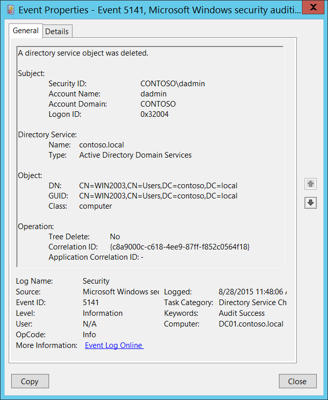
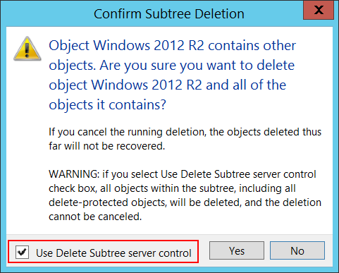

# 5141(S): ディレクトリ サービス オブジェクトが削除されました。



***サブカテゴリ:***&nbsp;[ディレクトリ サービスの変更の監査](audit-directory-service-changes.md)

***イベントの説明:***

このイベントは、Active Directory オブジェクトが削除されるたびに生成されます。

このイベントは、削除されたオブジェクトが特定のエントリを [SACL](/windows/win32/secauthz/access-control-lists) に持っている場合にのみ生成されます: 「**削除**」アクション、特定のオブジェクトの監査。

> **注**&nbsp;&nbsp;推奨事項については、このイベントの [セキュリティ監視の推奨事項](#security-monitoring-recommendations) を参照してください。

<br clear="all">

***イベント XML:***
```xml
- <Event xmlns="http://schemas.microsoft.com/win/2004/08/events/event">
- <System>
 <Provider Name="Microsoft-Windows-Security-Auditing" Guid="{54849625-5478-4994-A5BA-3E3B0328C30D}" /> 
 <EventID>5141</EventID> 
 <Version>0</Version> 
 <Level>0</Level> 
 <Task>14081</Task> 
 <Opcode>0</Opcode> 
 <Keywords>0x8020000000000000</Keywords> 
 <TimeCreated SystemTime="2015-08-28T18:48:06.792762900Z" /> 
 <EventRecordID>411118</EventRecordID> 
 <Correlation /> 
 <Execution ProcessID="516" ThreadID="4092" /> 
 <Channel>Security</Channel> 
 <Computer>DC01.contoso.local</Computer> 
 <Security /> 
 </System>
- <EventData>
 <Data Name="OpCorrelationID">{C8A9000C-C618-4EE9-87FF-F852C0564F18}</Data> 
 <Data Name="AppCorrelationID">-</Data> 
 <Data Name="SubjectUserSid">S-1-5-21-3457937927-2839227994-823803824-1104</Data> 
 <Data Name="SubjectUserName">dadmin</Data> 
 <Data Name="SubjectDomainName">CONTOSO</Data> 
 <Data Name="SubjectLogonId">0x32004</Data> 
 <Data Name="DSName">contoso.local</Data> 
 <Data Name="DSType">%%14676</Data> 
 <Data Name="ObjectDN">CN=WIN2003,CN=Users,DC=contoso,DC=local</Data> 
 <Data Name="ObjectGUID">{CA15B875-AFB1-4E5A-86B2-96E61DE09110}</Data> 
 <Data Name="ObjectClass">computer</Data> 
 <Data Name="TreeDelete">%%14679</Data> 
 </EventData>
 </Event>
```

***必要なサーバー ロール:*** Active Directory ドメイン コントローラー。

***最小 OS バージョン:*** Windows Server 2008。

***イベント バージョン:*** 0。

***フィールドの説明:***

**サブジェクト:**

-   **セキュリティ ID** \[タイプ = SID\]**:** 「オブジェクトの削除」操作を要求したアカウントの SID。イベント ビューアーは自動的に SID を解決し、アカウント名を表示しようとします。SID を解決できない場合、イベントにソース データが表示されます。

> **注**&nbsp;&nbsp;**セキュリティ識別子 (SID)** は、トラスティ (セキュリティ プリンシパル) を識別するために使用される可変長の一意の値です。各アカウントには、Active Directory ドメイン コントローラーなどの権限によって発行され、セキュリティ データベースに保存される一意の SID があります。ユーザーがログオンするたびに、システムはデータベースからそのユーザーの SID を取得し、そのユーザーのアクセストークンに配置します。システムは、アクセストークン内の SID を使用して、以降のすべての Windows セキュリティとのやり取りでユーザーを識別します。SID がユーザーまたはグループの一意の識別子として使用された場合、それは他のユーザーまたはグループを識別するために再利用されることはありません。SID の詳細については、[セキュリティ識別子](/windows/access-protection/access-control/security-identifiers) を参照してください。

-   **アカウント名** \[タイプ = UnicodeString\]**:** 「オブジェクト削除」操作を要求したアカウントの名前。

-   **アカウントドメイン** \[タイプ = UnicodeString\]**:** サブジェクトのドメインまたはコンピュータ名。形式は以下のように異なります：

    -   ドメインのNETBIOS名の例: CONTOSO

    -   小文字の完全ドメイン名: contoso.local

    -   大文字の完全ドメイン名: CONTOSO.LOCAL

    -   一部の[よく知られたセキュリティプリンシパル](/windows/security/identity-protection/access-control/security-identifiers)の場合、このフィールドの値は「NT AUTHORITY」となります（例：LOCAL SERVICEやANONYMOUS LOGON）。

    -   ローカルユーザーアカウントの場合、このフィールドにはこのアカウントが属するコンピュータまたはデバイスの名前が含まれます。例：「Win81」。

-   **ログオンID** \[タイプ = HexInt64\]**:** 16進数の値で、最近のイベントと同じログオンIDを含む可能性のあるイベントとこのイベントを関連付けるのに役立ちます。例：「[4624](event-4624.md): アカウントが正常にログオンされました。」

**ディレクトリサービス:**

-   **名前** \[タイプ = UnicodeString\]: オブジェクトが削除されたActive Directoryドメインの名前。

-   **タイプ** \[タイプ = UnicodeString\]**:** このイベントの値は「**Active Directory Domain Services**」です。

**オブジェクト:**

-   **DN** \[タイプ = UnicodeString\]: 削除されたオブジェクトの識別名。

> **注**&nbsp;&nbsp;LDAP APIはLDAPオブジェクトをその**識別名 (DN)**で参照します。DNは相対識別名 (RDN) のシーケンスで、カンマで接続されています。
> 
> RDNは属性とその値の形式 attribute=value; で構成されます。以下はRDN属性の例です：
> 
> • DC - domainComponent
> 
> • CN - commonName
> 
> • OU - organizationalUnitName
> 
> • O - organizationName

-   **GUID** \[タイプ = GUID\]**:** 各Active Directoryオブジェクトにはグローバルに一意の識別子 (GUID) があり、これはエンタープライズ内だけでなく世界中で一意の128ビットの値です。GUIDはActive Directoryによって作成されたすべてのオブジェクトに割り当てられます。各オブジェクトのGUIDはそのObject-GUID (**objectGUID**)プロパティに格納されます。

    Active Directoryは内部的にGUIDを使用してオブジェクトを識別します。例えば、GUIDはグローバルカタログに公開されるオブジェクトのプロパティの一つです。ユーザーオブジェクトのGUIDをグローバルカタログで検索すると、そのユーザーが企業内のどこかにアカウントを持っている場合に結果が得られます。実際、Object-GUIDでオブジェクトを検索することは、探しているオブジェクトを見つける最も信頼性の高い方法かもしれません。他のオブジェクトプロパティの値は変更される可能性がありますが、Object-GUIDは決して変更されません。オブジェクトにGUIDが割り当てられると、その値は生涯保持されます。

    Event Viewerは**GUID**フィールドを自動的に実際のオブジェクトに解決します。削除されたオブジェクトの場合、**GUID**はオブジェクトの新しい宛先に解決されます。例えば、OU=My\\0ADEL:cc94c0d7-dd53-4061-9791-e53478dbbc3b,CN=Deleted Objects,DC=contoso,DC=localのようになります。

    このGUIDを翻訳するには、次の手順を使用します：

    -   LDP.exeツールを使用して次のLDAP検索を実行します：

        -   Base DN: CN=Schema,CN=Configuration,DC=XXX,DC=XXX

        -   Filter: (&(objectClass=\*)(objectGUID=GUID))

            -   検索リクエストで使用する前に、GUIDに対して次の操作を行います：

                -   検索するGUIDは次の通りです：a6b34ab5-551b-4626-b8ee-2b36b3ee6672

                -   最初の3つのセクションを取り出します：a6b34ab5-551b-4626

                -   これら3つのセクションの各バイトの順序を変更（反転）します：b54ab3a6-1b55-2646

                -   最後の2つのセクションを変換せずに追加します：b54ab3a6-1b55-2646-b8ee-2b36b3ee6672

                -   削除します：b54ab3a61b552646b8ee2b36b3ee6672

                -   バイトをバックスラッシュで区切ります：\\b5\\4a\\b3\\a6\\1b\\55\\26\\46\\b8\\ee\\2b\\36\\b3\\ee\\66\\72

            -   フィルターの例：(&(objectClass=\*)(objectGUID = \\b5\\4a\\b3\\a6\\1b\\55\\26\\46\\b8\\ee\\2b\\36\\b3\\ee\\66\\72))

        -   Scope: Subtree

        -   Attributes: objectGUID

<!-- -->

-   **Class** \[Type = UnicodeString\]: 削除されたオブジェクトのクラス。一般的なActive Directoryオブジェクトクラスのいくつか：

-   container – コンテナ用。

-   user – ユーザー用。

-   group – グループ用。

-   domainDNS – ドメインオブジェクト用。

-   groupPolicyContainer – グループポリシーオブジェクト用。

    このフィールドのすべての可能な値については、Active Directory スキーマ スナップインを開きます（このスナップインを有効にする方法については、<https://technet.microsoft.com/library/Cc755885(v=WS.10).aspx> を参照）し、**Active Directory スキーマ\\クラス**に移動します。または、このドキュメントを使用します: <https://msdn.microsoft.com/library/cc221630.aspx>

**操作:**

-   **ツリー削除** \[タイプ = UnicodeString\]**:**

    -   **はい** – 「サブツリー削除」操作が実行されました。たとえば、Active Directory ユーザーとコンピュータ管理コンソールを使用して削除操作を行う際に、「サブツリー削除サーバーコントロールを使用する」チェックボックスがオンになっていた場合に発生します。

    -   **いいえ** – 「サブツリー削除」サーバーコントロールなしで削除操作が実行されました。



-   **相関ID** \[タイプ = GUID\]: 複数の変更がLDAPを介して1つの操作として実行されることがよくあります。この値を使用して、操作を構成するすべての変更イベントを相関させることができます。同じ**相関ID**を持つ現在のサブカテゴリの他のイベントを探します。たとえば、「[5137](event-5137.md): ディレクトリサービスオブジェクトが作成されました。」および「[5139](event-5139.md): ディレクトリサービスオブジェクトが移動されました。」などです。

> **注**&nbsp;&nbsp;**GUID**は「グローバル一意識別子」の略です。リソース、アクティビティ、またはインスタンスを識別するために使用される128ビットの整数です。

-   **アプリケーション相関ID** \[タイプ = UnicodeString\]: 常に「**-**」の値を持ちます。使用されていません。

## セキュリティ監視の推奨事項

5141(S): ディレクトリサービスオブジェクトが削除されました。

> **重要**&nbsp;&nbsp;このイベントについては、[付録A: 多くの監査イベントに対するセキュリティ監視の推奨事項](appendix-a-security-monitoring-recommendations-for-many-audit-events.md)も参照してください。

-   特定のクラスを持つActive Directoryオブジェクトの削除を監視する必要がある場合は、特定のクラス名を持つ**クラス**フィールドを監視します。たとえば、グループポリシーオブジェクトの削除を監視することをお勧めします: **groupPolicyContainer**クラス。

-   特定のActive Directoryオブジェクトの削除を監視する必要がある場合、特定のオブジェクト名を持つ**DN**フィールドを監視します。例えば、削除されるべきでない重要なActive Directoryオブジェクトがある場合、それらの削除を監視します。
