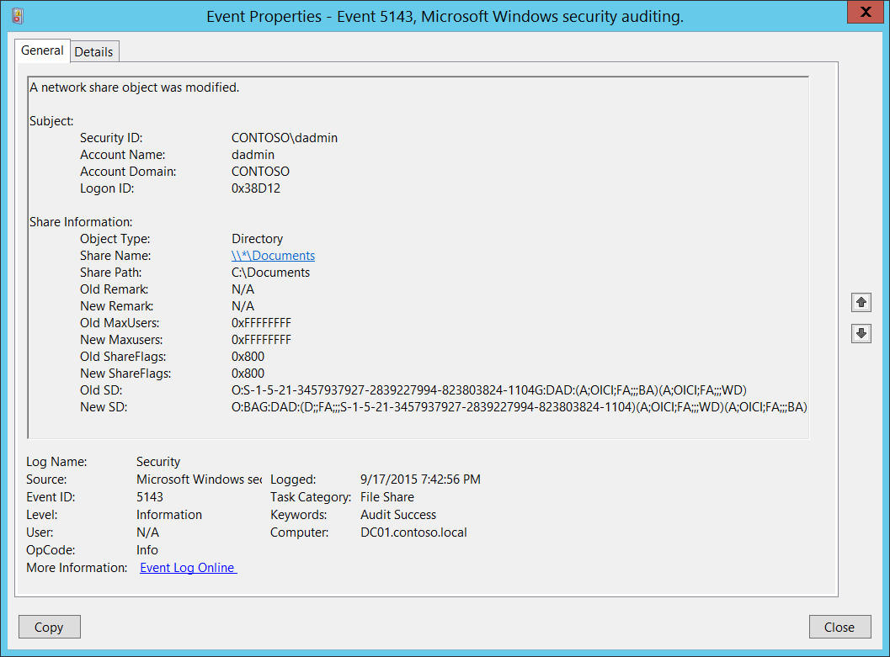
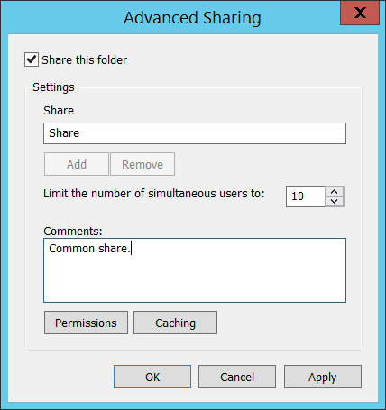
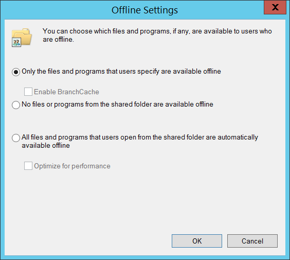

# 5143(S): ネットワーク共有オブジェクトが変更されました。



***サブカテゴリ:***&nbsp;[ファイル共有の監査](audit-file-share.md)

***イベントの説明:***

このイベントは、ネットワーク共有オブジェクトが変更されるたびに生成されます。

> **注**&nbsp;&nbsp;推奨事項については、このイベントの[セキュリティ監視の推奨事項](#security-monitoring-recommendations)を参照してください。

<br clear="all">

***イベント XML:***
```xml
- <Event xmlns="http://schemas.microsoft.com/win/2004/08/events/event">
- <System>
 <Provider Name="Microsoft-Windows-Security-Auditing" Guid="{54849625-5478-4994-A5BA-3E3B0328C30D}" /> 
 <EventID>5143</EventID> 
 <Version>0</Version> 
 <Level>0</Level> 
 <Task>12808</Task> 
 <Opcode>0</Opcode> 
 <Keywords>0x8020000000000000</Keywords> 
 <TimeCreated SystemTime="2015-09-18T02:42:56.743298600Z" /> 
 <EventRecordID>268483</EventRecordID> 
 <Correlation /> 
 <Execution ProcessID="516" ThreadID="524" /> 
 <Channel>Security</Channel> 
 <Computer>DC01.contoso.local</Computer> 
 <Security /> 
 </System>
- <EventData>
 <Data Name="SubjectUserSid">S-1-5-21-3457937927-2839227994-823803824-1104</Data> 
 <Data Name="SubjectUserName">dadmin</Data> 
 <Data Name="SubjectDomainName">CONTOSO</Data> 
 <Data Name="SubjectLogonId">0x38d12</Data> 
 <Data Name="ObjectType">Directory</Data> 
 <Data Name="ShareName">\\\\\*\\Documents</Data> 
 <Data Name="ShareLocalPath">C:\\Documents</Data> 
 <Data Name="OldRemark">N/A</Data> 
 <Data Name="NewRemark">N/A</Data> 
 <Data Name="OldMaxUsers">0xffffffff</Data> 
 <Data Name="NewMaxUsers">0xffffffff</Data> 
 <Data Name="OldShareFlags">0x800</Data> 
 <Data Name="NewShareFlags">0x800</Data> 
 <Data Name="OldSD">O:S-1-5-21-3457937927-2839227994-823803824-1104G:DAD:(A;OICI;FA;;;BA)(A;OICI;FA;;;WD)</Data> 
 <Data Name="NewSD">O:BAG:DAD:(D;;FA;;;S-1-5-21-3457937927-2839227994-823803824-1104)(A;OICI;FA;;;WD)(A;OICI;FA;;;BA)</Data> 
 </EventData>
 </Event>
```

***必要なサーバー役割:*** なし。

***最小 OS バージョン:*** Windows Server 2008 R2, Windows 7。

***イベントバージョン:*** 0。

***フィールドの説明:***

**サブジェクト:**

-   **セキュリティ ID** \[タイプ = SID\]**:** 「ネットワーク共有オブジェクトの変更」操作を要求したアカウントのSID。イベントビューアーは自動的にSIDを解決し、アカウント名を表示しようとします。SIDが解決できない場合、イベントにはソースデータが表示されます。

> **注**&nbsp;&nbsp;**セキュリティ識別子 (SID)** は、トラスティ (セキュリティプリンシパル) を識別するために使用される可変長の一意の値です。各アカウントには、Active Directory ドメインコントローラーなどの権限によって発行され、セキュリティデータベースに保存される一意のSIDがあります。ユーザーがログオンするたびに、システムはデータベースからそのユーザーのSIDを取得し、そのユーザーのアクセストークンに配置します。システムは、アクセストークン内のSIDを使用して、以降のすべてのWindowsセキュリティとのやり取りでユーザーを識別します。SIDがユーザーまたはグループの一意の識別子として使用された場合、それは他のユーザーまたはグループを識別するために再利用されることはありません。SIDの詳細については、[セキュリティ識別子](/windows/access-protection/access-control/security-identifiers)を参照してください。

-   **アカウント名** \[タイプ = UnicodeString\]**:** 「ネットワーク共有オブジェクトの変更」操作を要求したアカウントの名前。

-   **アカウントドメイン** \[タイプ = UnicodeString\]**:** サブジェクトのドメインまたはコンピュータ名。形式は以下のように異なります：

    -   ドメインのNETBIOS名の例: CONTOSO

    -   小文字の完全ドメイン名: contoso.local

    -   大文字の完全ドメイン名: CONTOSO.LOCAL

    -   一部の[よく知られたセキュリティプリンシパル](/windows/security/identity-protection/access-control/security-identifiers)の場合、例えばLOCAL SERVICEやANONYMOUS LOGON、このフィールドの値は「NT AUTHORITY」となります。

    -   ローカルユーザーアカウントの場合、このフィールドにはこのアカウントが属するコンピュータまたはデバイスの名前が含まれます。例えば、「Win81」。

-   **ログオンID** \[タイプ = HexInt64\]**:** 16進数の値で、最近のイベントと同じログオンIDを含む可能性のあるイベントとこのイベントを関連付けるのに役立ちます。例えば、「[4624](event-4624.md): アカウントが正常にログオンされました。」

**共有情報:**

-   **オブジェクトタイプ** \[タイプ = UnicodeString\]: 修正されたオブジェクトのタイプ。このイベントでは常に「**Directory**」。

    以下の表には、最も一般的な**オブジェクトタイプ**のリストが含まれています：

| ディレクトリ           | イベント      | タイマー              | デバイス       |
|-------------------------|--------------|----------------------|--------------|
| ミュータント            | タイプ        | ファイル              | トークン        |
| スレッド                | セクション    | ウィンドウステーション | デバッグオブジェクト |
| フィルター通信ポート    | イベントペア  | ドライバー            | IoCompletion |
| コントローラー          | シンボリックリンク | WmiGuid              | プロセス      |
| プロファイル            | デスクトップ  | キードイベント        | アダプター      |
| キー                    | 待機可能ポート | コールバック          | セマフォ        |
| ジョブ                  | ポート        | フィルター接続ポート  | ALPCポート    |

-   **共有名** \[タイプ = UnicodeString\]**:** 修正された共有オブジェクトの名前。形式は: \\\\\*\\SHARE\_NAME

- **共有パス** \[タイプ = UnicodeString\]**:** 追加された共有オブジェクトの完全なシステム (NTFS) パス。形式は: \\\\??\\PATH。例えば、**共有名**: \\\\\*\\IPC$ の場合は空であることがあります。



- **旧コメント** \[タイプ = UnicodeString\]: ネットワーク共有の「**コメント:**」フィールドの古い値。設定されていない場合は「**N/A**」の値を持ちます。

- **新コメント** \[タイプ = UnicodeString\]: ネットワーク共有の「**コメント:**」フィールドの新しい値。設定されていない場合は「**N/A**」の値を持ちます。

- **旧最大ユーザー数** \[タイプ = HexInt32\]: 「**同時に接続できるユーザー数を制限する:**」フィールドの古い16進数値。接続数が無制限の場合は「**0xFFFFFFFF**」の値を持ちます。

- **新最大ユーザー数** \[タイプ = HexInt32\]**:** 「**同時に接続できるユーザー数を制限する:**」フィールドの新しい16進数値。接続数が無制限の場合は「**0xFFFFFFFF**」の値を持ちます。

- **旧共有フラグ** \[タイプ = HexInt32\]: 「**オフライン設定**」キャッシュ設定ウィンドウフラグの古い16進数値。



- **新共有フラグ** \[タイプ = HexInt32\]: 「**オフライン設定**」キャッシュ設定ウィンドウフラグの新しい16進数値。

- **旧SD** \[タイプ = UnicodeString\]**:** ネットワーク共有セキュリティ記述子の古いセキュリティ記述子定義言語 (SDDL) 値。

- **新SD** \[タイプ = UnicodeString\]**:** ネットワーク共有セキュリティ記述子の新しいセキュリティ記述子定義言語 (SDDL) 値。

> **注**&nbsp;&nbsp;**セキュリティ記述子定義言語 (SDDL)** は、セキュリティ記述子に含まれる情報を列挙するための文字列要素を定義します。
> 
> 例:
> 
> *O*:BA*G*:SY*D*:(D;;0xf0007;;;AN)(D;;0xf0007;;;BG)(A;;0xf0007;;;SY)(A;;0×7;;;BA)*S*:ARAI(AU;SAFA;DCLCRPCRSDWDWO;;;WD)
> 
> - *O*: = 所有者。特定のセキュリティプリンシパルのSID、または予約済み（事前定義された）値。例えば: BA (BUILTIN\_ADMINISTRATORS)、WD (Everyone)、SY (LOCAL\_SYSTEM) など。可能な値のリストは以下の表を参照してください:

| 値    | 説明                                  | 値    | 説明                             |
|-------|--------------------------------------|-------|---------------------------------|
| "AO"  | アカウントオペレーター                | "PA"  | グループポリシー管理者           |
| "RU"  | 以前のWindows 2000を許可するエイリアス | "IU"  | インタラクティブにログオンしたユーザー |
| "AN"  | 匿名ログオン                          | "LA"  | ローカル管理者                   |
| "AU"  | 認証されたユーザー                    | "LG"  | ローカルゲスト                   |
| "BA"  | 組み込み管理者                        | "LS"  | ローカルサービスアカウント       |
| "BG"  | 組み込みゲスト                        | "SY"  | ローカルシステム                 |
| "BO"  | バックアップオペレーター              | "NU"  | ネットワークサインインユーザー   |
| "BU"  | 組み込みユーザー                      | "NO"  | ネットワーク構成オペレーター     |
| "CA"  | 証明書サーバー管理者                  | "NS"  | ネットワークサービスアカウント   |
| "CG"  | クリエーターグループ                  | "PO"  | プリンターオペレーター           |
| "CO"  | クリエーターオーナー                  | "PS"  | 個人自身                         |
| "DA"  | ドメイン管理者                        | "PU"  | パワーユーザー                   |
| "DC"  | ドメインコンピューター                | "RS"  | RASサーバーグループ              |
| "DD"  | ドメインコントローラー                | "RD"  | ターミナルサーバーユーザー       |
| "DG"  | ドメインゲスト                        | "RE"  | レプリケーター                   |
| "DU"  | ドメインユーザー                      | "RC"  | 制限付きコード                   |
| "EA"  | エンタープライズ管理者                | "SA"  | スキーマ管理者                   |
| "ED"  | エンタープライズドメインコントローラー | "SO"  | サーバーオペレーター             |
| "WD"  | すべてのユーザー                      | "SU"  | サービスサインインユーザー       |

- *G*: = プライマリグループ.
- *D*: = DACLエントリ.
- *S*: = SACLエントリ.

*DACL/SACLエントリ形式:* entry\_type:inheritance\_flags(ace\_type;ace\_flags;rights;object\_guid;inherit\_object\_guid;account\_sid)

例: D:(A;;FA;;;WD)

- entry\_type:

「D」 - DACL

「S」 - SACL

- inheritance\_flags:

「P」 - SDDL\_PROTECTED、フォルダー階層の上位にあるコンテナからの継承がブロックされます。

「AI」 - SDDL\_AUTO\_INHERITED、継承が許可されます。ただし、「P」が設定されていない場合に限ります。

「AR」 - SDDL\_AUTO\_INHERIT\_REQ、このオブジェクトから子オブジェクトが権限を継承します。

- ace\_type:

「A」 - アクセス許可

「D」 - アクセス拒否

「OA」 - オブジェクトアクセス許可: オブジェクトのサブセットにのみ適用されます。

「OD」 - オブジェクトアクセス拒否: オブジェクトのサブセットにのみ適用されます。

「AU」 - システム監査

「A」 - システムアラーム

「OU」 - オブジェクトシステム監査

「OL」 - オブジェクトシステムアラーム

- ace\_flags:

「CI」 - コンテナ継承: ディレクトリなどのコンテナである子オブジェクトが、ACEを明示的なACEとして継承します。

「OI」 - オブジェクト継承: コンテナでない子オブジェクトが、ACEを明示的なACEとして継承します。

「NP」 - 継承しない: 直接の子オブジェクトのみがこのACEを継承します。

「IO」 - 継承のみ: ACEはこのオブジェクトには適用されませんが、継承を通じて子オブジェクトに影響を与える可能性があります。

「ID」 - ACEが継承されました

「SA」 - アクセス成功監査

「FA」 - アクセス失敗監査

- rights: アクセスマスクまたは予約値を示す16進文字列。例: FA (ファイル全アクセス), FX (ファイル実行), FW (ファイル書き込み) など。

| 値                         | 説明                             | 値                   | 説明                     |
|----------------------------|---------------------------------|----------------------|--------------------------|
| 一般的なアクセス権         | ディレクトリサービスアクセス権   |
| 「GA」                     | 全般アクセス                     | 「RC」               | 読み取り権限             |
| 「GR」                     | 全般読み取り                     | 「SD」               | 削除                     |
| 「GW」                     | 全般書き込み                     | 「WD」               | 権限の変更               |
| 「GX」                     | 全般実行                         | 「WO」               | 所有者の変更             |
| ファイルアクセス権         | 「RP」                          | すべてのプロパティの読み取り |
| 「FA」                     | ファイル全アクセス               | 「WP」               | すべてのプロパティの書き込み |
| 「FR」                     | ファイル一般読み取り             | 「CC」               | すべての子オブジェクトの作成 |
| 「FW」                     | ファイル一般書き込み             | 「DC」               | すべての子オブジェクトの削除 |
| 「FX」                     | ファイル一般実行                 | 「LC」               | 内容の一覧表示           |
| レジストリキーアクセス権   | 「SW」                          | すべての検証済み書き込み |
| 「KA」                     | 「LO」                          | 「LO」               | オブジェクトの一覧表示   |
| 「K」                      | キー読み取り                     | 「DT」               | サブツリーの削除         |
| 「KW」                     | キー書き込み                     | 「CR」               | すべての拡張権限         |
| 「KX」                     | キー実行                         |                      |                          |

- object\_guid: 該当なし
- inherit\_object\_guid: 該当なし
- account\_sid: 特定のセキュリティプリンシパルのSID、または予約値。例えば、AN（匿名）、WD（全員）、SY（LOCAL\_SYSTEM）など。詳細については、上記の表を参照してください。

SDDL構文の詳細については、以下の記事を参照してください: <https://msdn.microsoft.com/library/cc230374.aspx>, <https://msdn.microsoft.com/library/windows/hardware/aa374892(v=vs.85).aspx>.

## セキュリティ監視の推奨事項

5143(S): ネットワーク共有オブジェクトが変更されました。

> **重要**&nbsp;&nbsp;このイベントについては、[付録A: 多くの監査イベントに対するセキュリティ監視の推奨事項](appendix-a-security-monitoring-recommendations-for-many-audit-events.md)も参照してください。

- すべての共有または特定の共有（「**共有名**」）のすべての変更を監視する必要がある高価値のコンピュータがある場合、このイベントを監視します。例えば、ドメインコントローラ上のSYSVOL共有のすべての変更を監視することができます。
