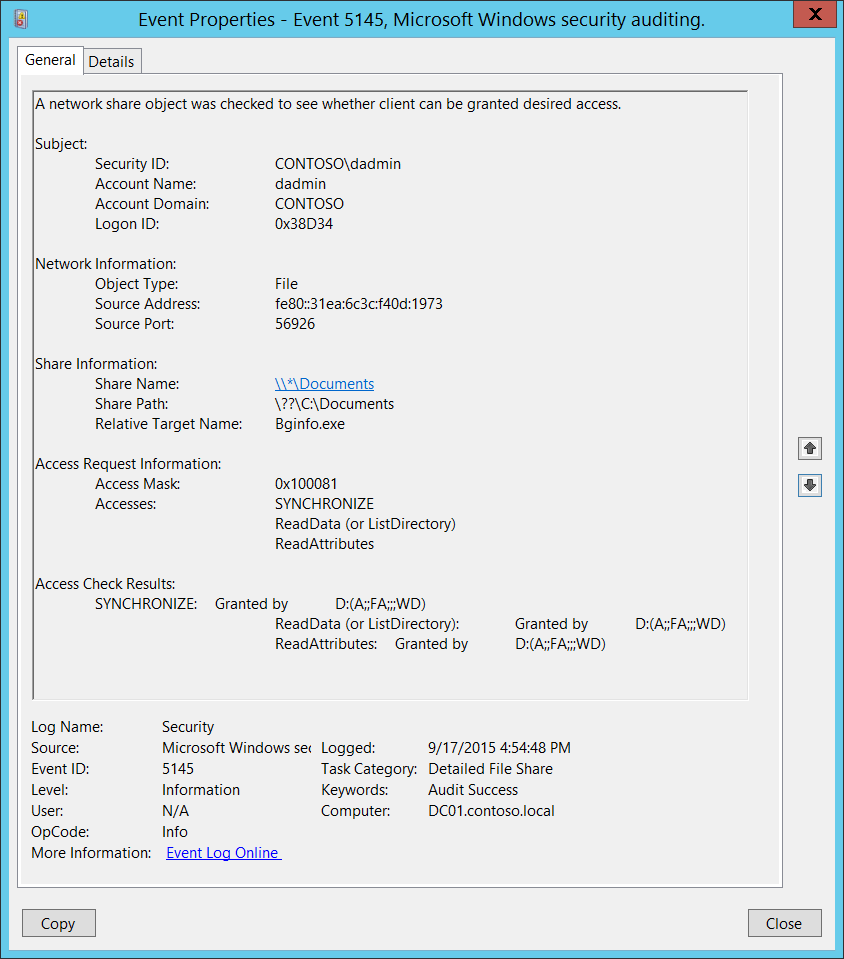

# 5145(S, F): クライアントに希望するアクセス権を付与できるかどうかを確認するためにネットワーク共有オブジェクトがチェックされました。



***サブカテゴリ:***&nbsp;[詳細ファイル共有の監査](audit-detailed-file-share.md)

***イベントの説明:***

このイベントは、ネットワーク共有オブジェクト（ファイルまたはフォルダー）にアクセスされるたびに生成されます。

*重要*: 失敗イベントは、ファイル共有レベルでアクセスが拒否された場合にのみ生成されます。ファイルシステム（NTFS）レベルでアクセスが拒否された場合は、イベントは生成されません。

> **注**&nbsp;&nbsp;推奨事項については、このイベントの[セキュリティ監視の推奨事項](#security-monitoring-recommendations)を参照してください。

<br clear="all">

***イベント XML:***
```xml
- <Event xmlns="http://schemas.microsoft.com/win/2004/08/events/event">
- <System>
 <Provider Name="Microsoft-Windows-Security-Auditing" Guid="{54849625-5478-4994-A5BA-3E3B0328C30D}" /> 
 <EventID>5145</EventID> 
 <Version>0</Version> 
 <Level>0</Level> 
 <Task>12811</Task> 
 <Opcode>0</Opcode> 
 <Keywords>0x8020000000000000</Keywords> 
 <TimeCreated SystemTime="2015-09-17T23:54:48.941761700Z" /> 
 <EventRecordID>267092</EventRecordID> 
 <Correlation /> 
 <Execution ProcessID="516" ThreadID="524" /> 
 <Channel>Security</Channel> 
 <Computer>DC01.contoso.local</Computer> 
 <Security /> 
 </System>
- <EventData>
 <Data Name="SubjectUserSid">S-1-5-21-3457937927-2839227994-823803824-1104</Data> 
 <Data Name="SubjectUserName">dadmin</Data> 
 <Data Name="SubjectDomainName">CONTOSO</Data> 
 <Data Name="SubjectLogonId">0x38d34</Data> 
 <Data Name="ObjectType">File</Data> 
 <Data Name="IpAddress">fe80::31ea:6c3c:f40d:1973</Data> 
 <Data Name="IpPort">56926</Data> 
 <Data Name="ShareName">\\\\\*\\Documents</Data> 
 <Data Name="ShareLocalPath">\\??\\C:\\Documents</Data> 
 <Data Name="RelativeTargetName">Bginfo.exe</Data> 
 <Data Name="AccessMask">0x100081</Data> 
 <Data Name="AccessList">%%1541 %%4416 %%4423</Data> 
 <Data Name="AccessReason">%%1541: %%1801 D:(A;;FA;;;WD) %%4416: %%1801 D:(A;;FA;;;WD) %%4423: %%1801 D:(A;;FA;;;WD)</Data> 
 </EventData>
 </Event>
```

***必要なサーバー役割:*** なし。

***最小 OS バージョン:*** Windows Server 2008, Windows Vista。

***イベントバージョン:*** 0。

***フィールドの説明:***

**サブジェクト:**

-   **セキュリティ ID** \[タイプ = SID\]**:** ネットワーク共有オブジェクトへのアクセスを要求したアカウントのSID。イベントビューアーは自動的にSIDを解決してアカウント名を表示しようとします。SIDが解決できない場合、イベントにはソースデータが表示されます。

> **注**&nbsp;&nbsp;**セキュリティ識別子 (SID)** は、トラスティ（セキュリティプリンシパル）を識別するために使用される可変長の一意の値です。各アカウントには、Active Directoryドメインコントローラーなどの権限によって発行され、セキュリティデータベースに保存される一意のSIDがあります。ユーザーがログオンするたびに、システムはデータベースからそのユーザーのSIDを取得し、そのユーザーのアクセス トークンに配置します。システムはアクセス トークン内のSIDを使用して、以降のすべてのWindowsセキュリティとのやり取りでユーザーを識別します。ユーザーまたはグループの一意の識別子としてSIDが使用された場合、それは他のユーザーまたはグループを識別するために再び使用されることはありません。SIDの詳細については、[セキュリティ識別子](/windows/access-protection/access-control/security-identifiers)を参照してください。

-   **アカウント名** \[型 = UnicodeString\]**:** ネットワーク共有オブジェクトへのアクセスを要求したアカウントの名前。

-   **アカウントドメイン** \[型 = UnicodeString\]**:** サブジェクトのドメインまたはコンピュータ名。形式はさまざまで、以下のものが含まれます：

    -   ドメイン NETBIOS 名の例: CONTOSO

    -   小文字の完全ドメイン名: contoso.local

    -   大文字の完全ドメイン名: CONTOSO.LOCAL

    -   一部の[よく知られたセキュリティプリンシパル](/windows/security/identity-protection/access-control/security-identifiers)の場合、例えば LOCAL SERVICE や ANONYMOUS LOGON、このフィールドの値は “NT AUTHORITY” です。

    -   ローカルユーザーアカウントの場合、このフィールドにはこのアカウントが属するコンピュータまたはデバイスの名前が含まれます。例えば: “Win81”。

-   **ログオンID** \[型 = HexInt64\]**:** このイベントを、同じログオンIDを含む可能性のある最近のイベントと関連付けるのに役立つ16進数の値。例えば、“[4624](event-4624.md): アカウントが正常にログオンされました。”

**ネットワーク情報:**

-   **オブジェクトタイプ** \[型 = UnicodeString\]: 操作中にアクセスされたオブジェクトのタイプ。このイベントでは常に “**File**” です。

    以下の表は、最も一般的な**オブジェクトタイプ**のリストを含んでいます：

| ディレクトリ           | イベント    | タイマー            | デバイス     |
|-------------------------|--------------|----------------------|--------------|
| ミュータント            | タイプ       | ファイル             | トークン     |
| スレッド                | セクション   | ウィンドウステーション | デバッグオブジェクト |
| フィルター通信ポート    | イベントペア | ドライバー           | IoCompletion |
| コントローラー          | シンボリックリンク | WmiGuid              | プロセス     |
| プロファイル            | デスクトップ | キードイベント       | アダプター   |
| キー                    | 待機可能ポート | コールバック         | セマフォ     |
| ジョブ                  | ポート       | フィルター接続ポート | ALPC ポート  |

-   **ソースアドレス** \[型 = UnicodeString\]**:** アクセスが行われた元のIPアドレス。

    -   クライアントのIPv6アドレスまたは::ffff:IPv4アドレス。

    -   ::1または127.0.0.1はlocalhostを意味します。

-   **ソースポート** \[Type = UnicodeString\]: リモートまたはローカルマシンからアクセス要求に使用されたソースTCPまたはUDPポート。

    -   ローカルアクセス試行の場合は0。

**共有情報:**

-   **共有名** \[Type = UnicodeString\]**:** アクセスされたネットワーク共有の名前。形式は: \\\\\*\\SHARE\_NAME。

-   **共有パス** \[Type = UnicodeString\]**:** アクセスされた共有の完全なシステム（NTFS）パス。形式は: \\\\??\\PATH。空の場合もあり、例えば**共有名**が\\\\\*\\IPC$の場合。

-   **相対ターゲット名** \[Type = UnicodeString\]**:** アクセスされたターゲットファイルまたはフォルダの相対名。このファイルパスはネットワーク共有に対して相対的です。共有自体にアクセスが要求された場合、このフィールドは“**\\**”として表示されます。

**アクセス要求情報:**

-   **アクセスマスク** \[Type = HexInt32\]: 要求されたアクセス権の16進数値の合計。アクセス権の異なる16進数値については[ファイルアクセスコードの表](/windows/security/threat-protection/auditing/event-5145#table-of-file-access-codes)を参照してください。

-   **アクセス** \[Type = UnicodeString\]: **Subject\\Security ID**によって要求されたアクセス権のリスト。これらのアクセス権は**オブジェクトタイプ**に依存します。

## ファイルアクセスコードの表

| <span id="File_access_codes" class="anchor"></span>アクセス | 16進値,<br>スキーマ値 | 説明   |
|-----------------------------------------------------------|----------------------------|---------------|
| ReadData (または ListDirectory)                               | 0x1,<br>%%4416             | **ReadData -** ファイルオブジェクトの場合、対応するファイルデータを読み取る権利。ディレクトリオブジェクトの場合、対応するディレクトリデータを読み取る権利。<br>**ListDirectory -** ディレクトリの場合、ディレクトリの内容を一覧表示する権利。                                                                                                                                                                                           |
| WriteData (または AddFile)                                    | 0x2,<br>%%4417             | **WriteData -** ファイルオブジェクトの場合、ファイルにデータを書き込む権利。ディレクトリオブジェクトの場合、ディレクトリにファイルを作成する権利（**FILE\_ADD\_FILE**）。<br>**AddFile -** ディレクトリの場合、ディレクトリにファイルを作成する権利。                                                                                                                                                                                               |
| AppendData (または AddSubdirectory または CreatePipeInstance)     | 0x4,<br>%%4418             | **AppendData -** ファイルオブジェクトの場合、ファイルにデータを追加する権利。（ローカルファイルの場合、このフラグが**FILE\_WRITE\_DATA**なしで指定されると、書き込み操作は既存のデータを上書きしません。）ディレクトリオブジェクトの場合、サブディレクトリを作成する権利（**FILE\_ADD\_SUBDIRECTORY**）。 <br>**AddSubdirectory -** ディレクトリの場合、サブディレクトリを作成する権利。<br>**CreatePipeInstance -** 名前付きパイプの場合、パイプを作成する権利。                                                                                                                       |
| ReadEA                                                    | 0x8,<br>%%4419             | 拡張ファイル属性を読み取る権利。                                                                                                                             |
| WriteEA                                                   | 0x10,<br>%%4420            | 拡張ファイル属性を書き込む権利。                                                                                                                            |
| Execute/Traverse                                          | 0x20,<br>%%4421            | **Execute** - ネイティブコードファイルの場合、ファイルを実行する権利。このアクセス権がスクリプトに与えられると、スクリプトインタープリタに依存してスクリプトが実行可能になる場合があります。<br>**Traverse -** ディレクトリの場合、ディレクトリをトラバースする権利。デフォルトでは、ユーザーには**BYPASS\_TRAVERSE\_CHECKING**&thinsp; [特権](/windows/win32/secauthz/privileges)が割り当てられており、**FILE\_TRAVERSE**&thinsp; [アクセス権](/windows/win32/secauthz/access-rights-and-access-masks)を無視します。詳細については、[ファイルセキュリティとアクセス権](/windows/win32/fileio/file-security-and-access-rights)の備考を参照してください。                                            |
| DeleteChild                                               | 0x40,<br>%%4422            | ディレクトリの場合、ディレクトリとその中のすべてのファイル（読み取り専用ファイルを含む）を削除する権利。                                                                                                                                                                                                     |
| ReadAttributes                                            | 0x80,<br>%%4423            | ファイル属性を読み取る権利。                                                                                                                                                                                                                                                                             |
| WriteAttributes                                           | 0x100,<br>%%4424           | ファイル属性を書き込む権利。                                                                                                                                     |
| DELETE                                                    | 0x10000,<br>%%1537         | オブジェクトを削除する権利。                                                                                                                                         |
| READ\_CONTROL                                             | 0x20000,<br>%%1538         | オブジェクトのセキュリティ記述子の情報を読み取る権利（システムアクセス制御リスト（SACL）の情報を含まない）。                                                                                                                                                                 |
| WRITE\_DAC                                                | 0x40000,<br>%%1539         | オブジェクトのセキュリティ記述子の任意アクセス制御リスト（DACL）を変更する権利。                                                                                                                                              |
| WRITE\_OWNER                                              | 0x80000,<br>%%1540         | オブジェクトのセキュリティ記述子の所有者を変更する権利。                                                                                                                                                                                                                                         |
| SYNCHRONIZE                                               | 0x100000,<br>%%1541        | オブジェクトを同期に使用する権利。この権利により、スレッドはオブジェクトがシグナル状態になるまで待機できます。一部のオブジェクトタイプはこのアクセス権をサポートしていません。                                                                                                                                  |
| ACCESS\_SYS\_SEC                                          | 0x1000000,<br>%%1542       | ACCESS\_SYS\_SECアクセス権は、オブジェクトのセキュリティ記述子内のSACLを取得または設定する能力を制御します。                                                                                                                                                                               |

> <span id="_Ref433878809" class="anchor"></span>表13. ファイルアクセスコード。

**アクセスチェック結果** \[Type = UnicodeString\]: アクセスチェック結果のリスト。結果の形式は以下の通りです:<br><br>

REQUESTED\_ACCESS: RESULT ACE\_WHICH\_ ALLOWED\_OR\_DENIED\_ACCESS.

-   REQUESTED\_ACCESS – 要求されたアクセスの名前。[ファイルアクセスコードの表](#table-of-file-access-codes)を参照してください。このトピックの前半にあります。

-   RESULT:

    -   Granted by – アクセスが許可された場合。

    -   Denied by – アクセスが拒否された場合。

-   ACE\_WHICH\_ ALLOWED\_OR\_DENIED\_ACCESS: アクセスを許可または拒否したアクセス制御エントリ (ACE) のセキュリティ記述子定義言語 (SDDL) 値。

> **Note**&nbsp;&nbsp;**<a id="SDDL" class="anchor"></a>セキュリティ記述子定義言語 (SDDL)** は、セキュリティ記述子に含まれる情報を列挙するための文字列要素を定義します。
> 
> 例:
> 
> *O*:BA*G*:SY*D*:(D;;0xf0007;;;AN)(D;;0xf0007;;;BG)(A;;0xf0007;;;SY)(A;;0×7;;;BA)*S*:ARAI(AU;SAFA;DCLCRPCRSDWDWO;;;WD)
> 
> - *O*: = 所有者。特定のセキュリティプリンシパルのSID、または予約済み（事前定義された）値。例えば: BA (BUILTIN\_ADMINISTRATORS), WD (Everyone), SY (LOCAL\_SYSTEM) など。可能な値のリストは以下の表を参照してください。

## アクセス制御エントリのSDDL値

| 値    | 説明                                  | 値    | 説明                             |
|-------|--------------------------------------|-------|---------------------------------|
| "AO"  | アカウントオペレーター                | "PA"  | グループポリシー管理者           |
| "RU"  | Windows 2000以前を許可するエイリアス  | "IU"  | インタラクティブにログオンしたユーザー |
| "AN"  | 匿名ログオン                          | "LA"  | ローカル管理者                   |
| "AU"  | 認証されたユーザー                    | "LG"  | ローカルゲスト                   |
| "BA"  | 組み込み管理者                        | "LS"  | ローカルサービスアカウント       |
| "BG"  | 組み込みゲスト                        | "SY"  | ローカルシステム                 |
| "BO"  | バックアップオペレーター              | "NU"  | ネットワークサインインユーザー   |
| "BU"  | 組み込みユーザー                      | "NO"  | ネットワーク構成オペレーター     |
| "CA"  | 証明書サーバー管理者                  | "NS"  | ネットワークサービスアカウント   |
| "CG"  | クリエイターグループ                  | "PO"  | プリンターオペレーター           |
| "CO"  | クリエイターオーナー                  | "PS"  | 個人自身                         |
| "DA"  | ドメイン管理者                        | "PU"  | パワーユーザー                   |
| "DC"  | ドメインコンピューター                | "RS"  | RASサーバーグループ              |
| "DD"  | ドメインコントローラー                | "RD"  | ターミナルサーバーユーザー       |
| "DG"  | ドメインゲスト                        | "RE"  | レプリケーター                   |
| "DU"  | ドメインユーザー                      | "RC"  | 制限付きコード                   |
| "EA"  | エンタープライズ管理者                | "SA"  | スキーマ管理者                   |
| "ED"  | エンタープライズドメインコントローラー| "SO"  | サーバーオペレーター             |
| "WD"  | すべてのユーザー                      | "SU"  | サービスサインインユーザー       |

- *G*: = プライマリグループ。
- *D*: = DACLエントリ。
- *S*: = SACLエントリ。

*DACL/SACLエントリ形式:* entry\_type:inheritance\_flags(ace\_type;ace\_flags;rights;object\_guid;inherit\_object\_guid;account\_sid)

例: D:(A;;FA;;;WD)

- entry\_type:

「D」 - DACL

「S」 - SACL

- inheritance\_flags:

「P」 - SDDL\_PROTECTED、フォルダ階層の上位にあるコンテナからの継承がブロックされます。

「AI」 - SDDL\_AUTO\_INHERITED、継承が許可されます。ただし、「P」が設定されていない場合に限ります。

「AR」 - SDDL\_AUTO\_INHERIT\_REQ、子オブジェクトはこのオブジェクトから権限を継承します。

- ace\_type:

「A」 - アクセス許可

「D」 - アクセス拒否

「OA」 - オブジェクトアクセス許可: オブジェクトのサブセットにのみ適用されます。

「OD」 - オブジェクトアクセス拒否: オブジェクトのサブセットにのみ適用されます。

「AU」 - システム監査

「A」 - システムアラーム

「OU」 - オブジェクトシステム監査

「OL」 - オブジェクトシステムアラーム

- ace\_flags:

「CI」 - コンテナ継承: ディレクトリなどのコンテナである子オブジェクトは、ACEを明示的なACEとして継承します。

「OI」 - オブジェクト継承: コンテナでない子オブジェクトは、ACEを明示的なACEとして継承します。

「NP」 - 継承しない: 直接の子オブジェクトのみがこのACEを継承します。

「IO」 - 継承のみ: ACEはこのオブジェクトには適用されませんが、継承を通じて子オブジェクトに影響を与える可能性があります。

「ID」 - ACEが継承されました

「SA」 - 成功したアクセス監査

「FA」 - 失敗したアクセス監査

- rights: アクセスマスクまたは予約値を示す16進文字列。例: FA (ファイル全アクセス), FX (ファイル実行), FW (ファイル書き込み) など。

| 値                        | 説明                             | 値                  | 説明                      |
|----------------------------|---------------------------------|----------------------|--------------------------|
| 一般的なアクセス権         | ディレクトリサービスアクセス権   |
| 「GA」                     | 全般アクセス                     | 「RC」               | 読み取り権限              |
| 「GR」                     | 全般読み取り                     | 「SD」               | 削除                      |
| 「GW」                     | 全般書き込み                     | 「WD」               | 権限の変更                |
| 「GX」                     | 全般実行                         | 「WO」               | 所有者の変更              |
| ファイルアクセス権         | 「RP」                          | すべてのプロパティの読み取り |
| 「FA」                     | ファイル全アクセス               | 「WP」               | すべてのプロパティの書き込み |
| 「FR」                     | ファイル一般読み取り             | 「CC」               | すべての子オブジェクトの作成 |
| 「FW」                     | ファイル一般書き込み             | 「DC」               | すべての子オブジェクトの削除 |
| 「FX」                     | ファイル一般実行                 | 「LC」               | コンテンツの一覧表示      |
| レジストリキーアクセス権   | 「SW」                          | すべての検証済み書き込み |
| 「KA」                     | 「LO」                          | 「LO」               | オブジェクトの一覧表示    |
| 「K」                      | キー読み取り                     | 「DT」               | サブツリーの削除          |
| 「KW」                     | キー書き込み                     | 「CR」               | すべての拡張権限          |
| 「KX」                     | キー実行                         |                      |                          |

- object\_guid: N/A
- inherit\_object\_guid: N/A
- account\_sid: 特定のセキュリティプリンシパルのSID、または予約値、例: AN (匿名)、WD (全員)、SY (LOCAL\_SYSTEM)など。詳細については、上記の表を参照してください。

SDDL構文の詳細については、次の記事を参照してください: <https://msdn.microsoft.com/library/cc230374.aspx>, <https://msdn.microsoft.com/library/windows/hardware/aa374892(v=vs.85).aspx>.

## セキュリティ監視の推奨事項

5145(S, F): クライアントが希望するアクセス権を付与できるかどうかを確認するためにネットワーク共有オブジェクトがチェックされました。

> **重要**&nbsp;&nbsp;このイベントについては、[付録A: 多くの監査イベントに対するセキュリティ監視の推奨事項](appendix-a-security-monitoring-recommendations-for-many-audit-events.md)も参照してください。

- **ネットワーク情報\\送信元アドレス**が内部IP範囲外の場合、このイベントを監視します。

- **ネットワーク情報\\送信元アドレス**が特定のコンピュータ（**コンピュータ:**）に接続できないはずの場合、このイベントを監視します。

- 特定のネットワーク共有に重要なファイルやフォルダがあり、アクセス試行（成功と失敗）を監視する必要がある場合、特定の**共有情報\\共有名**および**共有情報\\相対ターゲット名**を監視します。

- ドメインまたはローカルアカウントが特定の共有ファイルまたはフォルダのリストにのみアクセスできるはずの場合、許可されたリスト外のアクセス試行を監視できます。

- 次の**アクセス要求情報\\アクセス権**（特に失敗の場合）を監視することをお勧めします:

    - WriteData (または AddFile)

    - AppendData (または AddSubdirectory または CreatePipeInstance)

    - WriteEA

    - DeleteChild

    - WriteAttributes

    - DELETE

    - WRITE\_DAC

    - WRITE\_OWNER
