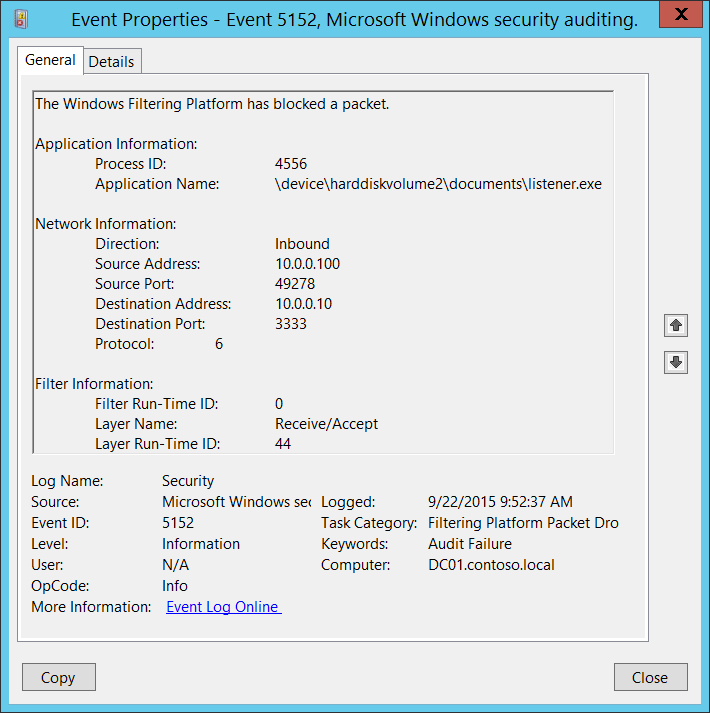

# 5152(F): Windows フィルタリング プラットフォームがパケットをブロックしました。




***サブカテゴリ:***&nbsp;[フィルタリング プラットフォーム パケット ドロップの監査](audit-filtering-platform-packet-drop.md)

***イベントの説明:***

このイベントは、[Windows フィルタリング プラットフォーム](/windows/win32/fwp/windows-filtering-platform-start-page) がネットワーク パケットをブロックしたときに生成されます。

このイベントは、受信したネットワーク パケットごとに生成されます。

> **注**&nbsp;&nbsp;推奨事項については、このイベントの[セキュリティ監視の推奨事項](#security-monitoring-recommendations)を参照してください。

<br clear="all">

***イベント XML:***
```
- <Event xmlns="http://schemas.microsoft.com/win/2004/08/events/event">
- <System>
 <Provider Name="Microsoft-Windows-Security-Auditing" Guid="{54849625-5478-4994-A5BA-3E3B0328C30D}" /> 
 <EventID>5152</EventID> 
 <Version>0</Version> 
 <Level>0</Level> 
 <Task>12809</Task> 
 <Opcode>0</Opcode> 
 <Keywords>0x8010000000000000</Keywords> 
 <TimeCreated SystemTime="2015-09-22T16:52:37.274367300Z" /> 
 <EventRecordID>321323</EventRecordID> 
 <Correlation /> 
 <Execution ProcessID="4" ThreadID="4456" /> 
 <Channel>Security</Channel> 
 <Computer>DC01.contoso.local</Computer> 
 <Security /> 
 </System>
- <EventData>
 <Data Name="ProcessId">4556</Data> 
 <Data Name="Application">\\device\\harddiskvolume2\\documents\\listener.exe</Data> 
 <Data Name="Direction">%%14592</Data> 
 <Data Name="SourceAddress">10.0.0.100</Data> 
 <Data Name="SourcePort">49278</Data> 
 <Data Name="DestAddress">10.0.0.10</Data> 
 <Data Name="DestPort">3333</Data> 
 <Data Name="Protocol">6</Data> 
 <Data Name="FilterRTID">0</Data> 
 <Data Name="LayerName">%%14610</Data> 
 <Data Name="LayerRTID">44</Data> 
 </EventData>
 </Event>

```

***必要なサーバー ロール:*** なし。

***最小 OS バージョン:*** Windows Server 2008、Windows Vista。

***イベント バージョン:*** 0。

***フィールドの説明:***

**アプリケーション情報**:

-   **プロセス ID** \[タイプ = ポインタ\]: ブロックされたネットワーク パケットが送信されたプロセスの 16 進数のプロセス ID。プロセス ID (PID) は、オペレーティング システムがアクティブなプロセスを一意に識別するために使用する番号です。特定のプロセスの PID を確認するには、たとえばタスク マネージャー (詳細タブ、PID 列) を使用できます。

    

    16 進数の値を 10 進数に変換すると、タスク マネージャーの値と比較できます。

    このプロセス ID を他のイベントのプロセス ID と関連付けることもできます。たとえば、「[4688](event-4688.md): 新しいプロセスが作成されました」**プロセス情報\\新しいプロセス ID**。

-   **アプリケーション名** \[タイプ = UnicodeString\]**:** プロセスの実行可能ファイルのフル パスと名前。

論理ディスクは \\device\\harddiskvolume\# の形式で表示されます。**diskpart** ユーティリティを使用して、すべてのローカルボリューム番号を取得できます。diskpart を使用してボリューム番号を取得するコマンドは「**list volume**」です：


**ネットワーク情報:**

-   **方向** \[Type = UnicodeString\]: ブロックされた接続の方向。

    -   Inbound – インバウンド接続の場合。

    -   Outbound – アウトバウンド接続の場合。

-   **送信元アドレス** \[Type = UnicodeString\]**:** アプリケーションがパケットを受信したローカルIPアドレス。

    -   IPv4 アドレス

    -   IPv6 アドレス

    -   :: - IPv6 形式のすべてのIPアドレス

    -   0.0.0.0 - IPv4 形式のすべてのIPアドレス

    -   127.0.0.1, ::1 - ローカルホスト

-   **送信元ポート** \[Type = UnicodeString\]**:** アプリケーションがパケットを受信したポート番号。

-   **宛先アドレス** \[Type = UnicodeString\]**:** パケットが受信または送信されたIPアドレス。

    -   IPv4 アドレス

    -   IPv6 アドレス

    -   :: - IPv6 形式のすべてのIPアドレス

    -   0.0.0.0 - IPv4 形式のすべてのIPアドレス

    -   127.0.0.1, ::1 - ローカルホスト

-   **宛先ポート** \[Type = UnicodeString\]**:** リモートマシンからパケットを送信するために使用されたポート番号。

-   **プロトコル** \[Type = UInt32\]**:** 使用されたプロトコルの番号。

| サービス                                            | プロトコル番号 |
|----------------------------------------------------|-----------------|
| インターネット制御メッセージプロトコル (ICMP)      | 1               |
| 伝送制御プロトコル (TCP)                           | 6               |
| ユーザーデータグラムプロトコル (UDP)               | 17              |
| 汎用ルーティングカプセル化 (PPTP データ over GRE)  | 47              |
| 認証ヘッダー (AH) IPSec                            | 51              |
| カプセル化セキュリティペイロード (ESP) IPSec      | 50              |
| エクステリアゲートウェイプロトコル (EGP)          | 8               |
| ゲートウェイ-ゲートウェイプロトコル (GGP)          | 3               |
| ホスト監視プロトコル (HMP)                         | 20              |
| インターネットグループ管理プロトコル (IGMP)        | 88              |
| MIT リモート仮想ディスク (RVD)                     | 66              |
| OSPF オープン最短経路優先                          | 89              |
| PARC ユニバーサルパケットプロトコル (PUP)          | 12              |
| 信頼性のあるデータグラムプロトコル (RDP)           | 27              |
| 予約プロトコル (RSVP) QoS                          | 46              |

**フィルター情報:**

-   **フィルター実行時ID** \[タイプ = UInt64\]: パケットをブロックしたユニークなフィルターID。

    特定のWindowsフィルタリングプラットフォームフィルターをIDで見つけるには、次のコマンドを実行します: **netsh wfp show filters**。このコマンドの結果として、**filters.xml**ファイルが生成されます。このファイルを開き、必要なフィルターID (**&lt;filterId&gt;**) を含む特定のサブストリングを見つけます。例えば:

    

-   **レイヤー名** \[タイプ = UnicodeString\]: [アプリケーションレイヤーエンフォースメント](/windows/win32/fwp/application-layer-enforcement--ale-) レイヤー名。

-   **レイヤー実行時ID** \[タイプ = UInt64\]: Windowsフィルタリングプラットフォームレイヤー識別子。特定のWindowsフィルタリングプラットフォームレイヤーIDを見つけるには、次のコマンドを実行します: **netsh wfp show state**。このコマンドの結果として**wfpstate.xml**ファイルが生成されます。このファイルを開き、必要なレイヤーID (**&lt;layerId&gt;**) を含む特定のサブストリングを見つけます。例えば:


## セキュリティ監視の推奨事項

5152(F): Windowsフィルタリングプラットフォームがパケットをブロックしました。

-   事前に定義されたアプリケーションがこのイベントで報告された操作を実行する必要がある場合、「**Application**」が定義されたアプリケーションと等しくないイベントを監視します。

-   「**Application**」が標準フォルダーにない（例えば、**System32**や**Program Files**にない）か、制限されたフォルダーにある（例えば、**Temporary Internet Files**）かを監視できます。

-   アプリケーション名に含まれる制限されたサブストリングや単語の事前定義リストがある場合（例えば、「**mimikatz**」や「**cain.exe**」）、これらのサブストリングを「**Application**」でチェックします。

-   **Source Address**がコンピューターに割り当てられたアドレスの1つであることを確認します。

-   コンピューターやデバイスがインターネットにアクセスするべきでない場合、またはインターネットに接続しないアプリケーションのみを含む場合、**Destination Address**がインターネットからのIPアドレス（プライベートIP範囲からではない）である[5152](event-5152.md)イベントを監視します。

-   コンピュータが特定のネットワークIPアドレスに接続したり、接続されたりしてはいけない場合、**Destination Address**でこれらのアドレスを監視します。

-   コンピュータやデバイスが接続することが期待されるIPアドレスの許可リストがある場合、許可リストにない**“Destination Address”**のIPアドレスを監視します。

-   特定のローカルポートへのすべての受信接続を監視する必要がある場合、その“**Source Port**”の[5152](event-5152.md)イベントを監視します。

-   このデバイスやコンピュータにとって通常ではない“**Protocol Number**”のすべての接続を監視します。例えば、1、6、17以外のものです。

-   コンピュータの“**Destination Address**”との通信が常に特定の“**Destination Port**”を使用する必要がある場合、他の“**Destination Port**”を監視します。
