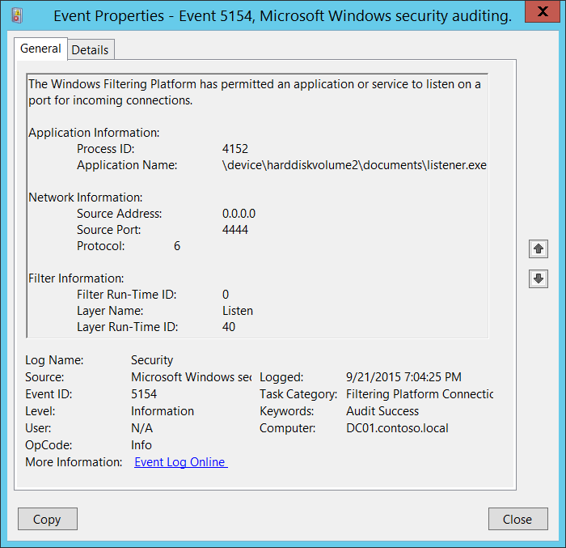
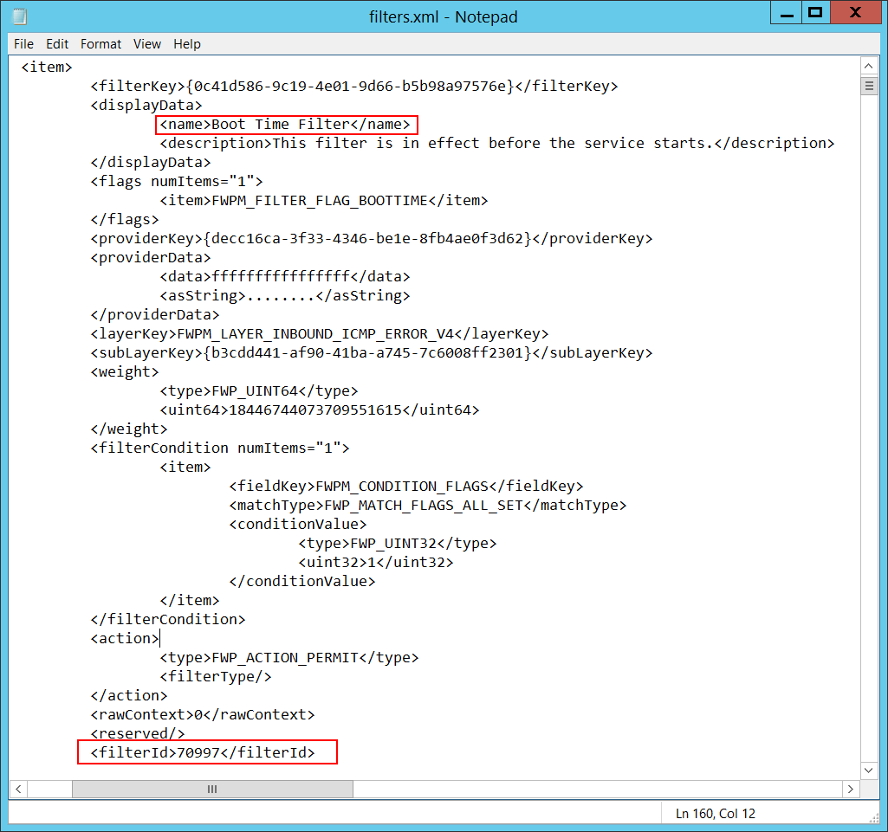

# 5154(S): Windows フィルタリング プラットフォームがアプリケーションまたはサービスに対して、着信接続のためにポートでのリッスンを許可しました。



***サブカテゴリ:***&nbsp;[フィルタリング プラットフォーム接続の監査](audit-filtering-platform-connection.md)

***イベントの説明:***

このイベントは、[Windows フィルタリング プラットフォーム](/windows/win32/fwp/windows-filtering-platform-start-page) がアプリケーションまたはサービスに対してポートでのリッスンを許可するたびに生成されます。

> **注**&nbsp;&nbsp;推奨事項については、このイベントの[セキュリティ監視の推奨事項](#security-monitoring-recommendations)を参照してください。

<br clear="all">

***イベント XML:***
```
- <Event xmlns="http://schemas.microsoft.com/win/2004/08/events/event">
- <System>
 <Provider Name="Microsoft-Windows-Security-Auditing" Guid="{54849625-5478-4994-A5BA-3E3B0328C30D}" /> 
 <EventID>5154</EventID> 
 <Version>0</Version> 
 <Level>0</Level> 
 <Task>12810</Task> 
 <Opcode>0</Opcode> 
 <Keywords>0x8020000000000000</Keywords> 
 <TimeCreated SystemTime="2015-09-22T02:04:25.757462900Z" /> 
 <EventRecordID>287929</EventRecordID> 
 <Correlation /> 
 <Execution ProcessID="4" ThreadID="3968" /> 
 <Channel>Security</Channel> 
 <Computer>DC01.contoso.local</Computer> 
 <Security /> 
 </System>
- <EventData>
 <Data Name="ProcessId">4152</Data> 
 <Data Name="Application">\\device\\harddiskvolume2\\documents\\listener.exe</Data> 
 <Data Name="SourceAddress">0.0.0.0</Data> 
 <Data Name="SourcePort">4444</Data> 
 <Data Name="Protocol">6</Data> 
 <Data Name="FilterRTID">0</Data> 
 <Data Name="LayerName">%%14609</Data> 
 <Data Name="LayerRTID">40</Data> 
 </EventData>
 </Event>

```

***必要なサーバー ロール:*** なし。

***最小 OS バージョン:*** Windows Server 2008, Windows Vista。

***イベント バージョン:*** 0。

***フィールドの説明:***

**アプリケーション情報**:

-   **プロセス ID** \[タイプ = ポインター\]: ポートでのリッスンを許可されたプロセスの 16 進数のプロセス ID。プロセス ID (PID) は、オペレーティング システムがアクティブなプロセスを一意に識別するために使用する番号です。特定のプロセスの PID を確認するには、例えばタスク マネージャー (詳細タブ、PID 列) を使用できます。

    

    16 進数の値を 10 進数に変換すると、タスク マネージャーの値と比較できます。

    また、このプロセス ID を他のイベントのプロセス ID と関連付けることもできます。例えば、「[4688](event-4688.md): 新しいプロセスが作成されました」**プロセス情報\\新しいプロセス ID**。

-   **アプリケーション名** \[タイプ = UnicodeString\]**:** プロセスの実行可能ファイルのフルパスと名前。

    論理ディスクは \\device\\harddiskvolume\# の形式で表示されます。すべてのローカルボリューム番号を取得するには、**diskpart** ユーティリティを使用します。diskpart を使用してボリューム番号を取得するコマンドは「**list volume**」です：


**ネットワーク情報:**

-   **送信元アドレス** \[タイプ = UnicodeString\]**:** アプリケーションがポートでリッスンするように要求したローカルIPアドレス。

    -   IPv4 アドレス

    -   IPv6 アドレス

    -   :: - IPv6形式のすべてのIPアドレス

    -   0.0.0.0 - IPv4形式のすべてのIPアドレス

    -   127.0.0.1, ::1 - ローカルホスト

-   **送信元ポート** \[タイプ = UnicodeString\]: アプリケーションがリッスンするように要求した送信元TCP\\UDPポート番号。

-   **プロトコル** \[タイプ = UInt32\]: プロトコル番号。例えば：

    -   6 – TCP。

    -   17 – UDP。

        このフィールドの可能な値についての詳細情報: <https://technet.microsoft.com/library/cc959827.aspx>。

**フィルター情報:**

-   **フィルター実行時ID** \[タイプ = UInt64\]: アプリケーションが特定のポートでリッスンすることを許可する一意のフィルターID。デフォルトでは、Windowsファイアウォールはアプリケーションがポートでリッスンするのを防ぎません。このアプリケーションがフィルターに一致しない場合、このフィールドには **0** の値が表示されます。

    特定のWindowsフィルタリングプラットフォームフィルターをIDで見つけるには、次のコマンドを実行します: **netsh wfp show filters**。このコマンドの結果として、**filters.xml** ファイルが生成されます。このファイルを開き、必要なフィルターID (**&lt;filterId&gt;**)**,** 例えば:



-   **レイヤー名** \[タイプ = UnicodeString\]: [アプリケーションレイヤーエンフォースメント](/windows/win32/fwp/application-layer-enforcement--ale-) レイヤー名。

-   **レイヤー実行時ID** \[タイプ = UInt64\]: Windowsフィルタリングプラットフォームレイヤー識別子。特定のWindowsフィルタリングプラットフォームレイヤーIDを見つけるには、次のコマンドを実行します: **netsh wfp show state**。このコマンドの結果として、**wfpstate.xml** ファイルが生成されます。このファイルを開き、必要なレイヤーID (**&lt;layerId&gt;**)**,** 例えば:


## セキュリティ監視の推奨事項

5154(S): Windows フィルタリング プラットフォームがアプリケーションまたはサービスに対して、ポートでの受信接続のリッスンを許可しました。

- 特定のオペレーティング システムやサーバー ロールに関連付けられたアプリケーションの「許可リスト」がある場合、**「アプリケーション名」**およびその他の関連情報についてこのイベントを監視します。

- 特定のアプリケーションが特定のポート番号でのみリッスンすることが許可されている場合、**「アプリケーション名」**および**「ネットワーク情報\\送信元ポート」**についてこのイベントを監視します。

- 特定のアプリケーションが特定の IP アドレスでのみリッスンすることが許可されている場合、**「アプリケーション名」**および**「ネットワーク情報\\送信元アドレス」**についてこのイベントを監視します。

- 特定のアプリケーションが TCP または UDP プロトコルのみを使用することが許可されている場合、**「アプリケーション名」**および**「ネットワーク情報\\プロトコル」**のプロトコル番号についてこのイベントを監視します。

- このイベントによって報告された操作を実行するために使用されるべき事前定義されたアプリケーションがある場合、定義されたアプリケーションと異なる「**アプリケーション**」のイベントを監視します。

- 「**アプリケーション**」が標準フォルダーにないか（例：**System32** または **Program Files** にない）、制限されたフォルダーにあるか（例：**Temporary Internet Files**）を監視できます。

- アプリケーション名に制限されたサブストリングまたは単語の事前定義リストがある場合（例：「**mimikatz**」または「**cain.exe**」）、これらのサブストリングが「**アプリケーション**」に含まれているかを確認します。

- 通常、このイベントは情報提供を目的としています。
