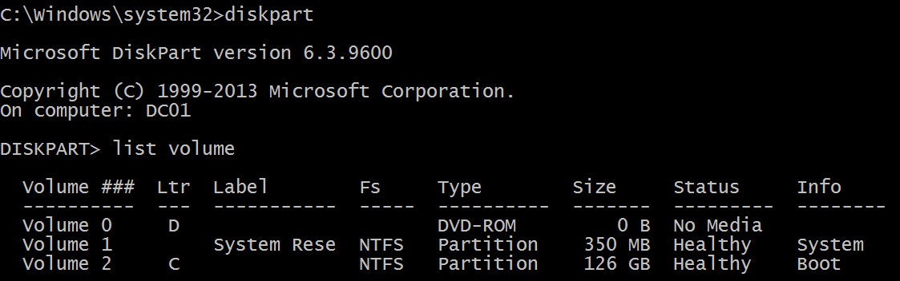
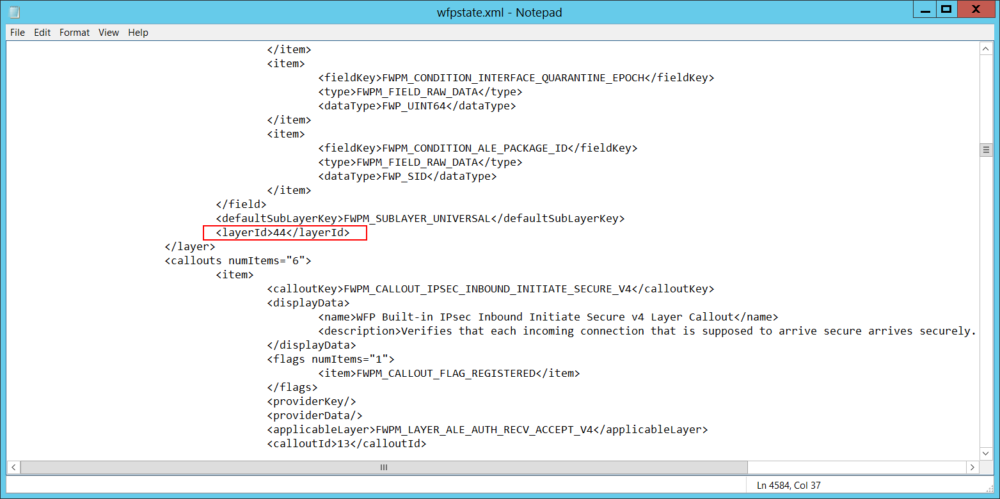

# 5156(S): Windowsフィルタリングプラットフォームが接続を許可しました。


***サブカテゴリ:***&nbsp;[フィルタリングプラットフォーム接続の監査](audit-filtering-platform-connection.md)

***イベントの説明:***

このイベントは、[Windowsフィルタリングプラットフォーム](/windows/win32/fwp/windows-filtering-platform-start-page)が接続を許可したときに生成されます。

> **注**&nbsp;&nbsp;推奨事項については、このイベントの[セキュリティ監視の推奨事項](#security-monitoring-recommendations)を参照してください。

<br clear="all">

***イベントXML:***
```xml
- <Event xmlns="http://schemas.microsoft.com/win/2004/08/events/event">
- <System>
 <Provider Name="Microsoft-Windows-Security-Auditing" Guid="{54849625-5478-4994-A5BA-3E3B0328C30D}" /> 
 <EventID>5156</EventID> 
 <Version>1</Version> 
 <Level>0</Level> 
 <Task>12810</Task> 
 <Opcode>0</Opcode> 
 <Keywords>0x8020000000000000</Keywords> 
 <TimeCreated SystemTime="2015-09-22T05:24:22.622090200Z" /> 
 <EventRecordID>308129</EventRecordID> 
 <Correlation /> 
 <Execution ProcessID="4" ThreadID="3712" /> 
 <Channel>Security</Channel> 
 <Computer>DC01.contoso.local</Computer> 
 <Security /> 
 </System>
- <EventData>
 <Data Name="ProcessID">4556</Data> 
 <Data Name="Application">\\device\\harddiskvolume2\\documents\\listener.exe</Data> 
 <Data Name="Direction">%%14592</Data> 
 <Data Name="SourceAddress">10.0.0.10</Data> 
 <Data Name="SourcePort">3333</Data> 
 <Data Name="DestAddress">10.0.0.100</Data> 
 <Data Name="DestPort">49278</Data> 
 <Data Name="Protocol">6</Data> 
 <Data Name="FilterRTID">70201</Data> 
 <Data Name="LayerName">%%14610</Data> 
 <Data Name="LayerRTID">44</Data> 
 <Data Name="RemoteUserID">S-1-0-0</Data> 
 <Data Name="RemoteMachineID">S-1-0-0</Data> 
 </EventData>
 </Event>

```

***必要なサーバー役割:*** なし。

***最小OSバージョン:*** Windows Server 2008, Windows Vista。

***イベントバージョン:*** 0。

***フィールドの説明:***

**アプリケーション情報**:

-   **プロセスID** \[タイプ = ポインタ\]: 接続を受け取ったプロセスの16進数のプロセスID。プロセスID (PID) は、オペレーティングシステムがアクティブなプロセスを一意に識別するために使用する番号です。特定のプロセスのPIDを確認するには、例えばタスクマネージャー（詳細タブ、PID列）を使用できます。

    

    16進数の値を10進数に変換すると、タスクマネージャーの値と比較できます。

    また、このプロセスIDを他のイベントのプロセスIDと関連付けることもできます。例えば、「[4688](event-4688.md): 新しいプロセスが作成されました」**プロセス情報\\新しいプロセスID**。

-   **アプリケーション名** \[タイプ = UnicodeString\]**:** プロセスの実行可能ファイルのフルパスと名前。

論理ディスクは \\device\\harddiskvolume\# の形式で表示されます。**diskpart** ユーティリティを使用して、すべてのローカルボリューム番号を取得できます。diskpart を使用してボリューム番号を取得するコマンドは「**list volume**」です：



**ネットワーク情報:**

-   **方向** \[Type = UnicodeString\]: 許可された接続の方向。

    -   Inbound – インバウンド接続の場合。

    -   Outbound – アウトバウンド接続の場合。

-   **送信元アドレス** \[Type = UnicodeString\]**:** 接続が開始されたIPアドレス。

    -   IPv4 アドレス

    -   IPv6 アドレス

    -   :: - IPv6形式のすべてのIPアドレス

    -   0.0.0.0 - IPv4形式のすべてのIPアドレス

    -   127.0.0.1, ::1 - ローカルホスト

-   **送信元ポート** \[Type = UnicodeString\]**:** 接続が開始されたポート番号。

-   **宛先アドレス** \[Type = UnicodeString\]**:** 接続が受信されたIPアドレス。

    -   IPv4 アドレス

    -   IPv6 アドレス

    -   :: - IPv6形式のすべてのIPアドレス

    -   0.0.0.0 - IPv4形式のすべてのIPアドレス

    -   127.0.0.1, ::1 - ローカルホスト

-   **宛先ポート** \[Type = UnicodeString\]**:** 接続が受信されたポート番号。

-   **プロトコル** \[Type = UInt32\]: 使用されたプロトコルの番号。

| サービス                                            | プロトコル番号 |
|----------------------------------------------------|-----------------|
| インターネット制御メッセージプロトコル (ICMP)      | 1               |
| 伝送制御プロトコル (TCP)                           | 6               |
| ユーザーデータグラムプロトコル (UDP)               | 17              |
| 汎用ルーティングカプセル化 (PPTPデータ over GRE)   | 47              |
| 認証ヘッダー (AH) IPSec                            | 51              |
| カプセル化セキュリティペイロード (ESP) IPSec      | 50              |
| エクステリアゲートウェイプロトコル (EGP)          | 8               |
| ゲートウェイ-ゲートウェイプロトコル (GGP)         | 3               |
| ホストモニタリングプロトコル (HMP)                | 20              |
| インターネットグループ管理プロトコル (IGMP)       | 88              |
| MIT リモートバーチャルディスク (RVD)               | 66              |
| OSPF オープンショーテストパスファースト           | 89              |
| PARC ユニバーサルパケットプロトコル (PUP)         | 12              |
| 信頼性のあるデータグラムプロトコル (RDP)          | 27              |
| 予約プロトコル (RSVP) QoS                          | 46              |

**フィルター情報:**

-   **フィルター実行時ID** \[タイプ = UInt64\]: 接続を許可したユニークなフィルターID。

    特定のWindowsフィルタリングプラットフォームフィルターをIDで見つけるには、次のコマンドを実行します: **netsh wfp show filters**。このコマンドの結果、**filters.xml**ファイルが生成されます。このファイルを開き、必要なフィルターID (**&lt;filterId&gt;**) を含む特定のサブストリングを見つけます。例えば:


-   **レイヤー名** \[タイプ = UnicodeString\]: [アプリケーションレイヤーエンフォースメント](/windows/win32/fwp/application-layer-enforcement--ale-) レイヤー名。

-   **レイヤー実行時ID** \[タイプ = UInt64\]: Windowsフィルタリングプラットフォームレイヤー識別子。特定のWindowsフィルタリングプラットフォームレイヤーIDを見つけるには、次のコマンドを実行します: **netsh wfp show state**。このコマンドの結果、**wfpstate.xml**ファイルが生成されます。このファイルを開き、必要なレイヤーID (**&lt;layerId&gt;**) を含む特定のサブストリングを見つけます。例えば:



## セキュリティ監視の推奨事項

5156(S): Windowsフィルタリングプラットフォームが接続を許可しました。

-   このイベントで報告された操作を実行するために使用されるべき事前定義されたアプリケーションがある場合、「**Application**」が定義されたアプリケーションと異なるイベントを監視します。

-   「**Application**」が標準フォルダーにない（例えば、**System32**や**Program Files**にない）か、制限されたフォルダーにある（例えば、**Temporary Internet Files**）かを監視できます。

-   アプリケーション名に含まれる制限されたサブストリングや単語の事前定義リストがある場合（例えば、「**mimikatz**」や「**cain.exe**」）、これらのサブストリングが「**Application**」に含まれているかを確認します。

-   「**Source Address**」がコンピューターに割り当てられたアドレスの一つであることを確認します。

-   コンピューターやデバイスがインターネットにアクセスするべきでない場合、またはインターネットに接続しないアプリケーションのみを含む場合、「**Destination Address**」がインターネットからのIPアドレス（プライベートIP範囲からではない）である[5156](event-5156.md)イベントを監視します。

-   コンピューターが特定のネットワークIPアドレスに接続するべきでない、または接続されるべきでないことがわかっている場合、「**Destination Address**」でこれらのアドレスを監視します。

-   コンピューターやデバイスが接続することが期待されるIPアドレスの許可リストがある場合、「**Destination Address**」に許可リストにないIPアドレスがないか監視します。

-   特定のローカルポートへのすべての受信接続を監視する必要がある場合、その「**Source Port**」を持つ[5156](event-5156.md)イベントを監視します。

-   このデバイスやコンピューターにとって典型的でない「**Protocol Number**」を持つすべての接続を監視します。例えば、1、6、または17以外のものです。

-   コンピューターの「**Destination Address**」との通信が常に特定の「**Destination Port**」を使用するべき場合、他の「**Destination Port**」を監視します。
