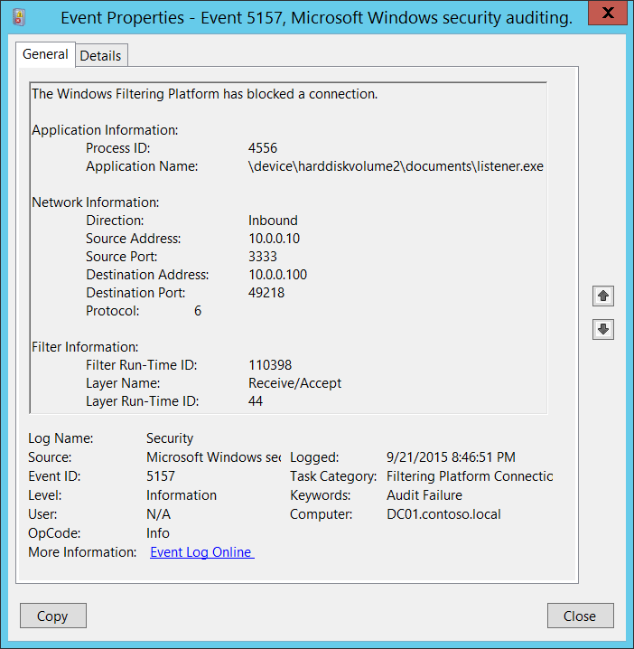
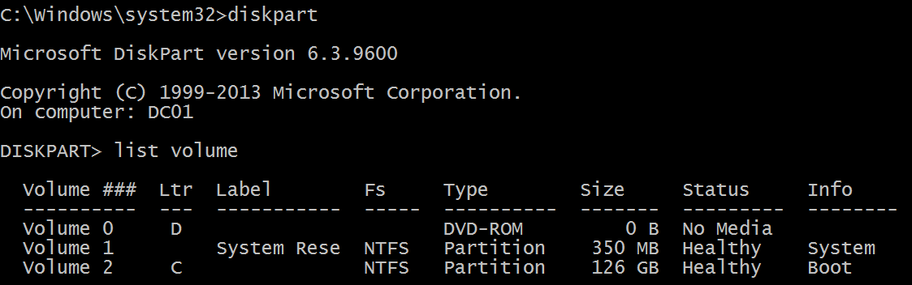

# 5157(F): Windows フィルタリング プラットフォームが接続をブロックしました。



***サブカテゴリ:***&nbsp;[フィルタリング プラットフォーム接続の監査](audit-filtering-platform-connection.md)

***イベントの説明:***

このイベントは、[Windows フィルタリング プラットフォーム](/windows/win32/fwp/windows-filtering-platform-start-page) が接続をブロックしたときに生成されます。

> **注**&nbsp;&nbsp;推奨事項については、このイベントの[セキュリティ監視の推奨事項](#security-monitoring-recommendations)を参照してください。

<br clear="all">

***イベント XML:***
```
- <Event xmlns="http://schemas.microsoft.com/win/2004/08/events/event">
- <System>
 <Provider Name="Microsoft-Windows-Security-Auditing" Guid="{54849625-5478-4994-A5BA-3E3B0328C30D}" /> 
 <EventID>5157</EventID> 
 <Version>1</Version> 
 <Level>0</Level> 
 <Task>12810</Task> 
 <Opcode>0</Opcode> 
 <Keywords>0x8010000000000000</Keywords> 
 <TimeCreated SystemTime="2015-09-22T03:46:51.662750400Z" /> 
 <EventRecordID>304390</EventRecordID> 
 <Correlation /> 
 <Execution ProcessID="4" ThreadID="4520" /> 
 <Channel>Security</Channel> 
 <Computer>DC01.contoso.local</Computer> 
 <Security /> 
 </System>
- <EventData>
 <Data Name="ProcessID">4556</Data> 
 <Data Name="Application">\\device\\harddiskvolume2\\documents\\listener.exe</Data> 
 <Data Name="Direction">%%14592</Data> 
 <Data Name="SourceAddress">10.0.0.10</Data> 
 <Data Name="SourcePort">3333</Data> 
 <Data Name="DestAddress">10.0.0.100</Data> 
 <Data Name="DestPort">49218</Data> 
 <Data Name="Protocol">6</Data> 
 <Data Name="FilterRTID">110398</Data> 
 <Data Name="LayerName">%%14610</Data> 
 <Data Name="LayerRTID">44</Data> 
 <Data Name="RemoteUserID">S-1-0-0</Data> 
 <Data Name="RemoteMachineID">S-1-0-0</Data> 
 </EventData>
 </Event>

```

***必要なサーバー ロール:*** なし。

***最小 OS バージョン:*** Windows Server 2008, Windows Vista。

***イベント バージョン:*** 0。

***フィールドの説明:***

**アプリケーション情報**:

-   **プロセス ID** \[型 = ポインタ\]: 接続を作成しようとしたプロセスの 16 進数のプロセス ID。プロセス ID (PID) は、オペレーティング システムがアクティブなプロセスを一意に識別するために使用する番号です。特定のプロセスの PID を確認するには、例えばタスク マネージャー (詳細タブ、PID 列) を使用できます。

    

    16 進数の値を 10 進数に変換すると、タスク マネージャーの値と比較できます。

    また、このプロセス ID を他のイベントのプロセス ID と関連付けることもできます。例えば、「[4688](event-4688.md): 新しいプロセスが作成されました」**プロセス情報\\新しいプロセス ID**。

-   **アプリケーション名** \[型 = UnicodeString\]**:** プロセスの実行可能ファイルのフル パスと名前。

論理ディスクは \\device\\harddiskvolume\# の形式で表示されます。**diskpart** ユーティリティを使用して、すべてのローカルボリューム番号を取得できます。diskpart を使用してボリューム番号を取得するコマンドは「**list volume**」です：



**ネットワーク情報:**

-   **方向** \[タイプ = UnicodeString\]: ブロックされた接続の方向。

    -   インバウンド – インバウンド接続の場合。

    -   アウトバウンド – アウトバウンド接続の場合。

-   **送信元アドレス** \[タイプ = UnicodeString\]**:** アプリケーションが接続を受信したローカルIPアドレス。

    -   IPv4アドレス

    -   IPv6アドレス

    -   :: - IPv6形式のすべてのIPアドレス

    -   0.0.0.0 - IPv4形式のすべてのIPアドレス

    -   127.0.0.1, ::1 - ローカルホスト

-   **送信元ポート** \[タイプ = UnicodeString\]**:** アプリケーションが接続を受信したポート番号。

-   **宛先アドレス** \[タイプ = UnicodeString\]**:** 接続が受信または開始されたIPアドレス。

    -   IPv4アドレス

    -   IPv6アドレス

    -   :: - IPv6形式のすべてのIPアドレス

    -   0.0.0.0 - IPv4形式のすべてのIPアドレス

    -   127.0.0.1, ::1 - ローカルホスト

-   **宛先ポート** \[タイプ = UnicodeString\]**:** リモートマシンから接続を開始するために使用されたポート番号。

-   **プロトコル** \[タイプ = UInt32\]: 使用されたプロトコルの番号。

| サービス                                            | プロトコル番号 |
|----------------------------------------------------|-----------------|
| インターネット制御メッセージプロトコル (ICMP)      | 1               |
| 転送制御プロトコル (TCP)                           | 6               |
| ユーザーデータグラムプロトコル (UDP)               | 17              |
| 汎用ルーティングカプセル化 (PPTPデータ over GRE)   | 47              |
| 認証ヘッダー (AH) IPSec                            | 51              |
| カプセル化セキュリティペイロード (ESP) IPSec      | 50              |
| エクステリアゲートウェイプロトコル (EGP)          | 8               |
| ゲートウェイ-ゲートウェイプロトコル (GGP)         | 3               |
| ホストモニタリングプロトコル (HMP)                | 20              |
| インターネットグループ管理プロトコル (IGMP)       | 88              |
| MITリモート仮想ディスク (RVD)                      | 66              |
| OSPF オープン最短経路優先                         | 89              |
| PARCユニバーサルパケットプロトコル (PUP)          | 12              |
| 信頼性のあるデータグラムプロトコル (RDP)          | 27              |
| 予約プロトコル (RSVP) QoS                          | 46              |

**フィルター情報:**

-   **フィルター実行時ID** \[タイプ = UInt64\]: 接続をブロックした一意のフィルターID。

    特定のWindowsフィルタリングプラットフォームフィルターをIDで見つけるには、次のコマンドを実行します: **netsh wfp show filters**。このコマンドの結果として、**filters.xml**ファイルが生成されます。このファイルを開き、必要なフィルターID (**&lt;filterId&gt;**) を含む特定のサブストリングを見つけます。例えば:

    

-   **レイヤー名** \[タイプ = UnicodeString\]: [アプリケーションレイヤーエンフォースメント](/windows/win32/fwp/application-layer-enforcement--ale-) レイヤー名。

-   **レイヤー実行時ID** \[タイプ = UInt64\]: Windowsフィルタリングプラットフォームレイヤー識別子。特定のWindowsフィルタリングプラットフォームレイヤーIDを見つけるには、次のコマンドを実行します: **netsh wfp show state**。このコマンドの結果として、**wfpstate.xml**ファイルが生成されます。このファイルを開き、必要なレイヤーID (**&lt;layerId&gt;**) を含む特定のサブストリングを見つけます。例えば:


## セキュリティ監視の推奨事項

5157(F): Windowsフィルタリングプラットフォームが接続をブロックしました。

-   このイベントで報告された操作を実行するために使用されるべき事前定義されたアプリケーションがある場合、「**Application**」が定義されたアプリケーションと等しくないイベントを監視します。

-   「**Application**」が標準フォルダー（例えば、**System32**や**Program Files**）にないか、制限されたフォルダー（例えば、**Temporary Internet Files**）にあるかを監視できます。

-   アプリケーション名に含まれる事前定義された制限されたサブストリングや単語（例えば、「**mimikatz**」や「**cain.exe**」）のリストがある場合、「**Application**」にこれらのサブストリングが含まれているかを確認します。

-   「**Source Address**」がコンピューターに割り当てられたアドレスの一つであることを確認します。

-   コンピューターやデバイスがインターネットにアクセスするべきでない場合、またはインターネットに接続しないアプリケーションのみを含む場合、「**Destination Address**」がインターネットからのIPアドレス（プライベートIP範囲からではない）である[5157](event-5157.md)イベントを監視します。

-   コンピュータが特定のネットワークIPアドレスに接続するべきでない、または接続されるべきでない場合、これらのアドレスを「**Destination Address**」で監視します。

-   コンピュータやデバイスが接続することが期待されるIPアドレスの許可リストがある場合、「**Destination Address**」で許可リストにないIPアドレスを監視します。

-   特定のローカルポートへのすべての受信接続を監視する必要がある場合、その「**Source Port**」で[5157](event-5157.md)イベントを監視します。

-   このデバイスやコンピュータにとって典型的でない「**Protocol Number**」、例えば1、6、17以外のすべての接続を監視します。

-   コンピュータの「**Destination Address**」との通信が常に特定の「**Destination Port**」を使用するべき場合、他の「**Destination Port**」を監視します。
