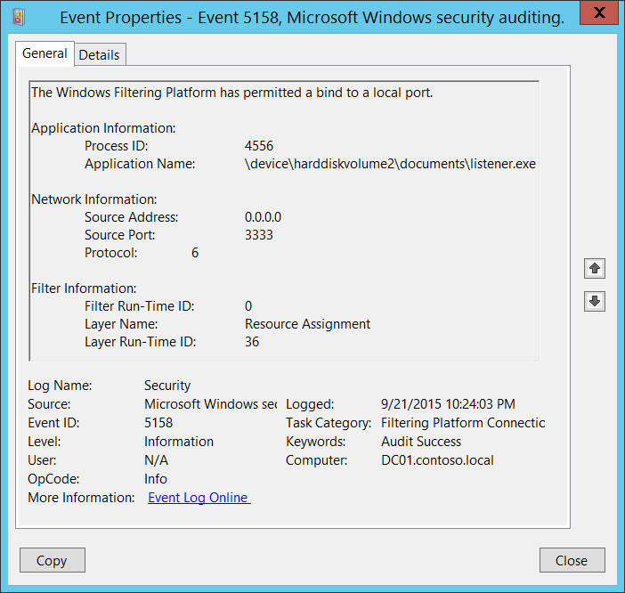
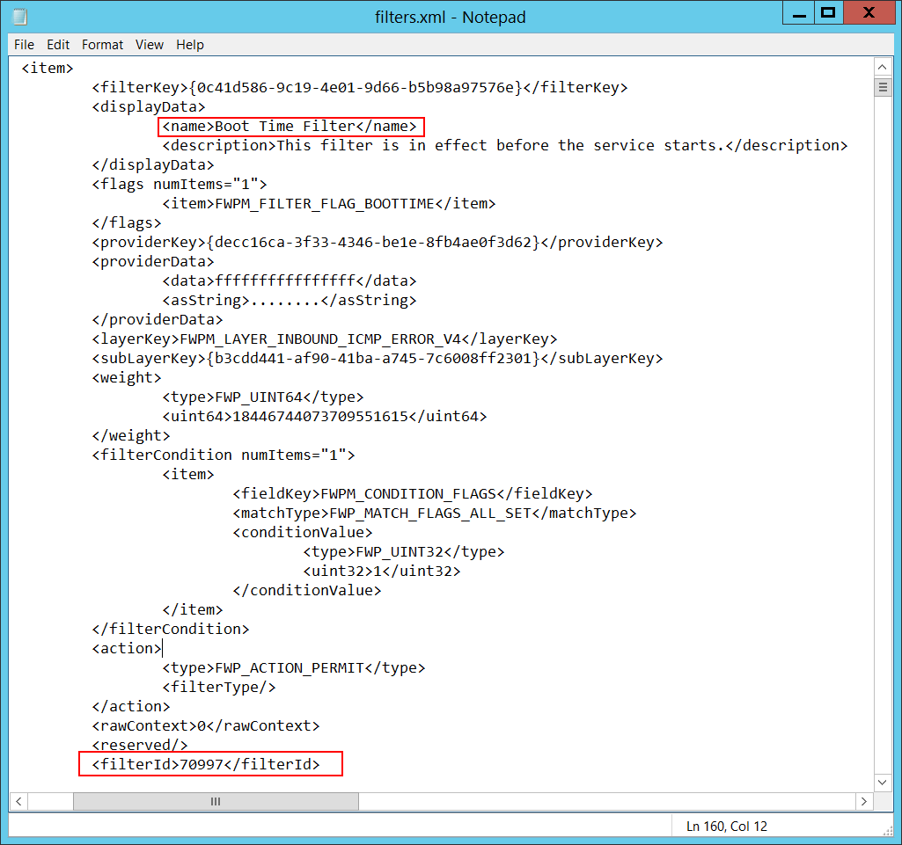

# 5158(S): Windows フィルタリング プラットフォームがローカル ポートへのバインドを許可しました。




***サブカテゴリ:***&nbsp;[フィルタリング プラットフォーム接続の監査](audit-filtering-platform-connection.md)

***イベントの説明:***

このイベントは、[Windows フィルタリング プラットフォーム](/windows/win32/fwp/windows-filtering-platform-start-page) がアプリケーションまたはサービスにローカル ポートへのバインドを許可するたびに生成されます。

> **注**&nbsp;&nbsp;推奨事項については、このイベントの[セキュリティ監視の推奨事項](#security-monitoring-recommendations)を参照してください。

<br clear="all">

***イベント XML:***
```
- <Event xmlns="http://schemas.microsoft.com/win/2004/08/events/event">
- <System>
 <Provider Name="Microsoft-Windows-Security-Auditing" Guid="{54849625-5478-4994-A5BA-3E3B0328C30D}" /> 
 <EventID>5158</EventID> 
 <Version>0</Version> 
 <Level>0</Level> 
 <Task>12810</Task> 
 <Opcode>0</Opcode> 
 <Keywords>0x8020000000000000</Keywords> 
 <TimeCreated SystemTime="2015-09-22T05:24:03.376171200Z" /> 
 <EventRecordID>308122</EventRecordID> 
 <Correlation /> 
 <Execution ProcessID="4" ThreadID="3712" /> 
 <Channel>Security</Channel> 
 <Computer>DC01.contoso.local</Computer> 
 <Security /> 
 </System>
- <EventData>
 <Data Name="ProcessId">4556</Data> 
 <Data Name="Application">\\device\\harddiskvolume2\\documents\\listener.exe</Data> 
 <Data Name="SourceAddress">0.0.0.0</Data> 
 <Data Name="SourcePort">3333</Data> 
 <Data Name="Protocol">6</Data> 
 <Data Name="FilterRTID">0</Data> 
 <Data Name="LayerName">%%14608</Data> 
 <Data Name="LayerRTID">36</Data> 
 </EventData>
 </Event>

```

***必要なサーバー ロール:*** なし。

***最小 OS バージョン:*** Windows Server 2008、Windows Vista。

***イベント バージョン:*** 0。

***フィールドの説明:***

**アプリケーション情報**:

-   **プロセス ID** \[型 = ポインタ\]: ローカル ポートへのバインドが許可されたプロセスの 16 進数のプロセス ID。プロセス ID (PID) は、オペレーティング システムがアクティブなプロセスを一意に識別するために使用する番号です。特定のプロセスの PID を確認するには、たとえばタスク マネージャー (詳細タブ、PID 列) を使用できます。

    

    16 進数の値を 10 進数に変換すると、タスク マネージャーの値と比較できます。

    また、このプロセス ID を他のイベントのプロセス ID と関連付けることもできます。たとえば、「[4688](event-4688.md): 新しいプロセスが作成されました」**プロセス情報\\新しいプロセス ID**。

<!-- -->

-   **アプリケーション名** \[型 = UnicodeString\]**:** プロセスの実行可能ファイルのフル パスと名前。

    論理ディスクは \\device\\harddiskvolume\# の形式で表示されます。すべてのローカルボリューム番号を取得するには、**diskpart** ユーティリティを使用します。diskpart を使用してボリューム番号を取得するコマンドは “**list volume”** です:


**ネットワーク情報:**

-   **送信元アドレス** \[タイプ = UnicodeString\]**:** アプリケーションがポートにバインドされたローカルIPアドレス。

    -   IPv4アドレス

    -   IPv6アドレス

    -   :: - IPv6形式のすべてのIPアドレス

    -   0.0.0.0 - IPv4形式のすべてのIPアドレス

    -   127.0.0.1, ::1 - ローカルホスト

-   **送信元ポート** \[タイプ = UnicodeString\]**:** アプリケーションがバインドされたポート番号。

-   **プロトコル** \[タイプ = UInt32\]: 使用されたプロトコルの番号。

| サービス                                            | プロトコル番号 |
|----------------------------------------------------|-----------------|
| インターネット制御メッセージプロトコル (ICMP)      | 1               |
| 転送制御プロトコル (TCP)                           | 6               |
| ユーザーデータグラムプロトコル (UDP)               | 17              |
| 汎用ルーティングカプセル化 (PPTPデータ over GRE)   | 47              |
| 認証ヘッダー (AH) IPSec                            | 51              |
| カプセル化セキュリティペイロード (ESP) IPSec      | 50              |
| 外部ゲートウェイプロトコル (EGP)                   | 8               |
| ゲートウェイ-ゲートウェイプロトコル (GGP)          | 3               |
| ホスト監視プロトコル (HMP)                         | 20              |
| インターネットグループ管理プロトコル (IGMP)        | 88              |
| MITリモート仮想ディスク (RVD)                      | 66              |
| OSPF オープン最短経路優先                          | 89              |
| PARCユニバーサルパケットプロトコル (PUP)           | 12              |
| 信頼性のあるデータグラムプロトコル (RDP)           | 27              |
| 予約プロトコル (RSVP) QoS                          | 46              |

**フィルター情報:**

-   **フィルター実行時ID** \[タイプ = UInt64\]: アプリケーションがポートにバインドすることを許可する一意のフィルターID。デフォルトでは、Windowsファイアウォールはアプリケーションがポートにバインドされるのを防ぎません。このアプリケーションがフィルターに一致しない場合、このフィールドには値0が表示されます。

特定のWindowsフィルタリングプラットフォームフィルタをIDで見つけるには、次のコマンドを実行します：**netsh wfp show filters**。このコマンドの結果として、**filters.xml**ファイルが生成されます。このファイルを開き、必要なフィルタID（**&lt;filterId&gt;**）を含む特定のサブストリングを見つけます。例えば：



-   **レイヤー名** \[タイプ = UnicodeString\]: [アプリケーションレイヤーエンフォースメント](/windows/win32/fwp/application-layer-enforcement--ale-)レイヤー名。

-   **レイヤーランタイムID** \[タイプ = UInt64\]: Windowsフィルタリングプラットフォームレイヤー識別子。特定のWindowsフィルタリングプラットフォームレイヤーIDを見つけるには、次のコマンドを実行します：**netsh wfp show state**。このコマンドの結果として、**wfpstate.xml**ファイルが生成されます。このファイルを開き、必要なレイヤーID（**&lt;layerId&gt;**）を含む特定のサブストリングを見つけます。例えば：


## セキュリティ監視の推奨事項

5158(S): Windowsフィルタリングプラットフォームがローカルポートへのバインドを許可しました。

-   このイベントで報告された操作を実行するために使用されるべき事前定義されたアプリケーションがある場合、「**Application**」が定義されたアプリケーションと等しくないイベントを監視します。

-   「**Application**」が標準フォルダ（例えば、**System32**や**Program Files**）にない、または制限されたフォルダ（例えば、**Temporary Internet Files**）にあるかどうかを監視できます。

-   アプリケーション名に含まれる制限されたサブストリングや単語の事前定義リストがある場合（例えば、「**mimikatz**」や「**cain.exe**」）、これらのサブストリングを「**Application**」でチェックします。

-   「**Source Address**」がコンピュータに割り当てられたアドレスの1つであることを確認します。

-   特定のローカルポートでのすべてのアクションを監視する必要がある場合、その「**Source Port**」で[5158](event-5158.md)イベントを監視します。

-   このデバイスやコンピュータにとって典型的でない「**Protocol Number**」を持つすべての接続を監視します。例えば、6や17以外のものです。

-   コンピュータが「**宛先アドレス**」との通信に常に特定の「**宛先ポート**」を使用する必要がある場合、他の「**宛先ポート**」を監視します。
