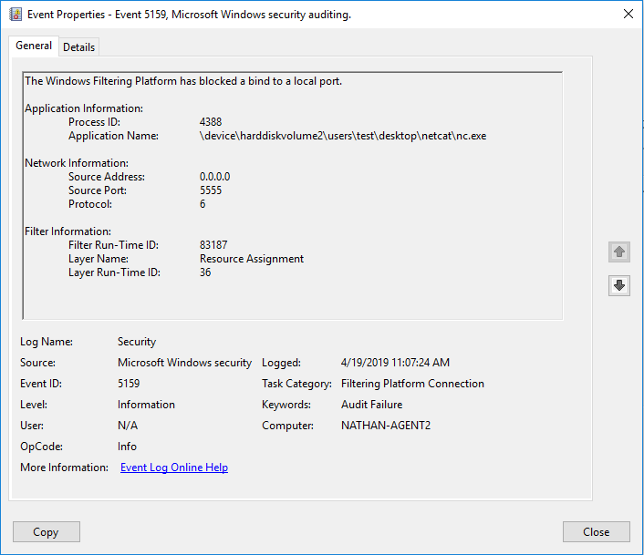
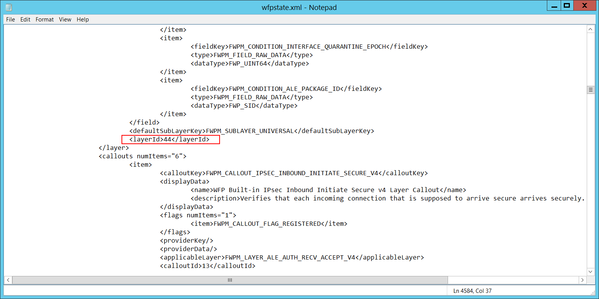

# 5159(F): Windows フィルタリング プラットフォームがローカル ポートへのバインドをブロックしました。




***サブカテゴリ:***&nbsp;[フィルタリング プラットフォーム接続の監査](audit-filtering-platform-connection.md)

***イベントの説明:***

このイベントは、Windows フィルタリング プラットフォームがローカル ポートへのバインドをブロックした場合に記録されます。

<br clear="all">

***イベント XML:***
```xml
- <Event xmlns="http://schemas.microsoft.com/win/2004/08/events/event">
- <System>
 <Provider Name="Microsoft-Windows-Security-Auditing" Guid="{54849625-5478-4994-A5BA-3E3B0328C30D}" />
 <EventID>5159</EventID>
 <Version>0</Version>
 <Level>0</Level>
 <Task>12810</Task>
 <Opcode>0</Opcode>
 <Keywords>0x8010000000000000</Keywords>
 <TimeCreated SystemTime="2019-04-19T07:36:55.955388300Z" />
 <EventRecordID>44097</EventRecordID>
 <Correlation />
 <Execution ProcessID="4" ThreadID="6480" />
 <Channel>Security</Channel>
 <Computer>DC01.contoso.local</Computer>
 <Security />
 </System>
- <EventData>
 <Data Name="ProcessId">7924</Data>
 <Data Name="Application">\device\harddiskvolume2\users\test\desktop\netcat\nc.exe</Data>
 <Data Name="SourceAddress">0.0.0.0</Data>
 <Data Name="SourcePort">5555</Data>
 <Data Name="Protocol">6</Data>
 <Data Name="FilterRTID">84614</Data>
 <Data Name="LayerName">%%14608</Data>
 <Data Name="LayerRTID">36</Data>
 </EventData>
 </Event>

```

***必要なサーバー ロール:*** なし。

***最小 OS バージョン:*** Windows Server 2008, Windows Vista。

***イベント バージョン:*** 0。

***フィールドの説明:***

**アプリケーション情報**:

-   **プロセス ID** \[タイプ = ポインター\]: ローカル ポートへのバインドが許可されたプロセスの 16 進数のプロセス ID。プロセス ID (PID) は、オペレーティング システムがアクティブなプロセスを一意に識別するために使用する番号です。特定のプロセスの PID を確認するには、たとえばタスク マネージャー (詳細タブ、PID 列) を使用できます。

    

    16 進数の値を 10 進数に変換すると、タスク マネージャーの値と比較できます。

    また、このプロセス ID を他のイベントのプロセス ID と関連付けることもできます。たとえば、「[4688](event-4688.md): 新しいプロセスが作成されました」**プロセス情報\\新しいプロセス ID**。

<!-- -->

-   **アプリケーション名** \[タイプ = UnicodeString\]**:** プロセスの実行可能ファイルのフル パスと名前。

    論理ディスクは \\device\\harddiskvolume\# の形式で表示されます。**diskpart** ユーティリティを使用して、すべてのローカル ボリューム番号を取得できます。diskpart を使用してボリューム番号を取得するコマンドは「**list volume**」です。


**ネットワーク情報:**

-   **送信元アドレス** \[タイプ = UnicodeString\]**:** アプリケーションが実行されているコンピュータのローカルIPアドレス。

    -   IPv4アドレス

    -   IPv6アドレス

    -   :: - IPv6形式のすべてのIPアドレス

    -   0.0.0.0 - IPv4形式のすべてのIPアドレス

    -   127.0.0.1, ::1 - ローカルホスト

-   **送信元ポート** \[タイプ = UnicodeString\]**:** アプリケーションが使用するポート番号。

-   **プロトコル** \[タイプ = UInt32\]: 使用されているプロトコル番号。

| サービス                                            | プロトコル番号 |
|----------------------------------------------------|-----------------|
| インターネット制御メッセージプロトコル (ICMP)      | 1               |
| 転送制御プロトコル (TCP)                           | 6               |
| ユーザデータグラムプロトコル (UDP)                 | 17              |
| 汎用ルーティングカプセル化 (PPTPデータ over GRE)   | 47              |
| 認証ヘッダー (AH) IPSec                            | 51              |
| カプセル化セキュリティペイロード (ESP) IPSec      | 50              |
| エクステリアゲートウェイプロトコル (EGP)          | 8               |
| ゲートウェイ-ゲートウェイプロトコル (GGP)         | 3               |
| ホストモニタリングプロトコル (HMP)                | 20              |
| インターネットグループ管理プロトコル (IGMP)       | 88              |
| MITリモート仮想ディスク (RVD)                      | 66              |
| OSPF オープン最短経路優先                          | 89              |
| PARCユニバーサルパケットプロトコル (PUP)          | 12              |
| 信頼性のあるデータグラムプロトコル (RDP)          | 27              |
| 予約プロトコル (RSVP) QoS                          | 46              |

**フィルター情報:**

-   **フィルター実行時ID** \[タイプ = UInt64\]: アプリケーションがポートにバインドするのをブロックする一意のフィルターID。デフォルトでは、Windowsファイアウォールはアプリケーションによるポートのバインドを防止しません。このアプリケーションがフィルターに一致しない場合、このフィールドには値0が表示されます。

特定のWindowsフィルタリングプラットフォームフィルターをIDで見つけるには、次のコマンドを実行します: **netsh wfp show filters**。このコマンドの結果、**filters.xml**ファイルが生成されます。このファイルを開き、必要なフィルターID (**&lt;filterId&gt;**) を含む特定のサブストリングを見つけます。例えば:


-   **レイヤー名** \[タイプ = UnicodeString\]: [アプリケーションレイヤーエンフォースメント](/windows/win32/fwp/application-layer-enforcement--ale-) レイヤー名。

-   **レイヤーランタイムID** \[タイプ = UInt64\]: Windowsフィルタリングプラットフォームレイヤー識別子。特定のWindowsフィルタリングプラットフォームレイヤーIDを見つけるには、次のコマンドを実行します: **netsh wfp show state**。このコマンドの結果、**wfpstate.xml**ファイルが生成されます。このファイルを開き、必要なレイヤーID (**&lt;layerId&gt;**) を含む特定のサブストリングを見つけます。例えば:



## セキュリティ監視の推奨事項

-   このドキュメントには、このイベントに対する推奨事項はありません。
