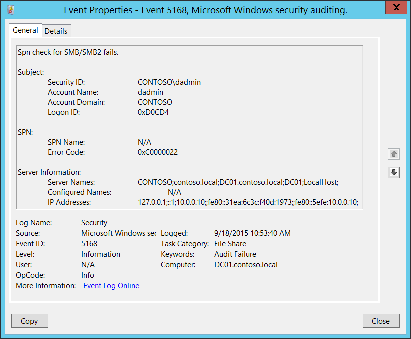

# 5168(F): SMB/SMB2 の SPN チェックに失敗しました。



***サブカテゴリ:***&nbsp;[ファイル共有の監査](audit-file-share.md)

***イベントの説明:***

このイベントは SMB SPN チェックが失敗したときに生成されます。

これは、クライアント側で NTLMv1 または LM プロトコルが使用されている場合に、サーバー側で「[Microsoft ネットワーク サーバー: サーバー SPN ターゲット名の検証レベル](/previous-versions/windows/it-pro/windows-server-2012-R2-and-2012/jj852272(v=ws.11))」グループ ポリシーが「クライアントから要求する」に設定されているときに発生することがよくあります。SPN は NTLMv2 または Kerberos プロトコルが使用されている場合にのみサーバーに送信され、その後 SPN を検証できます。

> **注**&nbsp;&nbsp;推奨事項については、このイベントの[セキュリティ監視の推奨事項](#security-monitoring-recommendations)を参照してください。

<br clear="all">

***イベント XML:***
```
- <Event xmlns="http://schemas.microsoft.com/win/2004/08/events/event">
- <System>
 <Provider Name="Microsoft-Windows-Security-Auditing" Guid="{54849625-5478-4994-A5BA-3E3B0328C30D}" /> 
 <EventID>5168</EventID> 
 <Version>0</Version> 
 <Level>0</Level> 
 <Task>12808</Task> 
 <Opcode>0</Opcode> 
 <Keywords>0x8010000000000000</Keywords> 
 <TimeCreated SystemTime="2015-09-18T17:53:40.294859800Z" /> 
 <EventRecordID>268946</EventRecordID> 
 <Correlation /> 
 <Execution ProcessID="4" ThreadID="80" /> 
 <Channel>Security</Channel> 
 <Computer>DC01.contoso.local</Computer> 
 <Security /> 
 </System>
- <EventData>
 <Data Name="SubjectUserSid">S-1-5-21-3457937927-2839227994-823803824-1104</Data> 
 <Data Name="SubjectUserName">dadmin</Data> 
 <Data Name="SubjectDomainName">CONTOSO</Data> 
 <Data Name="SubjectLogonId">0xd0cd4</Data> 
 <Data Name="SpnName">N/A</Data> 
 <Data Name="ErrorCode">0xc0000022</Data> 
 <Data Name="ServerNames">CONTOSO;contoso.local;DC01.contoso.local;DC01;LocalHost;</Data> 
 <Data Name="ConfiguredNames">N/A</Data> 
 <Data Name="IpAddresses">127.0.0.1;::1;10.0.0.10;;fe80::31ea:6c3c:f40d:1973;;fe80::5efe:10.0.0.10;</Data> 
 </EventData>
 </Event>

```

***必要なサーバー ロール:*** なし。

***最小 OS バージョン:*** Windows Server 2008 R2, Windows 7。

***イベント バージョン:*** 0。

***フィールドの説明:***

**サブジェクト:**

-   **セキュリティ ID** \[タイプ = SID\]**:** SPN チェック操作が失敗したアカウントの SID。イベント ビューアーは自動的に SID を解決してアカウント名を表示しようとします。SID を解決できない場合は、イベントにソース データが表示されます。

> **注**&nbsp;&nbsp;**セキュリティ識別子 (SID)** は、トラスティ (セキュリティ プリンシパル) を識別するために使用される可変長の一意の値です。各アカウントには、Active Directory ドメイン コントローラーなどの権限によって発行され、セキュリティ データベースに格納される一意の SID があります。ユーザーがログオンするたびに、システムはデータベースからそのユーザーの SID を取得し、そのユーザーのアクセストークンに配置します。システムはアクセストークン内の SID を使用して、以降のすべての Windows セキュリティとのやり取りでユーザーを識別します。SID がユーザーまたはグループの一意の識別子として使用された場合、それが再び別のユーザーまたはグループを識別するために使用されることはありません。SID の詳細については、[セキュリティ識別子](/windows/access-protection/access-control/security-identifiers)を参照してください。

-   **アカウント名** \[タイプ = UnicodeString\]**:** SPNチェック操作が失敗したアカウントの名前。

-   **アカウントドメイン** \[タイプ = UnicodeString\]**:** サブジェクトのドメインまたはコンピュータ名。形式は以下のように異なります：

    -   ドメインNETBIOS名の例: CONTOSO

    -   小文字の完全ドメイン名: contoso.local

    -   大文字の完全ドメイン名: CONTOSO.LOCAL

    -   一部の[よく知られたセキュリティプリンシパル](/windows/security/identity-protection/access-control/security-identifiers)の場合、例えばLOCAL SERVICEやANONYMOUS LOGON、このフィールドの値は「NT AUTHORITY」となります。

    -   ローカルユーザーアカウントの場合、このフィールドにはこのアカウントが属するコンピュータまたはデバイスの名前が含まれます。例えば、「Win81」。

-   **ログオンID** \[タイプ = HexInt64\]**:** 16進数の値で、最近のイベントと同じログオンIDを含む可能性のあるこのイベントを関連付けるのに役立ちます。例えば、「[4624](event-4624.md): アカウントが正常にログオンされました。」

**SPN**:

-   **SPN名** \[タイプ = UnicodeString\]: サーバーにアクセスするために使用されたSPN。SPNが提供されなかった場合、値は「N/A」となります。

> **注**&nbsp;&nbsp;**サービスプリンシパル名 (SPN)** は、クライアントがサービスのインスタンスを一意に識別するための名前です。フォレスト全体のコンピュータに複数のサービスインスタンスをインストールする場合、各インスタンスは独自のSPNを持つ必要があります。特定のサービスインスタンスには、クライアントが認証に使用する可能性のある複数の名前がある場合、複数のSPNを持つことができます。例えば、SPNには常にサービスインスタンスが実行されているホストコンピュータの名前が含まれるため、サービスインスタンスはホストの各名前またはエイリアスに対してSPNを登録することがあります。

-   **エラーコード** \[タイプ = HexInt32\]: 16進数のエラーコード。例えば「0xC0000022」 = STATUS\_ACCESS\_DENIED。すべてのSMBエラーコードの説明はこちらで見つけることができます: <https://msdn.microsoft.com/library/ee441884.aspx>。

**サーバー情報**:

-   **サーバー名** \[タイプ = UnicodeString\]: ターゲットサーバーにアクセスするために使用する可能性のあるサーバー名に関する情報（NETBIOS、DNS、localhostなど）。

-   **設定された名前** \[タイプ = UnicodeString\]: 検証のために提供された名前に関する情報。情報が提供されなかった場合、値は「**N/A**」となります。

-   **IPアドレス** \[タイプ = UnicodeString\]: ターゲットサーバーにアクセスするために使用可能なIPアドレス（IPv4、IPv6）に関する情報。

## セキュリティ監視の推奨事項

5168(F): SMB/SMB2のSPNチェックに失敗しました。

> **重要**&nbsp;&nbsp;このイベントについては、[付録A: 多くの監査イベントに対するセキュリティ監視の推奨事項](appendix-a-security-monitoring-recommendations-for-many-audit-events.md)も参照してください。

-   [5168](event-5168.md) イベントを監視することをお勧めします。これは、設定の問題や悪意のある認証試行の兆候である可能性があるためです。
