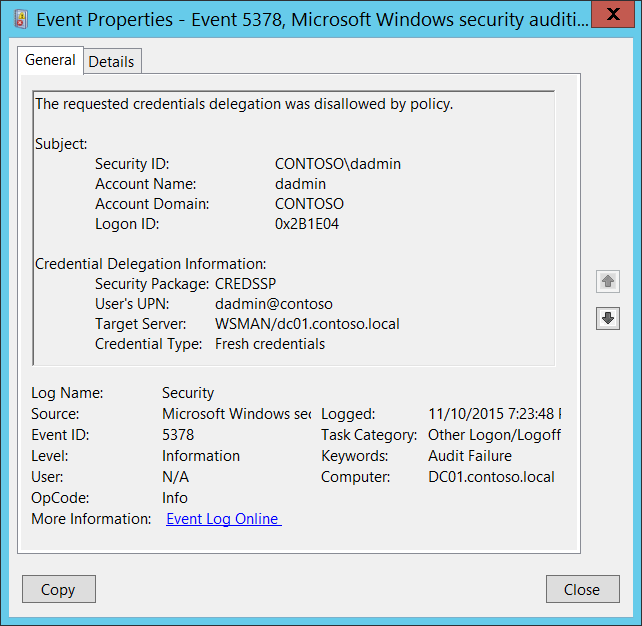

# 5378(F): 要求された資格情報の委任がポリシーによって拒否されました。



***サブカテゴリ:***&nbsp;[その他のログオン/ログオフイベントの監査](audit-other-logonlogoff-events.md)

***イベントの説明:***

このイベントは、要求された [CredSSP](/openspecs/windows_protocols/ms-cssp/85f57821-40bb-46aa-bfcb-ba9590b8fc30) 資格情報の委任が [CredSSP](/openspecs/windows_protocols/ms-cssp/85f57821-40bb-46aa-bfcb-ba9590b8fc30) 委任ポリシーによって拒否されたことを示します。

通常、[WinRM](/windows/win32/winrm/portal) [ダブルホップ](/windows/win32/winrm/multi-hop-support) セッションのための [CredSSP](/openspecs/windows_protocols/ms-cssp/85f57821-40bb-46aa-bfcb-ba9590b8fc30) 委任が適切に設定されていない場合に発生します。

> **注**&nbsp;&nbsp;推奨事項については、このイベントの [セキュリティ監視の推奨事項](#security-monitoring-recommendations) を参照してください。

<br clear="all">

***イベント XML:***
```xml
- <Event xmlns="http://schemas.microsoft.com/win/2004/08/events/event">
- <System>
 <Provider Name="Microsoft-Windows-Security-Auditing" Guid="{54849625-5478-4994-A5BA-3E3B0328C30D}" /> 
 <EventID>5378</EventID> 
 <Version>0</Version> 
 <Level>0</Level> 
 <Task>12551</Task> 
 <Opcode>0</Opcode> 
 <Keywords>0x8010000000000000</Keywords> 
 <TimeCreated SystemTime="2015-11-11T03:23:48.502346900Z" /> 
 <EventRecordID>1198733</EventRecordID> 
 <Correlation /> 
 <Execution ProcessID="500" ThreadID="4308" /> 
 <Channel>Security</Channel> 
 <Computer>DC01.contoso.local</Computer> 
 <Security /> 
 </System>
- <EventData>
 <Data Name="SubjectUserSid">S-1-5-21-3457937927-2839227994-823803824-1104</Data> 
 <Data Name="SubjectUserName">dadmin</Data> 
 <Data Name="SubjectDomainName">CONTOSO</Data> 
 <Data Name="SubjectLogonId">0x2b1e04</Data> 
 <Data Name="Package">CREDSSP</Data> 
 <Data Name="UserUPN">dadmin@contoso</Data> 
 <Data Name="TargetServer">WSMAN/dc01.contoso.local</Data> 
 <Data Name="CredType">%%8098</Data> 
 </EventData>
</Event>

```

***必要なサーバーの役割:*** なし。

***最小 OS バージョン:*** Windows Server 2008, Windows Vista。

***イベントバージョン:*** 0。

***フィールドの説明:***

**サブジェクト:**

-   **セキュリティ ID** \[タイプ = SID\]**:** 資格情報の委任を要求したアカウントの SID。イベントビューアーは自動的に SID を解決し、アカウント名を表示しようとします。SID を解決できない場合、イベントにはソースデータが表示されます。

> **注**&nbsp;&nbsp;**セキュリティ識別子 (SID)** は、トラスティ (セキュリティプリンシパル) を識別するために使用される可変長の一意の値です。各アカウントには、Active Directory ドメインコントローラーなどの権限によって発行され、セキュリティデータベースに保存される一意の SID があります。ユーザーがログオンするたびに、システムはデータベースからそのユーザーの SID を取得し、そのユーザーのアクセストークンに配置します。システムは、アクセストークン内の SID を使用して、以降のすべての Windows セキュリティとのやり取りでユーザーを識別します。SID がユーザーまたはグループの一意の識別子として使用された場合、それが再び別のユーザーまたはグループを識別するために使用されることはありません。SID の詳細については、[セキュリティ識別子](/windows/access-protection/access-control/security-identifiers) を参照してください。

-   **アカウント名** \[タイプ = UnicodeString\]**:** 資格情報の委任を要求したアカウントの名前。

-   **アカウントドメイン** \[タイプ = UnicodeString\]**:** サブジェクトのドメインまたはコンピュータ名。形式は以下のように異なります：

    -   ドメインのNETBIOS名の例: CONTOSO

    -   小文字の完全ドメイン名: contoso.local

    -   大文字の完全ドメイン名: CONTOSO.LOCAL

    -   LOCAL SERVICEやANONYMOUS LOGONなどの[よく知られたセキュリティプリンシパル](/windows/security/identity-protection/access-control/security-identifiers)の場合、このフィールドの値は「NT AUTHORITY」となります。

    -   ローカルユーザーアカウントの場合、このフィールドにはこのアカウントが属するコンピュータまたはデバイスの名前が含まれます。例: “Win81”。

-   **ログオンID** \[タイプ = HexInt64\]**:** 16進数の値で、同じログオンIDを含む最近のイベントとこのイベントを関連付けるのに役立ちます。例: “[4624](event-4624.md): アカウントが正常にログオンされました。”

**資格情報の委任情報:**

-   **セキュリティパッケージ** \[タイプ = UnicodeString\]: 使用された[セキュリティパッケージ](/windows/win32/secauthn/ssp-aps-versus-ssps)の名前。このイベントでは常に**CREDSSP**です。

-   **ユーザーのUPN** \[タイプ = UnicodeString\]: 委任が要求されたアカウントの[UPN](/windows/win32/secauthn/user-name-formats)。

-   **ターゲットサーバー** \[タイプ = UnicodeString\]: 委任が要求されたターゲットサービスのSPN。

> **注**&nbsp;&nbsp;**サービスプリンシパル名 (SPN)** は、クライアントがサービスのインスタンスを一意に識別する名前です。フォレスト全体のコンピュータに複数のサービスインスタンスをインストールする場合、各インスタンスは独自のSPNを持つ必要があります。特定のサービスインスタンスは、クライアントが認証に使用する可能性のある複数の名前がある場合、複数のSPNを持つことができます。例えば、SPNには常にサービスインスタンスが実行されているホストコンピュータの名前が含まれるため、サービスインスタンスはホストの各名前またはエイリアスに対してSPNを登録することがあります。

-   **資格情報の種類** \[タイプ = UnicodeString\]: 委任のために提示された資格情報の種類:

| 資格情報の種類       | 説明                                                                                                                                     |
|---------------------|---------------------------------------------------------------------------------------------------------------------------------------------|
| デフォルトの資格情報 | ユーザーが最初にWindowsにログオンしたときに取得される資格情報。                                                                            |
| 新しい資格情報       | アプリケーションを実行する際にユーザーに求められる資格情報。                                                                |
| 保存された資格情報   | [資格情報マネージャー](/windows/win32/secauthn/credential-manager)を使用して保存された資格情報。 |

## セキュリティ監視の推奨事項

5378(F): 要求された資格情報の委任がポリシーによって拒否されました。

> **重要**&nbsp;&nbsp;このイベントについては、[付録A: 多くの監査イベントに対するセキュリティ監視の推奨事項](appendix-a-security-monitoring-recommendations-for-many-audit-events.md)も参照してください。

-   CredSSP委任ポリシーを定義している場合、このイベントはポリシー違反を示します。これらのイベントを収集し、すべてのポリシー違反を調査することをお勧めします。

-   このイベントはCredSSP委任のトラブルシューティングにも使用できます。
