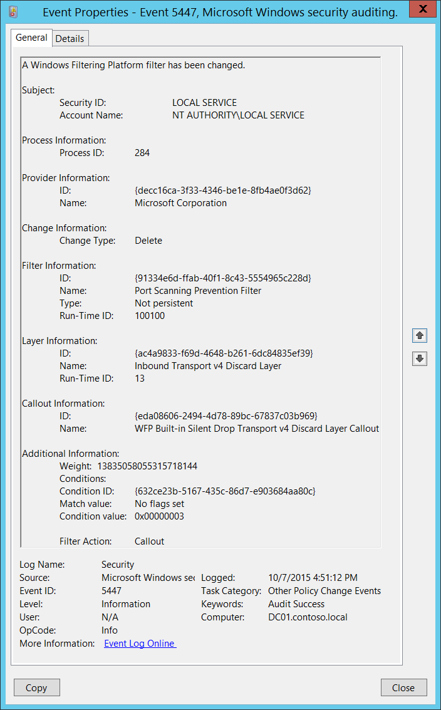

# 5447(S): Windows フィルタリング プラットフォーム フィルターが変更されました。




***サブカテゴリ:***&nbsp;[その他のポリシー変更イベントの監査](audit-other-policy-change-events.md)

***イベントの説明:***

このイベントは、[Windows フィルタリング プラットフォーム](/windows/win32/fwp/windows-filtering-platform-start-page) フィルターが変更されるたびに生成されます。

通常、グループ ポリシーの更新手順中に生成されます。

> **注**&nbsp;&nbsp;推奨事項については、このイベントの[セキュリティ監視の推奨事項](#security-monitoring-recommendations)を参照してください。

<br clear="all">

***イベント XML:***
```xml
- <Event xmlns="http://schemas.microsoft.com/win/2004/08/events/event">
- <System>
 <Provider Name="Microsoft-Windows-Security-Auditing" Guid="{54849625-5478-4994-A5BA-3E3B0328C30D}" /> 
 <EventID>5447</EventID> 
 <Version>0</Version> 
 <Level>0</Level> 
 <Task>13573</Task> 
 <Opcode>0</Opcode> 
 <Keywords>0x8020000000000000</Keywords> 
 <TimeCreated SystemTime="2015-10-07T23:51:12.191198900Z" /> 
 <EventRecordID>1060216</EventRecordID> 
 <Correlation /> 
 <Execution ProcessID="524" ThreadID="3784" /> 
 <Channel>Security</Channel> 
 <Computer>DC01.contoso.local</Computer> 
 <Security /> 
 </System>
- <EventData>
 <Data Name="ProcessId">284</Data> 
 <Data Name="UserSid">S-1-5-19</Data> 
 <Data Name="UserName">NT AUTHORITY\\LOCAL SERVICE</Data> 
 <Data Name="ProviderKey">{DECC16CA-3F33-4346-BE1E-8FB4AE0F3D62}</Data> 
 <Data Name="ProviderName">Microsoft Corporation</Data> 
 <Data Name="ChangeType">%%16385</Data> 
 <Data Name="FilterKey">{91334E6D-FFAB-40F1-8C43-5554965C228D}</Data> 
 <Data Name="FilterName">Port Scanning Prevention Filter</Data> 
 <Data Name="FilterType">%%16388</Data> 
 <Data Name="FilterId">100100</Data> 
 <Data Name="LayerKey">{AC4A9833-F69D-4648-B261-6DC84835EF39}</Data> 
 <Data Name="LayerName">Inbound Transport v4 Discard Layer</Data> 
 <Data Name="LayerId">13</Data> 
 <Data Name="Weight">13835058055315718144</Data> 
 <Data Name="Conditions">Condition ID: {632ce23b-5167-435c-86d7-e903684aa80c} Match value: No flags set Condition value: 0x00000003</Data> 
 <Data Name="Action">%%16391</Data> 
 <Data Name="CalloutKey">{EDA08606-2494-4D78-89BC-67837C03B969}</Data> 
 <Data Name="CalloutName">WFP Built-in Silent Drop Transport v4 Discard Layer Callout</Data> 
 </EventData>
 </Event>

```

***必要なサーバー ロール:*** なし。

***最小 OS バージョン:*** Windows Server 2008、Windows Vista。

***イベント バージョン:*** 0。

## セキュリティ監視の推奨事項

5447(S): Windows フィルタリング プラットフォーム フィルターが変更されました。

-   このイベントは主に Windows フィルタリング プラットフォームのトラブルシューティングに使用され、通常はセキュリティ関連性がほとんどありません。
