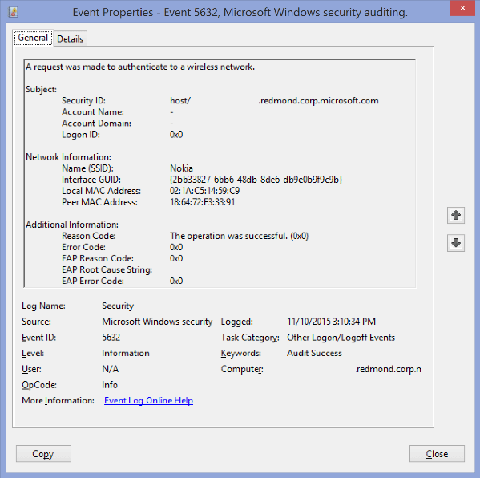
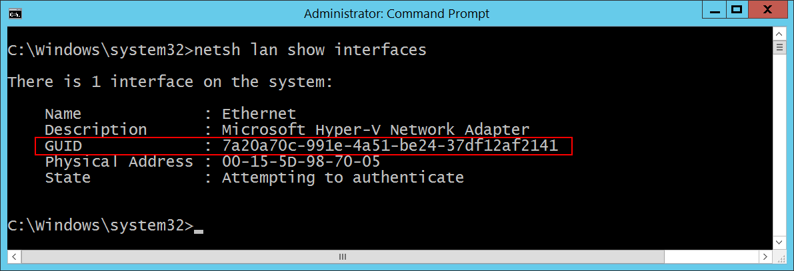

# 5632(S, F): ワイヤレスネットワークへの認証要求が行われました。




***サブカテゴリ:***&nbsp;[その他のログオン/ログオフイベントの監査](audit-other-logonlogoff-events.md)

***イベントの説明:***

このイベントは、ワイヤレスネットワークに対して[802.1x](/previous-versions/windows/it-pro/windows-server-2012-R2-and-2012/hh831831(v=ws.11))認証試行が行われたときに生成されます。

通常、ネットワークアダプタが新しいワイヤレスネットワークに接続するときに生成されます。

> **注**&nbsp;&nbsp;このイベントに関する推奨事項については、[セキュリティ監視の推奨事項](#security-monitoring-recommendations)を参照してください。

<br clear="all">

***イベント XML:***
```
- <Event xmlns="http://schemas.microsoft.com/win/2004/08/events/event">
- <System>
 <Provider Name="Microsoft-Windows-Security-Auditing" Guid="{54849625-5478-4994-A5BA-3E3B0328C30D}" />
 <EventID>5632</EventID>
 <Version>1</Version>
 <Level>0</Level>
 <Task>12551</Task>
 <Opcode>0</Opcode>
 <Keywords>0x8020000000000000</Keywords>
 <TimeCreated SystemTime="2015-11-10T23:10:34.052054800Z" />
 <EventRecordID>44113845</EventRecordID>
 <Correlation />
 <Execution ProcessID="712" ThreadID="4176" />
 <Channel>Security</Channel>
 <Computer>XXXXXXX.redmond.corp.microsoft.com</Computer>
 <Security />
 </System>
- <EventData>
 <Data Name="SSID">Nokia</Data>
 <Data Name="Identity">host/XXXXXXXX.redmond.corp.microsoft.com</Data>
 <Data Name="SubjectUserName">-</Data>
 <Data Name="SubjectDomainName">-</Data>
 <Data Name="SubjectLogonId">0x0</Data>
 <Data Name="PeerMac">18:64:72:F3:33:91</Data>
 <Data Name="LocalMac">02:1A:C5:14:59:C9</Data>
 <Data Name="IntfGuid">{2BB33827-6BB6-48DB-8DE6-DB9E0B9F9C9B}</Data>
 <Data Name="ReasonCode">0x0</Data>
 <Data Name="ReasonText">The operation was successful.</Data>
 <Data Name="ErrorCode">0x0</Data>
 <Data Name="EAPReasonCode">0x0</Data>
 <Data Name="EapRootCauseString" />
 <Data Name="EAPErrorCode">0x0</Data>
 </EventData>
 </Event>
```

***必要なサーバーの役割:*** なし。

***最小 OS バージョン:*** Windows Server 2008, Windows Vista。

***イベントバージョン:*** 0。

***フィールドの説明:***

**サブジェクト:**

-   **セキュリティ ID** \[タイプ = UnicodeString\]**:** 802.1x認証要求が行われたユーザープリンシパル名 (UPN) または他の種類のアカウント識別子。

> **注**&nbsp;&nbsp;[ユーザープリンシパル名](/windows/win32/secauthn/user-name-formats) (UPN) 形式は、UserName@Example.Microsoft.com のようなインターネットスタイルの名前を指定するために使用されます。

-   **アカウント名** \[タイプ = UnicodeString\]**:** 802.1x認証要求が行われたアカウントの名前。

-   **アカウントドメイン** \[タイプ = UnicodeString\]**:** サブジェクトのドメインまたはコンピュータ名。形式はさまざまで、以下のものが含まれます:

    -   ドメイン NETBIOS 名の例: CONTOSO

    -   小文字の完全なドメイン名: contoso.local

    -   大文字の完全なドメイン名: CONTOSO.LOCAL

-   [よく知られているセキュリティプリンシパル](/windows/security/identity-protection/access-control/security-identifiers)（例えば、LOCAL SERVICEやANONYMOUS LOGONなど）の場合、このフィールドの値は「NT AUTHORITY」となります。

    -   ローカルユーザーアカウントの場合、このフィールドにはこのアカウントが属するコンピュータまたはデバイスの名前が含まれます。例えば、「Win81」のように。

-   **ログオンID** \[タイプ = HexInt64\]**:** このイベントを同じログオンIDを含む最近のイベントと関連付けるのに役立つ16進数の値。例えば、「[4624](event-4624.md): アカウントが正常にログオンされました。」

**ネットワーク情報:**

-   **名前 (SSID)** \[タイプ = UnicodeString\]**:** 認証要求が送信されたワイヤレスネットワークのSSID。

> **注**&nbsp;&nbsp;**サービスセット識別子 (SSID)** は、ワイヤレスローカルエリアネットワーク (WLAN) を一意に名前付けする文字列のことです。SSIDは「ネットワーク名」と呼ばれることもあります。この名前により、複数の独立したネットワークが同じ物理エリアで動作している場合に、ステーションが希望するネットワークに接続することができます。

-   **インターフェースGUID** \[タイプ = GUID\]**:** 認証要求に使用されたネットワークインターフェースのGUID。

> **注**&nbsp;&nbsp;**GUID** は「グローバル一意識別子」の略です。リソース、アクティビティ、またはインスタンスを識別するために使用される128ビットの整数です。

インターフェースのGUIDは以下のコマンドを使用して確認できます：

-   “netsh lan show interfaces” – 有線インターフェースの場合。

-   “netsh wlan show interfaces” – 無線インターフェースの場合。



-   **ローカルMACアドレス** \[タイプ = UnicodeString\]**:** ローカルインターフェースのMACアドレス。

-   **ピアMACアドレス** \[タイプ = UnicodeString\]**:** ピア（通常はアクセスポイント）のMACアドレス。

**追加情報:**

-   **理由コード** \[タイプ = UnicodeString\]**:** ワイヤレス認証結果の理由コードと理由テキスト（理由コードの説明）を含みます。ワイヤレス認証の理由コードについての詳細はこちらをご覧ください: <https://msdn.microsoft.com/library/windows/desktop/dd877212(v=vs.85).aspx>, <https://technet.microsoft.com/library/cc727747(v=ws.10).aspx>.

-   **エラーコード** \[Type = HexInt32\]**:** このドキュメントにはこのフィールドに関する情報がありません。

-   **EAP理由コード** \[Type = HexInt32\]**:** このドキュメントにはこのフィールドに関する情報がありません。追加情報については、[EAP関連のエラーおよび情報定数](/windows/win32/eaphost/eap-related-error-and-information-constants)を参照してください。

-   **EAP根本原因文字列** \[Type = UnicodeString\]**:** このドキュメントにはこのフィールドに関する情報がありません。

-   **EAPエラーコード** \[Type = HexInt32\]**:** このドキュメントにはこのフィールドに関する情報がありません。

## セキュリティ監視の推奨事項

5632(S, F): ワイヤレスネットワークへの認証要求が行われました。

-   このドキュメントにはこのイベントに関する推奨事項はありません。
