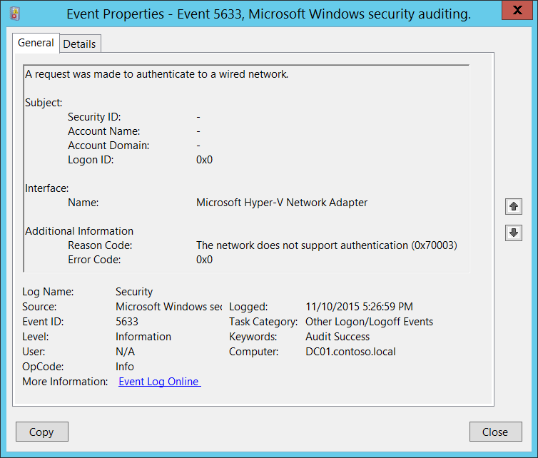
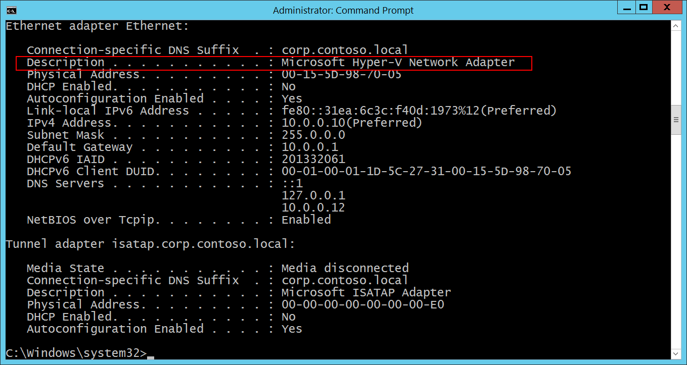

# 5633(S, F): 有線ネットワークへの認証要求が行われました。



***サブカテゴリ:***&nbsp;[その他のログオン/ログオフイベントの監査](audit-other-logonlogoff-events.md)

***イベントの説明:***

このイベントは、有線ネットワークに対して[802.1x](/previous-versions/windows/it-pro/windows-server-2012-R2-and-2012/hh831831(v=ws.11))認証の試行が行われたときに生成されます。

通常、ネットワークアダプターが新しい有線ネットワークに接続されたときに生成されます。

> **注**&nbsp;&nbsp;このイベントに関する推奨事項については、[セキュリティ監視の推奨事項](#security-monitoring-recommendations)を参照してください。

<br clear="all">

***イベント XML:***
```
- <Event xmlns="http://schemas.microsoft.com/win/2004/08/events/event">
- <System>
 <Provider Name="Microsoft-Windows-Security-Auditing" Guid="{54849625-5478-4994-A5BA-3E3B0328C30D}" /> 
 <EventID>5633</EventID> 
 <Version>0</Version> 
 <Level>0</Level> 
 <Task>12551</Task> 
 <Opcode>0</Opcode> 
 <Keywords>0x8020000000000000</Keywords> 
 <TimeCreated SystemTime="2015-11-11T01:26:59.679232500Z" /> 
 <EventRecordID>1198715</EventRecordID> 
 <Correlation /> 
 <Execution ProcessID="500" ThreadID="2920" /> 
 <Channel>Security</Channel> 
 <Computer>DC01.contoso.local</Computer> 
 <Security /> 
 </System>
- <EventData>
 <Data Name="InterfaceName">Microsoft Hyper-V Network Adapter</Data> 
 <Data Name="Identity">-</Data> 
 <Data Name="SubjectUserName">-</Data> 
 <Data Name="SubjectDomainName">-</Data> 
 <Data Name="SubjectLogonId">0x0</Data> 
 <Data Name="ReasonCode">0x70003</Data> 
 <Data Name="ReasonText">The network does not support authentication</Data> 
 <Data Name="ErrorCode">0x0</Data> 
 </EventData>
</Event>
```

***必要なサーバー役割:*** なし。

***最小 OS バージョン:*** Windows Server 2008, Windows Vista。

***イベントバージョン:*** 0。

***フィールドの説明:***

**サブジェクト:**

-   **セキュリティ ID** \[タイプ = UnicodeString\]**:** 802.1x 認証要求が行われたアカウントのユーザープリンシパル名 (UPN)。

> **注**&nbsp;&nbsp;[ユーザープリンシパル名](/windows/win32/secauthn/user-name-formats) (UPN) 形式は、UserName@Example.Microsoft.com のようなインターネットスタイルの名前を指定するために使用されます。

-   **アカウント名** \[タイプ = UnicodeString\]**:** 802.1x 認証要求が行われたアカウントの名前。

-   **アカウント ドメイン** \[タイプ = UnicodeString\]**:** サブジェクトのドメインまたはコンピューター名。形式はさまざまで、以下を含みます:

    -   ドメイン NETBIOS 名の例: CONTOSO

    -   小文字の完全なドメイン名: contoso.local

    -   大文字の完全なドメイン名: CONTOSO.LOCAL

-   一部の[よく知られたセキュリティプリンシパル](/windows/security/identity-protection/access-control/security-identifiers)（例えば、LOCAL SERVICEやANONYMOUS LOGONなど）の場合、このフィールドの値は「NT AUTHORITY」となります。

-   ローカルユーザーアカウントの場合、このフィールドにはこのアカウントが属するコンピューターやデバイスの名前が含まれます。例えば、「Win81」のように。

-   **ログオンID** \[Type = HexInt64\]**:** このイベントを同じログオンIDを含む最近のイベントと関連付けるのに役立つ16進数の値。例えば、「[4624](event-4624.md): アカウントが正常にログオンされました。」

**インターフェース:**

-   **名前** \[Type = UnicodeString\]: 認証要求に使用されたネットワークインターフェースの名前（説明）。「**ipconfig /all**」コマンドを使用して、利用可能なすべてのネットワークアダプターのリストを取得できます。各ネットワークアダプターの「説明」行を参照してください。



**追加情報:**

-   **理由コード** \[Type = UnicodeString\]: 理由コードの説明と有線認証結果の理由コードを含みます。有線認証の理由コードについての詳細は、<https://msdn.microsoft.com/library/windows/desktop/dd877212(v=vs.85).aspx>、<https://technet.microsoft.com/library/cc727747(v=ws.10).aspx>を参照してください。

-   **エラーコード** \[Type = HexInt32\]: 一意の[EAPエラーコード](/windows/win32/eaphost/eap-related-error-and-information-constants)。

## セキュリティ監視の推奨事項

5633(S, F): 有線ネットワークへの認証要求が行われました。

-   このドキュメントには、このイベントに対する推奨事項はありません。
