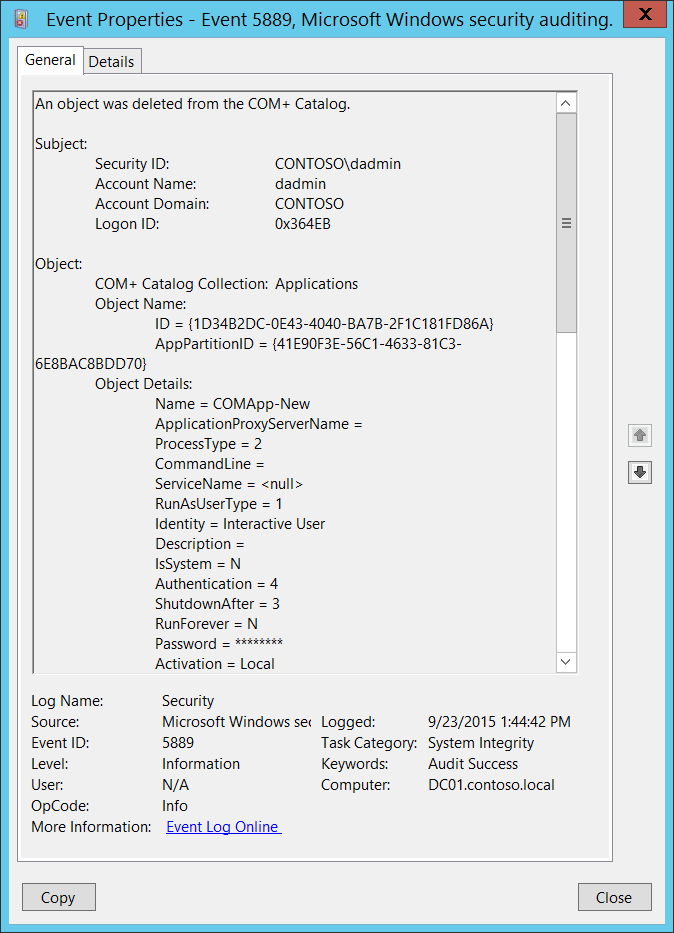

# 5889(S): COM+ カタログからオブジェクトが削除されました。



***サブカテゴリ:***&nbsp;[その他のオブジェクト アクセス イベントの監査](audit-other-object-access-events.md)

***イベントの説明:***

このイベントは、[COM+ カタログ](/windows/win32/cossdk/the-com--catalog)内のオブジェクトが削除されたときに生成されます。

何らかの理由でこのイベントは[システムの整合性の監査](event-5890.md)サブカテゴリに属していますが、このイベントの生成はこのサブカテゴリで有効になります。

> **注**&nbsp;&nbsp;推奨事項については、このイベントの[セキュリティ監視の推奨事項](#security-monitoring-recommendations)を参照してください。

<br clear="all">

***イベント XML:***
```xml
- <Event xmlns="http://schemas.microsoft.com/win/2004/08/events/event">
- <System>
 <Provider Name="Microsoft-Windows-Security-Auditing" Guid="{54849625-5478-4994-A5BA-3E3B0328C30D}" /> 
 <EventID>5889</EventID> 
 <Version>0</Version> 
 <Level>0</Level> 
 <Task>12290</Task> 
 <Opcode>0</Opcode> 
 <Keywords>0x8020000000000000</Keywords> 
 <TimeCreated SystemTime="2015-09-23T20:44:42.948569400Z" /> 
 <EventRecordID>344998</EventRecordID> 
 <Correlation /> 
 <Execution ProcessID="516" ThreadID="4756" /> 
 <Channel>Security</Channel> 
 <Computer>DC01.contoso.local</Computer> 
 <Security /> 
 </System>
- <EventData>
 <Data Name="SubjectUserSid">S-1-5-21-3457937927-2839227994-823803824-1104</Data> 
 <Data Name="SubjectUserName">dadmin</Data> 
 <Data Name="SubjectUserDomainName">CONTOSO</Data> 
 <Data Name="SubjectLogonId">222443</Data> 
 <Data Name="ObjectCollectionName">Applications</Data> 
 <Data Name="ObjectIdentifyingProperties">ID = {1D34B2DC-0E43-4040-BA7B-2F1C181FD86A} AppPartitionID = {41E90F3E-56C1-4633-81C3-6E8BAC8BDD70}</Data> 
 <Data Name="ObjectProperties">Name = COMApp-New ApplicationProxyServerName = ProcessType = 2 CommandLine = ServiceName = <null> RunAsUserType = 1 Identity = Interactive User Description = IsSystem = N Authentication = 4 ShutdownAfter = 3 RunForever = N Password = \*\*\*\*\*\*\*\* Activation = Local Changeable = Y Deleteable = Y CreatedBy = AccessChecksLevel = 1 ApplicationAccessChecksEnabled = 1 cCOL\_SecurityDescriptor = <Opaque> ImpersonationLevel = 3 AuthenticationCapability = 64 CRMEnabled = 0 3GigSupportEnabled = 0 QueuingEnabled = 0 QueueListenerEnabled = N EventsEnabled = 1 ProcessFlags = 0 ThreadMax = 0 ApplicationProxy = 0 CRMLogFile = DumpEnabled = 0 DumpOnException = 0 DumpOnFailfast = 0 MaxDumpCount = 5 DumpPath = %systemroot%\\system32\\com\\dmp IsEnabled = 1 AppPartitionID = {41E90F3E-56C1-4633-81C3-6E8BAC8BDD70} ConcurrentApps = 1 RecycleLifetimeLimit = 0 RecycleCallLimit = 0 RecycleActivationLimit = 0 RecycleMemoryLimit = 0 RecycleExpirationTimeout = 15 QCListenerMaxThreads = 0 QCAuthenticateMsgs = 0 ApplicationDirectory = SRPTrustLevel = 262144 SRPEnabled = 0 SoapActivated = 0 SoapVRoot = SoapMailTo = SoapBaseUrl = Replicable = 1</Data> 
 </EventData>
 </Event>

```

***必要なサーバー ロール:*** なし。

***最小 OS バージョン:*** Windows Server 2008, Windows Vista。

***イベント バージョン:*** 0。

***フィールドの説明:***

**サブジェクト:**

-   **セキュリティ ID** \[タイプ = SID\]**:** 「オブジェクトの削除」操作を要求したアカウントの SID。イベント ビューアーは自動的に SID を解決し、アカウント名を表示しようとします。SID を解決できない場合、イベントにソース データが表示されます。

> **注**&nbsp;&nbsp;**セキュリティ識別子 (SID)** は、トラスティ (セキュリティ プリンシパル) を識別するために使用される可変長の一意の値です。各アカウントには、Active Directory ドメイン コントローラーなどの権限によって発行され、セキュリティ データベースに保存される一意の SID があります。ユーザーがログオンするたびに、システムはデータベースからそのユーザーの SID を取得し、そのユーザーのアクセストークンに配置します。システムは、アクセストークン内の SID を使用して、以降のすべての Windows セキュリティとのやり取りでユーザーを識別します。SID がユーザーまたはグループの一意の識別子として使用された場合、それが別のユーザーまたはグループを識別するために再利用されることはありません。SID の詳細については、[セキュリティ識別子](/windows/access-protection/access-control/security-identifiers)を参照してください。

-   **アカウント名** \[タイプ = UnicodeString\]**:** “オブジェクトの削除”操作を要求したアカウントの名前。

-   **アカウントドメイン** \[タイプ = UnicodeString\]**:** サブジェクトのドメインまたはコンピュータ名。形式は以下のように異なります：

    -   ドメイン NETBIOS 名の例：CONTOSO

    -   小文字の完全なドメイン名：contoso.local

    -   大文字の完全なドメイン名：CONTOSO.LOCAL

    -   LOCAL SERVICE や ANONYMOUS LOGON などの[よく知られたセキュリティプリンシパル](/windows/security/identity-protection/access-control/security-identifiers)の場合、このフィールドの値は “NT AUTHORITY” です。

    -   ローカルユーザーアカウントの場合、このフィールドにはこのアカウントが属するコンピュータまたはデバイスの名前が含まれます。例：“Win81”。

-   **ログオンID** \[タイプ = HexInt64\]**:** 16進数の値で、同じログオンIDを含む最近のイベントとこのイベントを関連付けるのに役立ちます。例：“[4624](event-4624.md): アカウントが正常にログオンされました。”

**オブジェクト**：

-   **COM+ カタログコレクション** \[タイプ = UnicodeString\]: COM+ オブジェクトが削除された COM+ コレクションの名前。以下は説明付きの可能なコレクション値のリストです：

| コレクション                                                                                                       | 説明                                                                                                                                                                                                     |
|------------------------------------------------------------------------------------------------------------------|-----------------------------------------------------------------------------------------------------------------------------------------------------------------------------------------------------------------|
| [ApplicationCluster](/windows/win32/cossdk/applicationcluster)            | アプリケーションクラスター内のサーバーのリストを含みます。                                                                                                                                                      |
| [ApplicationInstances](/windows/win32/cossdk/applicationinstances)          | 実行中の COM+ アプリケーションの各インスタンスのオブジェクトを含みます。                                                                                                                                             |
| [Applications](/windows/win32/cossdk/applications)                  | ローカルコンピュータにインストールされている各 COM+ アプリケーションのオブジェクトを含みます。                                                                                                                                   |
| [Components](/windows/win32/cossdk/components)                    | 関連するアプリケーション内の各コンポーネントのオブジェクトを含みます。                                                                                                                                |
| [ComputerList](/windows/win32/cossdk/computerlist)                  | コンポーネントサービス管理ツールのコンピュータフォルダーに見つかったコンピュータのリストを含みます。                                                                                                   |
| [DCOMProtocols](/windows/win32/cossdk/dcomprotocols)                 | DCOM が使用するプロトコルのリストを含みます。各プロトコルのオブジェクトを含みます。                                                                                                                   |
| [ErrorInfo](/windows/win32/cossdk/errorinfo)                     | 複数のオブジェクトを扱うメソッドに関する拡張エラー情報を取得します。                                                                                                                         |
| [EventClassesForIID](/windows/win32/cossdk/eventclassesforiid)            | イベントクラスに関する情報を取得します。                                                                                                                                                                  |
| [FilesForImport](/windows/win32/cossdk/filesforimport)                | インポート可能なアプリケーションに関する情報を MSI ファイルから取得します。                                                                                                                              |
| [InprocServers](/windows/win32/cossdk/inprocservers)                 | システムに登録されているインプロセスサーバーのリストを含みます。各コンポーネントのオブジェクトを含みます。                                                                                                 |
| [InterfacesForComponent](/windows/win32/cossdk/interfacesforcomponent)        | コレクションが関連するコンポーネントによって公開される各インターフェイスのオブジェクトを含みます。                                                                                                              |
| [LegacyComponents](/windows/win32/cossdk/legacycomponents)              | 関連するアプリケーション内の未構成コンポーネントの各オブジェクトを含みます。                                                                                                                   |
| [LegacyServers](/windows/win32/cossdk/legacyservers)                 | [InprocServers](/windows/win32/cossdk/inprocservers) コレクションと同一ですが、このコレクションにはローカルサーバーも含まれます。                           |
| [LocalComputer](/windows/win32/cossdk/localcomputer)                 | アクセスしているカタログのコンピュータレベルの設定情報を保持する単一のオブジェクトを含みます。                                                                                       |
| [MethodsForInterface](/windows/win32/cossdk/methodsforinterface)           | コレクションが関連するインターフェイスの各メソッドのオブジェクトを含みます。                                                                                                                         |
| [Partitions](/windows/win32/cossdk/partitions)                    | 各パーティションに含まれるアプリケーションを指定するために使用されます。                                                                                                                                                   |
| [PartitionUsers](/windows/win32/cossdk/partitionusers)                | 各パーティションに含まれるユーザーを指定するために使用されます。                                                                                                                                                          |
| [PropertyInfo](/windows/win32/cossdk/propertyinfo)                  | 指定されたコレクションがサポートするプロパティに関する情報を取得します。                                                                                                                                |
| [PublisherProperties](/windows/win32/cossdk/publisherproperties)           | 親の [SubscriptionsForComponent](/windows/win32/cossdk/subscriptionsforcomponent) コレクションの各パブリッシャープロパティのオブジェクトを含みます。                          |
| [RelatedCollectionInfo](/windows/win32/cossdk/relatedcollectioninfo)         | 呼び出されたコレクションに関連する他のコレクションに関する情報を取得します。                                                                                                                |
| [Roles](/windows/win32/cossdk/roles)                         | 関連するアプリケーションに割り当てられた各ロールのオブジェクトを含みます。                                                                                                                            |
| [RolesForComponent](/windows/win32/cossdk/rolesforcomponent)             | コレクションが関連するコンポーネントに割り当てられた各ロールのオブジェクトを含みます。                                                                                                                  |
| [RolesForInterface](/windows/win32/cossdk/rolesforinterface)             | コレクションが関連するインターフェイスに割り当てられた各ロールのオブジェクトを含みます。                                                                                                                  |
| [RolesForMethod](/windows/win32/cossdk/rolesformethod)                | コレクションが関連するメソッドに割り当てられた各ロールのオブジェクトを含みます。                                                                                                                     |
| [RolesForPartition](/windows/win32/cossdk/rolesforpartition)             | コレクションが関連するパーティションに割り当てられた各ロールのオブジェクトを含みます。                                                                                                                  |
| [Root](/windows/win32/cossdk/root)                          | カタログのトップレベルコレクションを含みます。                                                                                                                                                              |
| [SubscriberProperties](/windows/win32/cossdk/subscriberproperties)          | 親の [SubscriptionsForComponent](/windows/win32/cossdk/subscriptionsforcomponent) コレクションの各サブスクライバープロパティのオブジェクトを含みます。                         |
| [SubscriptionsForComponent](/windows/win32/cossdk/subscriptionsforcomponent)     | 親の [Components](/windows/win32/cossdk/components) コレクションの各サブスクリプションのオブジェクトを含みます。                                               |
| [TransientPublisherProperties](/windows/win32/cossdk/transientpublisherproperties)  | 親の [TransientSubscriptions](/windows/win32/cossdk/transientsubscriptions) コレクションの各パブリッシャープロパティのオブジェクトを含みます。                             |
| [TransientSubscriberProperties](/windows/win32/cossdk/transientsubscriberproperties) | 親の [TransientSubscriptions](/windows/win32/cossdk/transientsubscriptions) コレクションの各サブスクライバープロパティのオブジェクトを含みます。                            |
| [TransientSubscriptions](/windows/win32/cossdk/transientsubscriptions)        | 各一時サブスクリプションのオブジェクトを含みます。                                                                                                                                                             |
| [UsersInPartitionRole](/windows/win32/cossdk/usersinpartitionrole)          | コレクションが関連するパーティションロール内の各ユーザーのオブジェクトを含みます。                                                                                                                      |
| [UsersInRole](/windows/win32/cossdk/usersinrole)                   | コレクションが関連するロール内の各ユーザーのオブジェクトを含みます。                                                                                                                                |
| [WOWInprocServers](/windows/win32/cossdk/wowinprocservers)              | 64ビットコンピュータ上の32ビットコンポーネント用にシステムに登録されているインプロセスサーバーのリストを含みます。                                                                                                 |
| [WOWLegacyServers](/windows/win32/cossdk/wowlegacyservers)              | [LegacyServers](/windows/win32/cossdk/legacyservers) コレクションと同一ですが、このコレクションは64ビットコンピュータ上の32ビットレジストリから取得されます。 |

-   **オブジェクト名** \[タイプ = UnicodeString\]: 削除されたオブジェクトの名前と識別子を含むオブジェクト固有のフィールドです。これは **COM+ カタログコレクション** の値に依存します。例えば、**COM+ カタログコレクション** = [Applications](/windows/win32/cossdk/applications) の場合、次のようになります。

    -   **ID** - アプリケーションを表すGUID。このプロパティは、このコレクションのオブジェクトに対して [Key](/windows/win32/api/comadmin/nf-comadmin-icatalogobject-get_key) プロパティメソッドが呼び出されたときに返されます。

    -   **AppPartitionID** - アプリケーションパーティションIDを表すGUID。

> **Note**&nbsp;&nbsp;**GUID**は「Globally Unique Identifier」の略です。リソース、アクティビティ、またはインスタンスを識別するために使用される128ビットの整数です。

-   **オブジェクトの詳細** \[タイプ = UnicodeString\]: 削除されたオブジェクト（**オブジェクト名**）のプロパティのリスト。

    項目は次の形式です: Property\_Name = VALUE

    オブジェクトのプロパティと説明のリストについては、特定の **COM+ カタログコレクション** の説明を確認してください。

## セキュリティ監視の推奨事項

5889(S): COM+ カタログからオブジェクトが削除されました。

> **Important**&nbsp;&nbsp;このイベントについては、[付録A: 多くの監査イベントのためのセキュリティ監視の推奨事項](appendix-a-security-monitoring-recommendations-for-many-audit-events.md) も参照してください。

-   すべての変更（特に削除操作）を監視する必要がある特定の COM+ オブジェクトがある場合、対応する **オブジェクト名** を持つすべての [5889](event-5889.md) イベントを監視してください。
