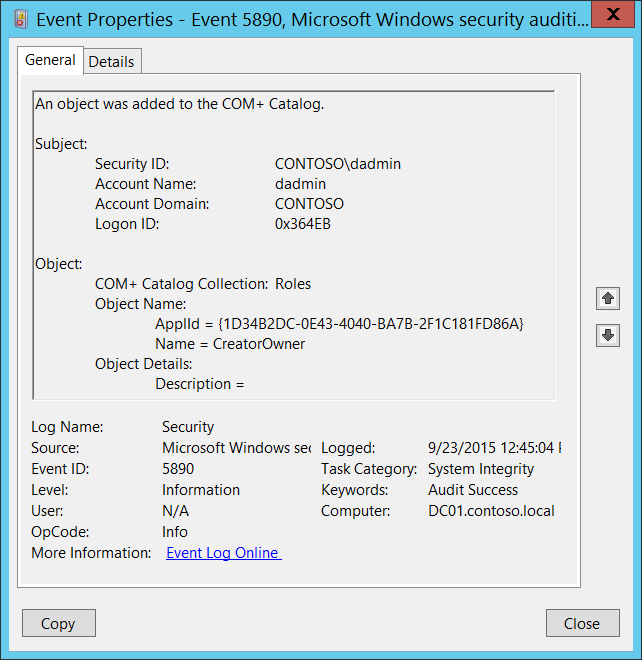

# 5890(S): COM+ カタログにオブジェクトが追加されました。



***サブカテゴリ:***&nbsp;[その他のオブジェクト アクセス イベントの監査](audit-other-object-access-events.md)

***イベントの説明:***

このイベントは、新しいオブジェクトが [COM+ カタログ](/windows/win32/cossdk/the-com--catalog) に追加されたときに生成されます。

何らかの理由でこのイベントは [システムの整合性の監査](event-5890.md) サブカテゴリに属していますが、このイベントの生成はこのサブカテゴリで有効になります。

> **注**&nbsp;&nbsp;推奨事項については、このイベントの [セキュリティ監視の推奨事項](#security-monitoring-recommendations) を参照してください。

<br clear="all">

***イベント XML:***
```
- <Event xmlns="http://schemas.microsoft.com/win/2004/08/events/event">
- <System>
 <Provider Name="Microsoft-Windows-Security-Auditing" Guid="{54849625-5478-4994-A5BA-3E3B0328C30D}" /> 
 <EventID>5890</EventID> 
 <Version>0</Version> 
 <Level>0</Level> 
 <Task>12290</Task> 
 <Opcode>0</Opcode> 
 <Keywords>0x8020000000000000</Keywords> 
 <TimeCreated SystemTime="2015-09-23T19:45:04.239886800Z" /> 
 <EventRecordID>344980</EventRecordID> 
 <Correlation /> 
 <Execution ProcessID="516" ThreadID="2856" /> 
 <Channel>Security</Channel> 
 <Computer>DC01.contoso.local</Computer> 
 <Security /> 
 </System>
- <EventData>
 <Data Name="SubjectUserSid">S-1-5-21-3457937927-2839227994-823803824-1104</Data> 
 <Data Name="SubjectUserName">dadmin</Data> 
 <Data Name="SubjectUserDomainName">CONTOSO</Data> 
 <Data Name="SubjectLogonId">222443</Data> 
 <Data Name="ObjectCollectionName">Roles</Data> 
 <Data Name="ObjectIdentifyingProperties">ApplId = {1D34B2DC-0E43-4040-BA7B-2F1C181FD86A} Name = CreatorOwner</Data> 
 <Data Name="ObjectProperties">Description =</Data> 
 </EventData>
 </Event>

```

***必要なサーバー ロール:*** なし。

***最小 OS バージョン:*** Windows Server 2008、Windows Vista。

***イベント バージョン:*** 0。

***フィールドの説明:***

**サブジェクト:**

-   **セキュリティ ID** \[タイプ = SID\]**:** 「オブジェクトの追加」操作を要求したアカウントの SID。イベント ビューアーは自動的に SID を解決し、アカウント名を表示しようとします。SID を解決できない場合、イベントにソース データが表示されます。

> **注**&nbsp;&nbsp;**セキュリティ識別子 (SID)** は、トラスティ (セキュリティ プリンシパル) を識別するために使用される可変長の一意の値です。各アカウントには、Active Directory ドメイン コントローラーなどの認証機関によって発行され、セキュリティ データベースに保存される一意の SID があります。ユーザーがログオンするたびに、システムはデータベースからそのユーザーの SID を取得し、そのユーザーのアクセストークンに配置します。システムはアクセストークン内の SID を使用して、以降のすべての Windows セキュリティとのやり取りでユーザーを識別します。SID がユーザーまたはグループの一意の識別子として使用された場合、それが再び別のユーザーまたはグループを識別するために使用されることはありません。SID の詳細については、[セキュリティ識別子](/windows/access-protection/access-control/security-identifiers) を参照してください。

-   **アカウント名** \[タイプ = UnicodeString\]**:** 「オブジェクト追加」操作を要求したアカウントの名前。

-   **アカウントドメイン** \[タイプ = UnicodeString\]**:** サブジェクトのドメインまたはコンピュータ名。形式は以下のように異なります：

    -   ドメインのNETBIOS名の例：CONTOSO

    -   小文字の完全なドメイン名：contoso.local

    -   大文字の完全なドメイン名：CONTOSO.LOCAL

    -   LOCAL SERVICEやANONYMOUS LOGONなどの[よく知られたセキュリティプリンシパル](/windows/security/identity-protection/access-control/security-identifiers)の場合、このフィールドの値は「NT AUTHORITY」となります。

    -   ローカルユーザーアカウントの場合、このフィールドにはこのアカウントが属するコンピュータまたはデバイスの名前が含まれます。例：「Win81」。

-   **ログオンID** \[タイプ = HexInt64\]**:** 16進数の値で、最近のイベントと同じログオンIDを含む可能性のあるイベントとこのイベントを関連付けるのに役立ちます。例：「[4624](event-4624.md): アカウントが正常にログオンされました。」

**オブジェクト**：

-   **COM+ カタログコレクション** \[タイプ = UnicodeString\]: 新しいオブジェクトが追加されたCOM+コレクションの名前。以下は、可能なコレクション値とその説明のリストです：

| コレクション                                                                                                       | 説明                                                                                                                                                                                                     |
|------------------------------------------------------------------------------------------------------------------|-----------------------------------------------------------------------------------------------------------------------------------------------------------------------------------------------------------------|
| [ApplicationCluster](/windows/win32/cossdk/applicationcluster)            | アプリケーションクラスター内のサーバーのリストを含みます。                                                                                                                                                      |
| [ApplicationInstances](/windows/win32/cossdk/applicationinstances)          | 実行中のCOM+アプリケーションの各インスタンスのオブジェクトを含みます。                                                                                                                                             |
| [Applications](/windows/win32/cossdk/applications)                  | ローカルコンピュータにインストールされている各COM+アプリケーションのオブジェクトを含みます。                                                                                                                                   |
| [Components](/windows/win32/cossdk/components)                    | 関連するアプリケーション内の各コンポーネントのオブジェクトを含みます。                                                                                                                                |
| [ComputerList](/windows/win32/cossdk/computerlist)                  | コンポーネントサービス管理ツールのコンピュータフォルダーに見つかったコンピュータのリストを含みます。                                                                                                   |
| [DCOMProtocols](/windows/win32/cossdk/dcomprotocols)                 | DCOMで使用されるプロトコルのリストを含みます。各プロトコルのオブジェクトが含まれます。                                                                                                                   |
| [ErrorInfo](/windows/win32/cossdk/errorinfo)                     | 複数のオブジェクトを扱うメソッドに関する拡張エラー情報を取得します。                                                                                                                         |
| [EventClassesForIID](/windows/win32/cossdk/eventclassesforiid)            | イベントクラスに関する情報を取得します。                                                                                                                                                                  |
| [FilesForImport](/windows/win32/cossdk/filesforimport)                | インポート可能なアプリケーションに関する情報をMSIファイルから取得します。                                                                                                                              |
| [InprocServers](/windows/win32/cossdk/inprocservers)                 | システムに登録されているインプロセスサーバーのリストを含みます。各コンポーネントのオブジェクトが含まれます。                                                                                                 |
| [InterfacesForComponent](/windows/win32/cossdk/interfacesforcomponent)        | 関連するコンポーネントが公開する各インターフェースのオブジェクトを含みます。                                                                                                              |
| [LegacyComponents](/windows/win32/cossdk/legacycomponents)              | 関連するアプリケーション内の未構成の各コンポーネントのオブジェクトを含みます。                                                                                                                   |
| [LegacyServers](/windows/win32/cossdk/legacyservers)                 | [InprocServers](/windows/win32/cossdk/inprocservers) コレクションと同一ですが、このコレクションにはローカルサーバーも含まれます。                           |
| [LocalComputer](/windows/win32/cossdk/localcomputer)                 | アクセスしているカタログのコンピュータのレベル設定情報を保持する単一のオブジェクトを含みます。                                                                                       |
| [MethodsForInterface](/windows/win32/cossdk/methodsforinterface)           | 関連するインターフェースの各メソッドのオブジェクトを含みます。                                                                                                                         |
| [Partitions](/windows/win32/cossdk/partitions)                    | 各パーティションに含まれるアプリケーションを指定するために使用されます。                                                                                                                                                   |
| [PartitionUsers](/windows/win32/cossdk/partitionusers)                | 各パーティションに含まれるユーザーを指定するために使用されます。                                                                                                                                                          |
| [PropertyInfo](/windows/win32/cossdk/propertyinfo)                  | 指定されたコレクションがサポートするプロパティに関する情報を取得します。                                                                                                                                |
| [PublisherProperties](/windows/win32/cossdk/publisherproperties)           | 親の[SubscriptionsForComponent](/windows/win32/cossdk/subscriptionsforcomponent) コレクションの各パブリッシャープロパティのオブジェクトを含みます。                          |
| [RelatedCollectionInfo](/windows/win32/cossdk/relatedcollectioninfo)         | 呼び出されたコレクションに関連する他のコレクションに関する情報を取得します。                                                                                                                |
| [Roles](/windows/win32/cossdk/roles)                         | 関連するアプリケーションに割り当てられた各ロールのオブジェクトを含みます。                                                                                                                            |
| [RolesForComponent](/windows/win32/cossdk/rolesforcomponent)             | 関連するコンポーネントに割り当てられた各ロールのオブジェクトを含みます。                                                                                                                  |
| [RolesForInterface](/windows/win32/cossdk/rolesforinterface)             | 関連するインターフェースに割り当てられた各ロールのオブジェクトを含みます。                                                                                                                  |
| [RolesForMethod](/windows/win32/cossdk/rolesformethod)                | 関連するメソッドに割り当てられた各ロールのオブジェクトを含みます。                                                                                                                     |
| [RolesForPartition](/windows/win32/cossdk/rolesforpartition)             | 関連するパーティションに割り当てられた各ロールのオブジェクトを含みます。                                                                                                                  |
| [Root](/windows/win32/cossdk/root)                          | カタログのトップレベルコレクションを含みます。                                                                                                                                                              |
| [SubscriberProperties](/windows/win32/cossdk/subscriberproperties)          | 親の[SubscriptionsForComponent](/windows/win32/cossdk/subscriptionsforcomponent) コレクションの各サブスクライバープロパティのオブジェクトを含みます。                         |
| [SubscriptionsForComponent](/windows/win32/cossdk/subscriptionsforcomponent)     | 親の[Components](/windows/win32/cossdk/components) コレクションの各サブスクリプションのオブジェクトを含みます。                                               |
| [TransientPublisherProperties](/windows/win32/cossdk/transientpublisherproperties)  | 親の[TransientSubscriptions](/windows/win32/cossdk/transientsubscriptions) コレクションの各パブリッシャープロパティのオブジェクトを含みます。                             |
| [TransientSubscriberProperties](/windows/win32/cossdk/transientsubscriberproperties) | 親の[TransientSubscriptions](/windows/win32/cossdk/transientsubscriptions) コレクションの各サブスクライバープロパティのオブジェクトを含みます。                            |
| [TransientSubscriptions](/windows/win32/cossdk/transientsubscriptions)        | 各一時的なサブスクリプションのオブジェクトを含みます。                                                                                                                                                             |
| [UsersInPartitionRole](/windows/win32/cossdk/usersinpartitionrole)          | 関連するパーティションロール内の各ユーザーのオブジェクトを含みます。                                                                                                                      |
| [UsersInRole](/windows/win32/cossdk/usersinrole)                   | 関連するロール内の各ユーザーのオブジェクトを含みます。                                                                                                                                |
| [WOWInprocServers](/windows/win32/cossdk/wowinprocservers)              | 64ビットコンピュータ上の32ビットコンポーネント用にシステムに登録されているインプロセスサーバーのリストを含みます。                                                                                                 |
| [WOWLegacyServers](/windows/win32/cossdk/wowlegacyservers)              | [LegacyServers](/windows/win32/cossdk/legacyservers) コレクションと同一ですが、このコレクションは64ビットコンピュータ上の32ビットレジストリから取得されます。 |

-   **オブジェクト名** \[タイプ = UnicodeString\]: 新しいオブジェクトの名前と識別子を含むオブジェクト固有のフィールドです。これは **COM+ カタログコレクション** の値に依存します。例えば、**COM+ カタログコレクション** = [Applications](/windows/win32/cossdk/applications) の場合、以下のようになります。

    -   **ID** - アプリケーションを表す GUID。このプロパティは、このコレクションのオブジェクトに対して [Key](/windows/win32/api/comadmin/nf-comadmin-icatalogobject-get_key) プロパティメソッドが呼び出されたときに返されます。

    -   **AppPartitionID** - アプリケーションパーティションIDを表す GUID。

> **注**&nbsp;&nbsp;**GUID** は「Globally Unique Identifier」の略です。これはリソース、アクティビティ、またはインスタンスを識別するために使用される128ビットの整数です。

-   **オブジェクトの詳細** \[タイプ = UnicodeString\]: 新しいオブジェクト（**オブジェクト名**）のプロパティのリスト。

    項目は次の形式を持ちます: Property\_Name = VALUE

    オブジェクトのプロパティと説明のリストについては、特定の **COM+ カタログコレクション** の説明を確認してください。

## セキュリティ監視の推奨事項

5890(S): COM+ カタログにオブジェクトが追加されました。

> **重要**&nbsp;&nbsp;このイベントについては、[付録A: 多くの監査イベントのためのセキュリティ監視の推奨事項](appendix-a-security-monitoring-recommendations-for-many-audit-events.md) も参照してください。

-   特定の COM+ コレクション内で新しい COM+ オブジェクトの作成を監視する必要がある場合、対応する **COM+ カタログコレクション** フィールド値を持つすべての [5890](event-5890.md) イベントを監視してください。
