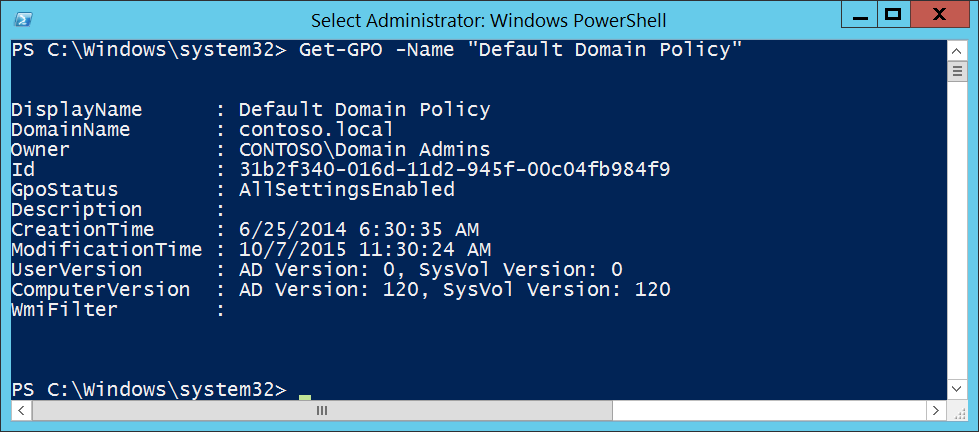

# 6144(S): グループ ポリシー オブジェクトのセキュリティ ポリシーが正常に適用されました。


***サブカテゴリ:***&nbsp;[その他のポリシー変更イベントの監査](audit-other-policy-change-events.md)

***イベントの説明:***

このイベントは、グループ ポリシー オブジェクトの「セキュリティ設定」セクションからの設定がコンピューターにエラーなく正常に適用されるたびに生成されます。このイベントはターゲット コンピューター自体で生成されます。

これは、コンピューターに適用された「セキュリティ設定」ポリシーを含むグループ ポリシー オブジェクトのリストを示す定期的なイベントです。

このイベントは、グループ ポリシーがコンピューターに適用されるたびに生成されます。

> **注**&nbsp;&nbsp;推奨事項については、このイベントの[セキュリティ監視の推奨事項](#security-monitoring-recommendations)を参照してください。

<br clear="all">

***イベント XML:***
```
- <Event xmlns="http://schemas.microsoft.com/win/2004/08/events/event">
- <System>
 <Provider Name="Microsoft-Windows-Security-Auditing" Guid="{54849625-5478-4994-A5BA-3E3B0328C30D}" /> 
 <EventID>6144</EventID> 
 <Version>0</Version> 
 <Level>0</Level> 
 <Task>13573</Task> 
 <Opcode>0</Opcode> 
 <Keywords>0x8020000000000000</Keywords> 
 <TimeCreated SystemTime="2015-10-07T22:59:32.280498500Z" /> 
 <EventRecordID>1055041</EventRecordID> 
 <Correlation /> 
 <Execution ProcessID="524" ThreadID="712" /> 
 <Channel>Security</Channel> 
 <Computer>DC01.contoso.local</Computer> 
 <Security /> 
 </System>
- <EventData>
 <Data Name="ErrorCode">0</Data> 
 <Data Name="GPOList">{8AB9311A-E5FB-4A5A-8FB7-027D1B877D6D} DC Main Policy</Data> 
 </EventData>
 </Event>

```

***必要なサーバー ロール:*** なし。

***最小 OS バージョン:*** Windows Server 2008, Windows Vista。

***イベント バージョン:*** 0。

***フィールドの説明:***

**リターン コード** \[型 = UInt32\]: このイベントでは常に「**0**」の値を持ちます。

**GPO リスト** \[型 = UnicodeString\]: コンピューターに適用された「セキュリティ設定」ポリシーを含むグループ ポリシー オブジェクトのリスト。リスト項目の形式は「GROUP\_POLICY\_GUID GROUP\_POLICY\_NAME」です。

特定の GROUP\_POLICY\_GUID は、**Get-GPO** PowerShell コマンドレットを「**–Name** GROUP\_POLICY\_NAME」パラメーターで使用して見つけることができます。行「Id」はグループ ポリシーの GUID です:



> **Note**&nbsp;&nbsp;**GUID**は「Globally Unique Identifier（グローバルに一意の識別子）」の略です。これはリソース、アクティビティ、またはインスタンスを識別するために使用される128ビットの整数です。

## セキュリティ監視の推奨事項

6144(S): グループポリシーオブジェクトのセキュリティポリシーが正常に適用されました。

-   セキュリティ設定を含むグループポリシーオブジェクトの事前定義リストがあり、特定のコンピュータに適用する必要がある場合、このイベントのリストと自分のリストを比較し、違いがあればアラートをトリガーする必要があります。

-   このイベントは主に情報提供のためのイベントです。
