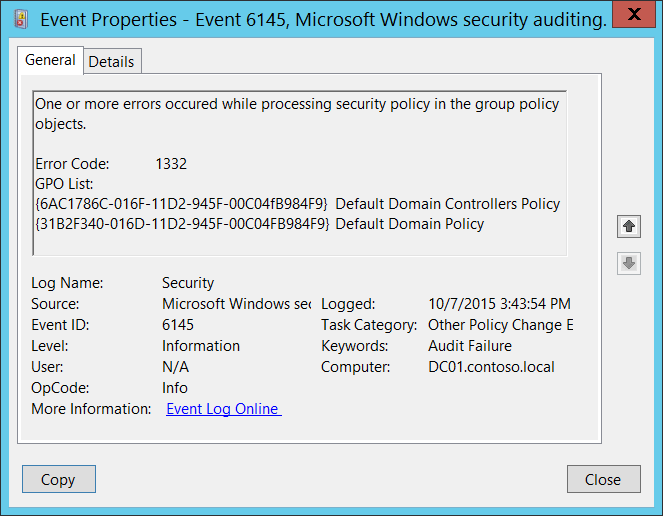
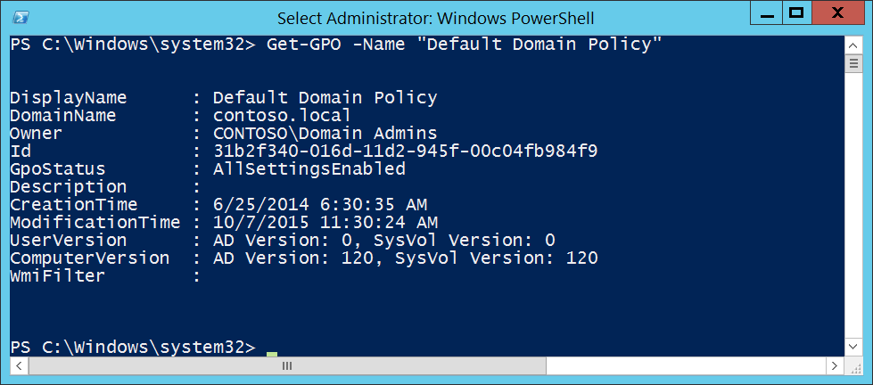

# 6145(F): グループ ポリシー オブジェクトのセキュリティ ポリシーの処理中に 1 つ以上のエラーが発生しました。



***サブカテゴリ:***&nbsp;[その他のポリシー変更イベントの監査](audit-other-policy-change-events.md)

***イベントの説明:***

このイベントは、グループ ポリシー オブジェクトの「セキュリティ設定」セクションからの設定が 1 つ以上のエラーと共にコンピューターに適用されるたびに生成されます。このイベントはターゲット コンピューター自体で生成されます。

たとえば、グループ ポリシー設定の 1 つに含まれていたセキュリティ プリンシパルの [SID](/windows/win32/secauthz/security-identifiers) が解決または実際のアカウント名に変換できない場合に、このイベントが生成されます。

> **注**&nbsp;&nbsp;このイベントに関する推奨事項については、[セキュリティ監視の推奨事項](#security-monitoring-recommendations)を参照してください。

<br clear="all">

***イベント XML:***
```xml
- <Event xmlns="http://schemas.microsoft.com/win/2004/08/events/event">
- <System>
 <Provider Name="Microsoft-Windows-Security-Auditing" Guid="{54849625-5478-4994-A5BA-3E3B0328C30D}" /> 
 <EventID>6145</EventID> 
 <Version>0</Version> 
 <Level>0</Level> 
 <Task>13573</Task> 
 <Opcode>0</Opcode> 
 <Keywords>0x8010000000000000</Keywords> 
 <TimeCreated SystemTime="2015-10-07T22:43:54.183603800Z" /> 
 <EventRecordID>1052680</EventRecordID> 
 <Correlation /> 
 <Execution ProcessID="524" ThreadID="3476" /> 
 <Channel>Security</Channel> 
 <Computer>DC01.contoso.local</Computer> 
 <Security /> 
 </System>
- <EventData>
 <Data Name="ErrorCode">1332</Data> 
 <Data Name="GPOList">{6AC1786C-016F-11D2-945F-00C04fB984F9} Default Domain Controllers Policy {31B2F340-016D-11D2-945F-00C04FB984F9} Default Domain Policy</Data> 
 </EventData>
 </Event>

```

***必要なサーバー ロール:*** なし。

***最小 OS バージョン:*** Windows Server 2008、Windows Vista。

***イベント バージョン:*** 0。

***フィールドの説明:***

**エラー コード** \[型 = UInt32\]: グループ ポリシー処理中に発生したエラーを示す特定のエラー コード。特定のエラー コードの意味は、<https://msdn.microsoft.com/library/windows/desktop/ms681381(v=vs.85).aspx> で確認できます。たとえば、エラー コード 1332 は「アカウント名とセキュリティ ID の間にマッピングが行われなかった」ことを意味します。

**GPO リスト** \[型 = UnicodeString\]: 「セキュリティ設定」ポリシーを含み、エラーと共にコンピューターに適用されたグループ ポリシー オブジェクトのリスト。リスト項目の形式は「GROUP\_POLICY\_GUID GROUP\_POLICY\_NAME」です。

特定のGROUP_POLICY_GUIDを見つけるには、**Get-GPO** PowerShellコマンドレットを使用し、「**–Name** GROUP_POLICY_NAME」パラメータを指定します。行「Id」がグループポリシーのGUIDです：



> **Note**&nbsp;&nbsp;**GUID**は「Globally Unique Identifier」の略です。これはリソース、アクティビティ、またはインスタンスを識別するために使用される128ビットの整数です。

## セキュリティ監視の推奨事項

6145(F): グループポリシーオブジェクトのセキュリティポリシーを処理中に1つ以上のエラーが発生しました。

-   このイベントは、コンピュータまたはデバイスに適用されたグループポリシーオブジェクトの処理中にいくつかのエラーが発生したことを示します。このイベントが表示された場合、**GPOリスト**の設定を確認し、エラーの原因を解決することをお勧めします。

-   セキュリティ設定を含む事前定義されたグループポリシーオブジェクトのリストがあり、それが特定のコンピュータに適用される必要がある場合、このイベントを確認してセキュリティ設定が適用されたときにエラーが発生したかどうかを確認します。エラーが発生した場合、エラーコードを確認し、失敗の原因を調査することができます。

-   通常、このイベントは情報提供の目的であり、理由はグループポリシーのセキュリティ設定の構成エラーです。

-   このイベントは、グループポリシーのトラブルシューティング目的で使用されることがあります。
