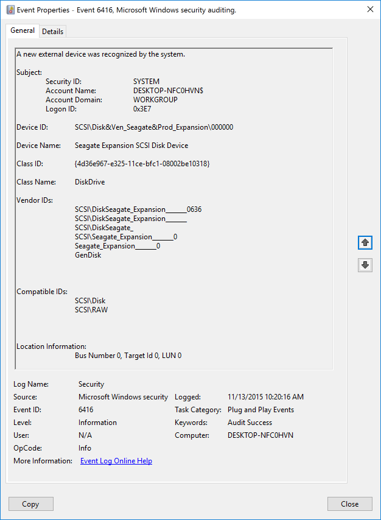
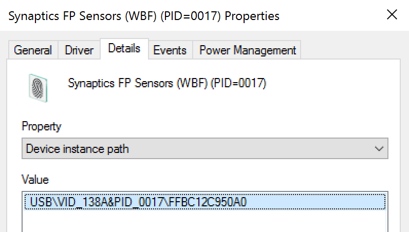
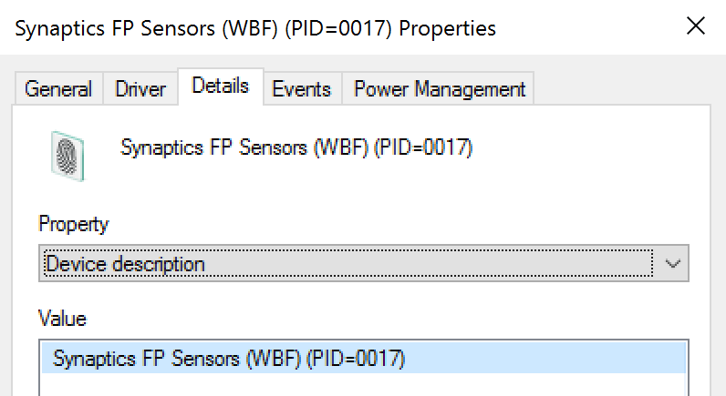
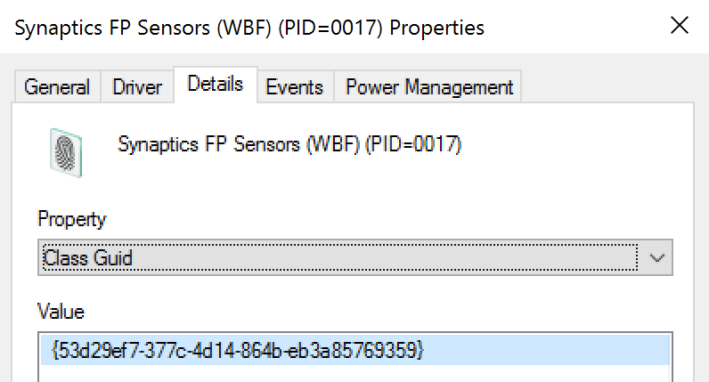
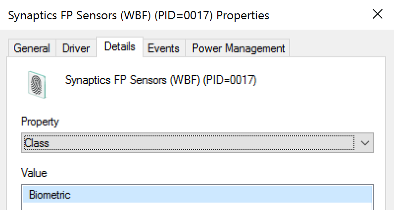
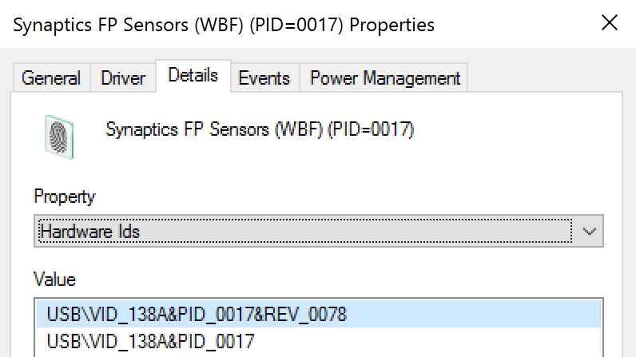
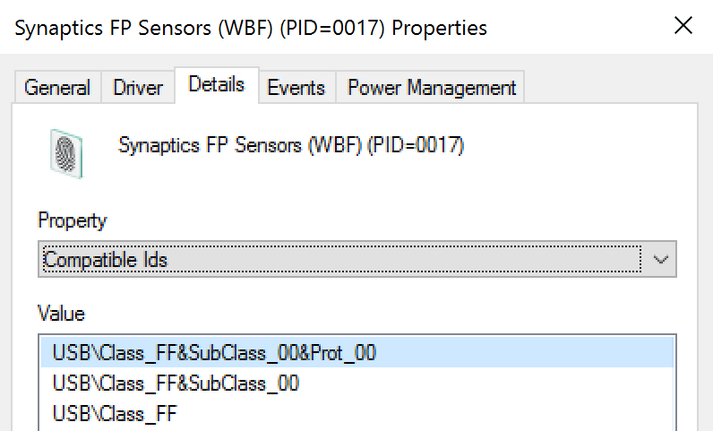

# 6416(S): 新しい外部デバイスがシステムによって認識されました。



***サブカテゴリ:***&nbsp;[PNPアクティビティの監査](audit-pnp-activity.md)

***イベントの説明:***

このイベントは、新しい外部デバイスがシステムによって認識されるたびに生成されます。

例えば、新しい外部デバイスが接続または有効化されたときにこのイベントが生成されます。

> **注**&nbsp;&nbsp;推奨事項については、このイベントの[セキュリティ監視の推奨事項](#security-monitoring-recommendations)を参照してください。

<br clear="all">

***イベントXML:***
```xml
- <Event xmlns="http://schemas.microsoft.com/win/2004/08/events/event">
- <System>
 <Provider Name="Microsoft-Windows-Security-Auditing" Guid="{54849625-5478-4994-A5BA-3E3B0328C30D}" /> 
 <EventID>6416</EventID> 
 <Version>1</Version> 
 <Level>0</Level> 
 <Task>13316</Task> 
 <Opcode>0</Opcode> 
 <Keywords>0x8020000000000000</Keywords> 
 <TimeCreated SystemTime="2015-11-13T18:20:16.818569900Z" /> 
 <EventRecordID>436</EventRecordID> 
 <Correlation /> 
 <Execution ProcessID="4" ThreadID="308" /> 
 <Channel>Security</Channel> 
 <Computer>DESKTOP-NFC0HVN</Computer> 
 <Security /> 
 </System>
- <EventData>
 <Data Name="SubjectUserSid">S-1-5-18</Data> 
 <Data Name="SubjectUserName">DESKTOP-NFC0HVN$</Data> 
 <Data Name="SubjectDomainName">WORKGROUP</Data> 
 <Data Name="SubjectLogonId">0x3e7</Data> 
 <Data Name="DeviceId">SCSI\\Disk&Ven\_Seagate&Prod\_Expansion\\000000</Data> 
 <Data Name="DeviceDescription">Seagate Expansion SCSI Disk Device</Data> 
 <Data Name="ClassId">{4D36E967-E325-11CE-BFC1-08002BE10318}</Data> 
 <Data Name="ClassName">DiskDrive</Data> 
 <Data Name="VendorIds">SCSI\\DiskSeagate\_Expansion\_\_\_\_\_\_\_0636 SCSI\\DiskSeagate\_Expansion\_\_\_\_\_\_\_ SCSI\\DiskSeagate\_ SCSI\\Seagate\_Expansion\_\_\_\_\_\_\_0 Seagate\_Expansion\_\_\_\_\_\_\_0 GenDisk</Data> 
 <Data Name="CompatibleIds">SCSI\\Disk SCSI\\RAW</Data> 
 <Data Name="LocationInformation">Bus Number 0, Target Id 0, LUN 0</Data> 
 </EventData>
</Event>

```

***必要なサーバーロール:*** なし。

***最小OSバージョン:*** Windows Server 2016, Windows 10。

***イベントバージョン:***

-   0 - Windows 10。

-   1 - Windows 10 \[バージョン 1511\]。

    -   「デバイスID」フィールドが追加されました。

    -   「デバイス名」フィールドが追加されました。

    -   「クラス名」フィールドが追加されました。

***フィールドの説明:***

**サブジェクト:**

-   **セキュリティID** \[タイプ = SID\]**:** 新しいデバイスを登録したアカウントのSID。イベントビューアーは自動的にSIDを解決し、アカウント名を表示しようとします。SIDが解決できない場合、イベントにはソースデータが表示されます。

> **注**&nbsp;&nbsp;**セキュリティ識別子 (SID)** は、トラスティ (セキュリティプリンシパル) を識別するために使用される可変長の一意の値です。各アカウントには、Active Directoryドメインコントローラーなどの権限によって発行され、セキュリティデータベースに保存される一意のSIDがあります。ユーザーがログオンするたびに、システムはデータベースからそのユーザーのSIDを取得し、そのユーザーのアクセストークンに配置します。システムは、アクセストークン内のSIDを使用して、以降のすべてのWindowsセキュリティとのやり取りでユーザーを識別します。SIDがユーザーまたはグループの一意の識別子として使用された場合、それは他のユーザーまたはグループを識別するために再利用されることはありません。SIDの詳細については、[セキュリティ識別子](/windows/access-protection/access-control/security-identifiers)を参照してください。


-   **アカウント名** \[タイプ = UnicodeString\]**:** 新しいデバイスを登録したアカウントの名前。

-   **アカウントドメイン** \[タイプ = UnicodeString\]**:** サブジェクトのドメインまたはコンピュータ名。形式はさまざまで、以下のようなものが含まれます：

    -   ドメイン NETBIOS 名の例: CONTOSO

    -   小文字の完全ドメイン名: contoso.local

    -   大文字の完全ドメイン名: CONTOSO.LOCAL

    -   一部の[よく知られたセキュリティプリンシパル](/windows/security/identity-protection/access-control/security-identifiers)の場合、例えば LOCAL SERVICE や ANONYMOUS LOGON、このフィールドの値は “NT AUTHORITY” です。

    -   ローカルユーザーアカウントの場合、このフィールドにはこのアカウントが属するコンピュータまたはデバイスの名前が含まれます。例えば: “Win81”。

-   **ログオンID** \[タイプ = HexInt64\]**:** 16進数の値で、最近のイベントと同じログオンIDを含む可能性のあるこのイベントを関連付けるのに役立ちます。例えば、 “[4624](event-4624.md): アカウントが正常にログオンされました。”

**デバイスID** \[タイプ = UnicodeString\] \[バージョン 1\]: デバイスの“**デバイスインスタンスパス**”属性。デバイスのプロパティを表示するには、デバイスマネージャを起動し、特定のデバイスプロパティを開き、“詳細”をクリックします：



**デバイス名** \[タイプ = UnicodeString\] \[バージョン 1\]: デバイスの“**デバイス説明**”属性。デバイスのプロパティを表示するには、デバイスマネージャを起動し、特定のデバイスプロパティを開き、“詳細”をクリックします：



**クラスID** \[タイプ = UnicodeString\]: デバイスの“**クラスGuid**”属性。デバイスのプロパティを表示するには、デバイスマネージャを起動し、特定のデバイスプロパティを開き、“詳細”をクリックします：



**クラス名** \[タイプ = UnicodeString\] \[バージョン 1\]: デバイスの“**クラス**”属性。デバイスのプロパティを表示するには、デバイスマネージャを起動し、特定のデバイスプロパティを開き、“詳細”をクリックします：



**ベンダーID** \[タイプ = UnicodeString\]: デバイスの“**ハードウェアID**”属性。デバイスのプロパティを表示するには、デバイスマネージャーを起動し、特定のデバイスのプロパティを開き、「詳細」タブをクリックします。



**互換性ID** \[タイプ = UnicodeString\]: デバイスの“**互換性ID**”属性。デバイスのプロパティを表示するには、デバイスマネージャーを起動し、特定のデバイスのプロパティを開き、「詳細」タブをクリックします。



**位置情報** \[タイプ = UnicodeString\]: デバイスの“**位置情報**”属性。デバイスのプロパティを表示するには、デバイスマネージャーを起動し、特定のデバイスのプロパティを開き、「詳細」タブをクリックします。


## セキュリティ監視の推奨事項

6416(S): システムによって新しい外部デバイスが認識されました。

> **重要**&nbsp;&nbsp;このイベントについては、[付録A: 多くの監査イベントに対するセキュリティ監視の推奨事項](appendix-a-security-monitoring-recommendations-for-many-audit-events.md)も参照してください。

-   このイベントは通常SYSTEMアカウントによってトリガーされるため、**“Subject\\Security ID”**がSYSTEMでない場合に報告することをお勧めします。

-   このイベントを使用して、以下の表に示すフィールドを使用してイベントおよびイベント情報を追跡できます。

| 監視するイベントおよびイベント情報                | 使用するフィールド         |
|-----------------------------------------------------|----------------------------|
| デバイス認識イベント、**デバイスインスタンスパス** | “**デバイスID**”           |
| デバイス認識イベント、**デバイス説明**             | “**デバイス名**”           |
| デバイス認識イベント、**クラスGUID**               | “**クラスID**”             |
| デバイス認識イベント、**ハードウェアID**           | “**ベンダーID**”           |
| デバイス認識イベント、**互換性ID**                 | “**互換性ID**”             |
| デバイス認識イベント、**位置情報**                 | “**位置情報**”             |

It looks like you haven't pasted the Markdown content yet. Please provide the text you want translated into Japanese.
