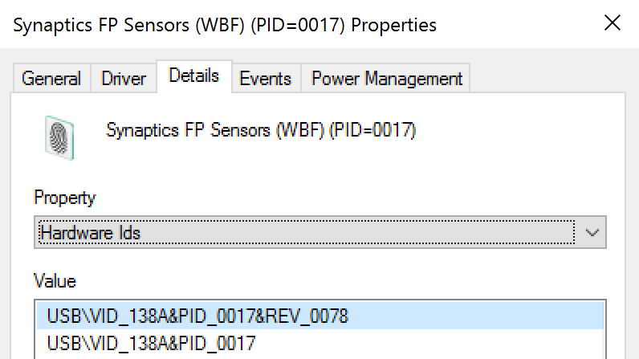

# 6421(S): デバイスを有効にする要求が行われました。


***サブカテゴリ:***&nbsp;[PNP アクティビティの監査](audit-pnp-activity.md)

***イベントの説明:***

このイベントは、誰かがデバイスを有効にする要求を行ったときに毎回生成されます。

このイベントは、デバイスが有効になったことを意味するものではありません。

> **注**&nbsp;&nbsp;推奨事項については、このイベントの[セキュリティ監視の推奨事項](#security-monitoring-recommendations)を参照してください。

<br clear="all">

***イベント XML:***
```xml
- <Event xmlns="http://schemas.microsoft.com/win/2004/08/events/event">
- <System>
 <Provider Name="Microsoft-Windows-Security-Auditing" Guid="{54849625-5478-4994-A5BA-3E3B0328C30D}" /> 
 <EventID>6421</EventID> 
 <Version>0</Version> 
 <Level>0</Level> 
 <Task>13316</Task> 
 <Opcode>0</Opcode> 
 <Keywords>0x8020000000000000</Keywords> 
 <TimeCreated SystemTime="2015-11-14T22:37:50.034918700Z" /> 
 <EventRecordID>485</EventRecordID> 
 <Correlation /> 
 <Execution ProcessID="2192" ThreadID="1392" /> 
 <Channel>Security</Channel> 
 <Computer>DESKTOP-NFC0HVN</Computer> 
 <Security /> 
 </System>
- <EventData>
 <Data Name="SubjectUserSid">S-1-5-21-2695983153-1310895815-1903476278-1001</Data> 
 <Data Name="SubjectUserName">ladmin</Data> 
 <Data Name="SubjectDomainName">DESKTOP-NFC0HVN</Data> 
 <Data Name="SubjectLogonId">0x3fcc7</Data> 
 <Data Name="DeviceId">USB\\VID\_138A&PID\_0017\\FFBC12C950A0</Data> 
 <Data Name="DeviceDescription">Synaptics FP Sensors (WBF) (PID=0017)</Data> 
 <Data Name="ClassId">{53D29EF7-377C-4D14-864B-EB3A85769359}</Data> 
 <Data Name="ClassName">Biometric</Data> 
 <Data Name="HardwareIds">USB\\VID\_138A&PID\_0017&REV\_0078 USB\\VID\_138A&PID\_0017</Data> 
 <Data Name="CompatibleIds">USB\\Class\_FF&SubClass\_00&Prot\_00 USB\\Class\_FF&SubClass\_00 USB\\Class\_FF</Data> 
 <Data Name="LocationInformation">Port\_\#0002.Hub\_\#0004</Data> 
 </EventData>
</Event>

```

***必要なサーバー ロール:*** なし。

***最小 OS バージョン:*** Windows 10 \[バージョン 1511\]。

***イベント バージョン:*** 0。

***フィールドの説明:***

**サブジェクト:**

-   **セキュリティ ID** \[タイプ = SID\]**:** 要求を行ったアカウントの SID。イベント ビューアーは自動的に SID を解決し、アカウント名を表示しようとします。SID を解決できない場合、イベントにはソース データが表示されます。

> **注**&nbsp;&nbsp;**セキュリティ識別子 (SID)** は、トラスティ (セキュリティ プリンシパル) を識別するために使用される可変長の一意の値です。各アカウントには、Active Directory ドメイン コントローラーなどの権限によって発行され、セキュリティ データベースに保存される一意の SID があります。ユーザーがログオンするたびに、システムはデータベースからそのユーザーの SID を取得し、そのユーザーのアクセス トークンに配置します。システムは、アクセス トークン内の SID を使用して、以降のすべての Windows セキュリティとのやり取りでユーザーを識別します。SID がユーザーまたはグループの一意の識別子として使用された場合、それが別のユーザーまたはグループを識別するために再度使用されることはありません。SID の詳細については、[セキュリティ識別子](/windows/access-protection/access-control/security-identifiers)を参照してください。

-   **アカウント名** \[タイプ = UnicodeString\]**:** リクエストを行ったアカウントの名前。

-   **アカウントドメイン** \[タイプ = UnicodeString\]**:** サブジェクトのドメインまたはコンピュータ名。形式は以下のように異なります：

    -   ドメインのNETBIOS名の例: CONTOSO

    -   小文字の完全なドメイン名: contoso.local

    -   大文字の完全なドメイン名: CONTOSO.LOCAL

    -   一部の[よく知られたセキュリティプリンシパル](/windows/security/identity-protection/access-control/security-identifiers)の場合、例えばLOCAL SERVICEやANONYMOUS LOGON、このフィールドの値は「NT AUTHORITY」となります。

    -   ローカルユーザーアカウントの場合、このフィールドにはこのアカウントが属するコンピュータまたはデバイスの名前が含まれます。例えば、「Win81」。

-   **ログオンID** \[タイプ = HexInt64\]**:** 16進数の値で、最近のイベントと同じログオンIDを含む可能性のあるイベントとこのイベントを関連付けるのに役立ちます。例えば、「[4624](event-4624.md): アカウントが正常にログオンされました。」

**デバイスID** \[タイプ = UnicodeString\]: デバイスの「**デバイスインスタンスパス**」属性。デバイスのプロパティを表示するには、デバイスマネージャを起動し、特定のデバイスプロパティを開き、「詳細」をクリックします：


**デバイス名** \[タイプ = UnicodeString\]: デバイスの「**デバイス説明**」属性。デバイスのプロパティを表示するには、デバイスマネージャを起動し、特定のデバイスプロパティを開き、「詳細」をクリックします：


**クラスID** \[タイプ = UnicodeString\]: デバイスの「**クラスGuid**」属性。デバイスのプロパティを表示するには、デバイスマネージャを起動し、特定のデバイスプロパティを開き、「詳細」をクリックします：


**クラス名** \[タイプ = UnicodeString\]: デバイスの「**クラス**」属性。デバイスのプロパティを表示するには、デバイスマネージャを起動し、特定のデバイスプロパティを開き、「詳細」をクリックします：


**ハードウェアID** \[タイプ = UnicodeString\]: デバイスの「**ハードウェアID**」属性。デバイスのプロパティを表示するには、デバイスマネージャーを起動し、特定のデバイスのプロパティを開き、「詳細」タブをクリックします。



**互換性ID** \[タイプ = UnicodeString\]: デバイスの「**互換性ID**」属性。デバイスのプロパティを表示するには、デバイスマネージャーを起動し、特定のデバイスのプロパティを開き、「詳細」タブをクリックします。


**位置情報** \[タイプ = UnicodeString\]: デバイスの「**位置情報**」属性。デバイスのプロパティを表示するには、デバイスマネージャーを起動し、特定のデバイスのプロパティを開き、「詳細」タブをクリックします。


## セキュリティ監視の推奨事項

6421(S): デバイスを有効にする要求が行われました。

> **重要**&nbsp;&nbsp;このイベントについては、[付録A: 多くの監査イベントに対するセキュリティ監視の推奨事項](appendix-a-security-monitoring-recommendations-for-many-audit-events.md)も参照してください。

-   このイベントを使用して、以下の表に示すイベントおよびイベント情報をリストされたフィールドを使用して追跡できます。

| 監視するイベントおよびイベント情報           | 使用するフィールド               |
|--------------------------------------------------|----------------------------|
| デバイス有効化要求、**デバイスインスタンスパス** | 「**デバイスID**」            |
| デバイス有効化要求、**デバイス説明**   | 「**デバイス名**」          |
| デバイス有効化要求、**クラスGUID**           | 「**クラスID**」             |
| デバイス有効化要求、**ハードウェアID**         | 「**ハードウェアID**」         |
| デバイス有効化要求、**互換性ID**       | 「**互換性ID**」       |
| デバイス有効化要求、**位置情報** | 「**位置情報**」 |

It looks like you haven't pasted any Markdown content yet. Please provide the content you want translated, and I'll get started on the translation for you.
