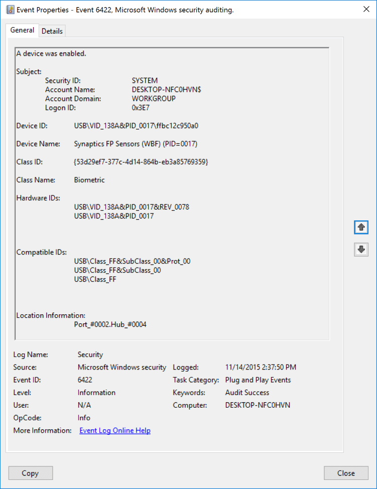
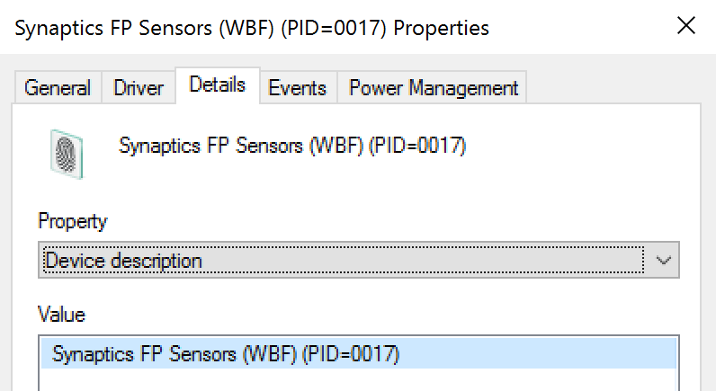
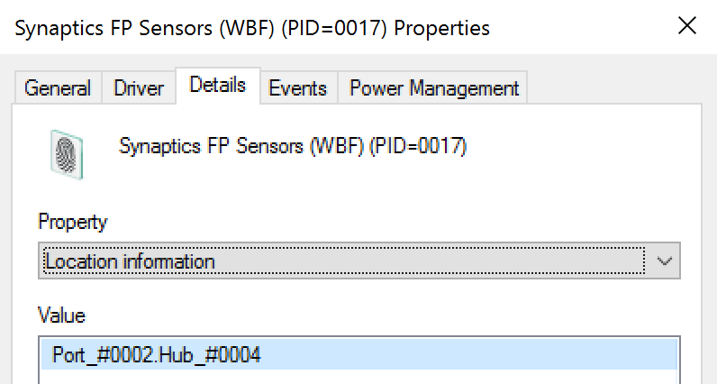

# 6422(S): デバイスが有効になりました。



***サブカテゴリ:***&nbsp;[PNPアクティビティの監査](audit-pnp-activity.md)

***イベントの説明:***

このイベントは、特定のデバイスが有効になるたびに生成されます。

> **注**&nbsp;&nbsp;推奨事項については、このイベントの[セキュリティ監視の推奨事項](#security-monitoring-recommendations)を参照してください。

<br clear="all">

***イベント XML:***
```xml
- <Event xmlns="http://schemas.microsoft.com/win/2004/08/events/event">
- <System>
 <Provider Name="Microsoft-Windows-Security-Auditing" Guid="{54849625-5478-4994-A5BA-3E3B0328C30D}" /> 
 <EventID>6422</EventID> 
 <Version>0</Version> 
 <Level>0</Level> 
 <Task>13316</Task> 
 <Opcode>0</Opcode> 
 <Keywords>0x8020000000000000</Keywords> 
 <TimeCreated SystemTime="2015-11-14T22:37:50.036050900Z" /> 
 <EventRecordID>486</EventRecordID> 
 <Correlation /> 
 <Execution ProcessID="4" ThreadID="408" /> 
 <Channel>Security</Channel> 
 <Computer>DESKTOP-NFC0HVN</Computer> 
 <Security /> 
 </System>
- <EventData>
 <Data Name="SubjectUserSid">S-1-5-18</Data> 
 <Data Name="SubjectUserName">DESKTOP-NFC0HVN$</Data> 
 <Data Name="SubjectDomainName">WORKGROUP</Data> 
 <Data Name="SubjectLogonId">0x3e7</Data> 
 <Data Name="DeviceId">USB\\VID\_138A&PID\_0017\\ffbc12c950a0</Data> 
 <Data Name="DeviceDescription">Synaptics FP Sensors (WBF) (PID=0017)</Data> 
 <Data Name="ClassId">{53D29EF7-377C-4D14-864B-EB3A85769359}</Data> 
 <Data Name="ClassName">Biometric</Data> 
 <Data Name="HardwareIds">USB\\VID\_138A&PID\_0017&REV\_0078 USB\\VID\_138A&PID\_0017</Data> 
 <Data Name="CompatibleIds">USB\\Class\_FF&SubClass\_00&Prot\_00 USB\\Class\_FF&SubClass\_00 USB\\Class\_FF</Data> 
 <Data Name="LocationInformation">Port\_\#0002.Hub\_\#0004</Data> 
 </EventData>
</Event>

```

***必要なサーバー役割:*** なし。

***最小OSバージョン:*** Windows 10 \[バージョン 1511\]。

***イベントバージョン:*** 0。

***フィールドの説明:***

**サブジェクト:**

-   **セキュリティID** \[タイプ = SID\]**:** デバイスを有効にしたアカウントのSID。イベントビューアーは自動的にSIDを解決し、アカウント名を表示しようとします。SIDが解決できない場合、イベント内にソースデータが表示されます。

> **注**&nbsp;&nbsp;**セキュリティ識別子 (SID)** は、トラスティ (セキュリティプリンシパル) を識別するために使用される可変長の一意の値です。各アカウントには、Active Directoryドメインコントローラーなどの権限によって発行され、セキュリティデータベースに保存される一意のSIDがあります。ユーザーがログオンするたびに、システムはデータベースからそのユーザーのSIDを取得し、そのユーザーのアクセス トークンに配置します。システムは、アクセス トークン内のSIDを使用して、以降のすべてのWindowsセキュリティとのやり取りでユーザーを識別します。SIDがユーザーまたはグループの一意の識別子として使用された場合、それは他のユーザーまたはグループを識別するために再利用されることはありません。SIDの詳細については、[セキュリティ識別子](/windows/access-protection/access-control/security-identifiers)を参照してください。

-   **アカウント名** \[タイプ = UnicodeString\]**:** デバイスを有効にしたアカウントの名前。

-   **アカウントドメイン** \[タイプ = UnicodeString\]**:** サブジェクトのドメインまたはコンピュータ名。形式はさまざまで、以下を含みます：

    -   ドメイン NETBIOS 名の例: CONTOSO

    -   小文字の完全ドメイン名: contoso.local

    -   大文字の完全ドメイン名: CONTOSO.LOCAL

    -   LOCAL SERVICE や ANONYMOUS LOGON などの[よく知られたセキュリティプリンシパル](/windows/security/identity-protection/access-control/security-identifiers)の場合、このフィールドの値は “NT AUTHORITY” です。

    -   ローカルユーザーアカウントの場合、このフィールドにはこのアカウントが属するコンピュータまたはデバイスの名前が含まれます。例: “Win81”。

-   **ログオンID** \[タイプ = HexInt64\]**:** 16進数の値で、最近のイベントとこのイベントを関連付けるのに役立ちます。たとえば、同じログオンIDを含む可能性のある “[4624](event-4624.md): アカウントが正常にログオンされました。”

**デバイスID** \[タイプ = UnicodeString\]: デバイスの “**デバイスインスタンスパス**” 属性。デバイスのプロパティを表示するには、デバイスマネージャーを起動し、特定のデバイスのプロパティを開き、「詳細」をクリックします：


**デバイス名** \[タイプ = UnicodeString\]: デバイスの “**デバイス説明**” 属性。デバイスのプロパティを表示するには、デバイスマネージャーを起動し、特定のデバイスのプロパティを開き、「詳細」をクリックします：



**クラスID** \[タイプ = UnicodeString\]: デバイスの “**クラスGuid**” 属性。デバイスのプロパティを表示するには、デバイスマネージャーを起動し、特定のデバイスのプロパティを開き、「詳細」をクリックします：


**クラス名** \[タイプ = UnicodeString\]: デバイスの “**クラス**” 属性。デバイスのプロパティを表示するには、デバイスマネージャーを起動し、特定のデバイスのプロパティを開き、「詳細」をクリックします：


**ハードウェアID** \[タイプ = UnicodeString\]: デバイスの「**ハードウェアID**」属性。デバイスのプロパティを表示するには、デバイスマネージャーを起動し、特定のデバイスのプロパティを開き、「詳細」タブをクリックします。


**互換性ID** \[タイプ = UnicodeString\]: デバイスの「**互換性ID**」属性。デバイスのプロパティを表示するには、デバイスマネージャーを起動し、特定のデバイスのプロパティを開き、「詳細」タブをクリックします。


**位置情報** \[タイプ = UnicodeString\]: デバイスの「**位置情報**」属性。デバイスのプロパティを表示するには、デバイスマネージャーを起動し、特定のデバイスのプロパティを開き、「詳細」タブをクリックします。



## セキュリティ監視の推奨事項

6422(S): デバイスが有効になりました。

> **重要**&nbsp;&nbsp;このイベントについては、[付録A: 多くの監査イベントに対するセキュリティ監視の推奨事項](appendix-a-security-monitoring-recommendations-for-many-audit-events.md)も参照してください。

-   このイベントは通常SYSTEMアカウントによってトリガーされるため、**「Subject\\Security ID」**がSYSTEMでない場合に報告することをお勧めします。

-   このイベントを使用して、以下の表に示すフィールドを使用してイベントおよびイベント情報を追跡できます。

| 監視するイベントおよびイベント情報           | 使用するフィールド         |
|------------------------------------------------|----------------------------|
| デバイス有効化イベント、**デバイスインスタンスパス** | 「**デバイスID**」          |
| デバイス有効化イベント、**デバイス説明**       | 「**デバイス名**」          |
| デバイス有効化イベント、**クラスGUID**         | 「**クラスID**」            |
| デバイス有効化イベント、**ハードウェアID**     | 「**ハードウェアID**」      |
| デバイス有効化イベント、**互換性ID**           | 「**互換性ID**」            |
| デバイス有効化イベント、**位置情報**           | 「**位置情報**」            |

It looks like you haven't pasted the Markdown content yet. Please provide the content you want translated into Japanese.
