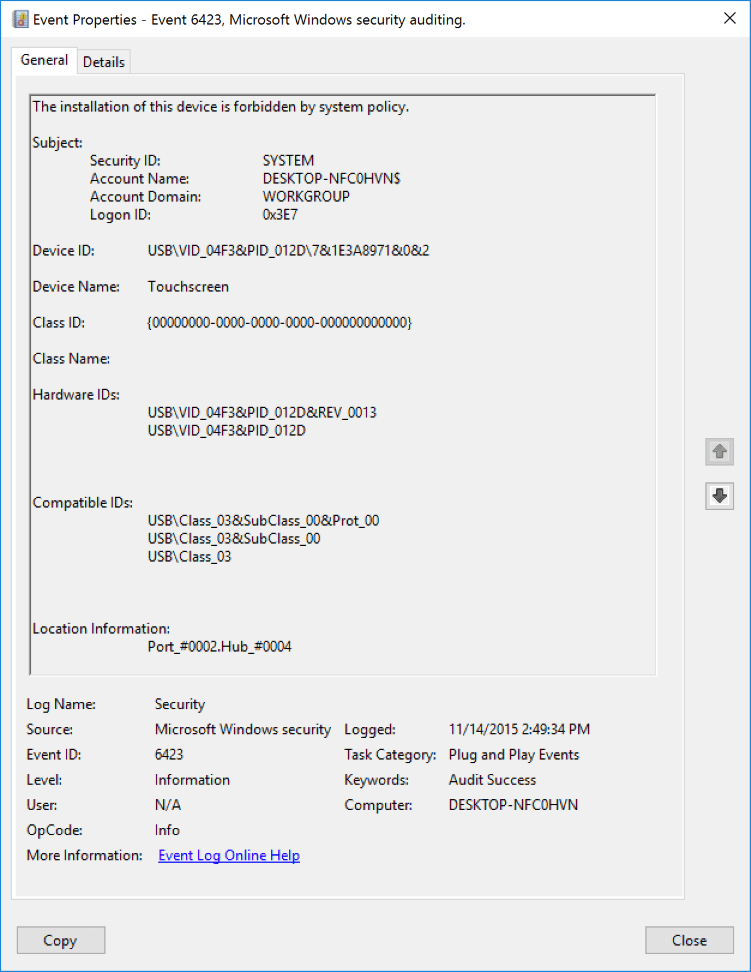

# 6423(S): システムポリシーによりこのデバイスのインストールは禁止されています。



***サブカテゴリ:***&nbsp;[PNP アクティビティの監査](audit-pnp-activity.md)

***イベントの説明:***

このイベントは、システムポリシーによりこのデバイスのインストールが禁止されるたびに生成されます。

デバイスインストール制限のグループポリシーは次の場所にあります: **\\コンピューターの構成\\管理用テンプレート\\システム\\デバイスのインストール\\デバイスのインストール制限**。特定のデバイスのインストールを制限するポリシーがある場合、このイベントが生成されます。

> **注**&nbsp;&nbsp;推奨事項については、このイベントの[セキュリティ監視の推奨事項](#security-monitoring-recommendations)を参照してください。

<br clear="all">

***イベント XML:***
```xml
- <Event xmlns="http://schemas.microsoft.com/win/2004/08/events/event">
- <System>
 <Provider Name="Microsoft-Windows-Security-Auditing" Guid="{54849625-5478-4994-A5BA-3E3B0328C30D}" /> 
 <EventID>6423</EventID> 
 <Version>0</Version> 
 <Level>0</Level> 
 <Task>13316</Task> 
 <Opcode>0</Opcode> 
 <Keywords>0x8020000000000000</Keywords> 
 <TimeCreated SystemTime="2015-11-14T22:49:34.647975900Z" /> 
 <EventRecordID>488</EventRecordID> 
 <Correlation /> 
 <Execution ProcessID="828" ThreadID="1924" /> 
 <Channel>Security</Channel> 
 <Computer>DESKTOP-NFC0HVN</Computer> 
 <Security /> 
 </System>
- <EventData>
 <Data Name="SubjectUserSid">S-1-5-18</Data> 
 <Data Name="SubjectUserName">DESKTOP-NFC0HVN$</Data> 
 <Data Name="SubjectDomainName">WORKGROUP</Data> 
 <Data Name="SubjectLogonId">0x3e7</Data> 
 <Data Name="DeviceId">USB\\VID\_04F3&PID\_012D\\7&1E3A8971&0&2</Data> 
 <Data Name="DeviceDescription">Touchscreen</Data> 
 <Data Name="ClassId">{00000000-0000-0000-0000-000000000000}</Data> 
 <Data Name="ClassName" /> 
 <Data Name="HardwareIds">USB\\VID\_04F3&PID\_012D&REV\_0013 USB\\VID\_04F3&PID\_012D</Data> 
 <Data Name="CompatibleIds">USB\\Class\_03&SubClass\_00&Prot\_00 USB\\Class\_03&SubClass\_00 USB\\Class\_03</Data> 
 <Data Name="LocationInformation">Port\_\#0002.Hub\_\#0004</Data> 
 </EventData>
</Event>

```

***必要なサーバーの役割:*** なし。

***最小 OS バージョン:*** Windows 10 \[バージョン 1511\]。

***イベントバージョン:*** 0。

***フィールドの説明:***

**サブジェクト:**

-   **セキュリティ ID** \[タイプ = SID\]**:** デバイスのインストールを禁止するアカウントの SID。イベントビューアーは自動的に SID を解決し、アカウント名を表示しようとします。SID を解決できない場合、イベントにソースデータが表示されます。

> **注**&nbsp;&nbsp;**セキュリティ識別子 (SID)** は、トラスティ (セキュリティプリンシパル) を識別するために使用される可変長の一意の値です。各アカウントには、Active Directory ドメインコントローラーなどの権限によって発行され、セキュリティデータベースに保存される一意の SID があります。ユーザーがログオンするたびに、システムはデータベースからそのユーザーの SID を取得し、そのユーザーのアクセス トークンに配置します。システムは、アクセス トークン内の SID を使用して、以降のすべての Windows セキュリティとのやり取りでユーザーを識別します。SID がユーザーまたはグループの一意の識別子として使用された場合、それが再び別のユーザーまたはグループを識別するために使用されることはありません。SID の詳細については、[セキュリティ識別子](/windows/access-protection/access-control/security-identifiers)を参照してください。

-   **アカウント名** \[タイプ = UnicodeString\]**:** デバイスのインストールを禁止するアカウントの名前。

-   **アカウントドメイン** \[タイプ = UnicodeString\]**:** サブジェクトのドメインまたはコンピュータ名。形式はさまざまで、以下を含みます：

    -   ドメインのNETBIOS名の例: CONTOSO

    -   小文字の完全なドメイン名: contoso.local

    -   大文字の完全なドメイン名: CONTOSO.LOCAL

    -   LOCAL SERVICEやANONYMOUS LOGONなどの[よく知られたセキュリティプリンシパル](/windows/security/identity-protection/access-control/security-identifiers)の場合、このフィールドの値は「NT AUTHORITY」となります。

    -   ローカルユーザーアカウントの場合、このフィールドにはこのアカウントが属するコンピュータまたはデバイスの名前が含まれます。例: “Win81”。

-   **ログオンID** \[タイプ = HexInt64\]**:** 16進数の値で、最近のイベントと同じログオンIDを含む可能性のあるイベントとこのイベントを関連付けるのに役立ちます。例: “[4624](event-4624.md): アカウントが正常にログオンされました。”

**デバイスID** \[タイプ = UnicodeString\]: デバイスの「**デバイスインスタンスパス**」属性。デバイスのプロパティを表示するには、デバイスマネージャーを起動し、特定のデバイスのプロパティを開き、「詳細」をクリックします：


**デバイス名** \[タイプ = UnicodeString\]: デバイスの「**デバイス説明**」属性。デバイスのプロパティを表示するには、デバイスマネージャーを起動し、特定のデバイスのプロパティを開き、「詳細」をクリックします：


**クラスID** \[タイプ = UnicodeString\]: デバイスの「**クラスGuid**」属性。デバイスのプロパティを表示するには、デバイスマネージャーを起動し、特定のデバイスのプロパティを開き、「詳細」をクリックします：


**クラス名** \[タイプ = UnicodeString\]: デバイスの「**クラス**」属性。デバイスのプロパティを表示するには、デバイスマネージャーを起動し、特定のデバイスのプロパティを開き、「詳細」をクリックします：


**ハードウェア ID** \[タイプ = UnicodeString\]: デバイスの「**ハードウェア ID**」属性。デバイスのプロパティを表示するには、デバイス マネージャーを起動し、特定のデバイスのプロパティを開き、「詳細」タブをクリックします。


**互換 ID** \[タイプ = UnicodeString\]: デバイスの「**互換 ID**」属性。デバイスのプロパティを表示するには、デバイス マネージャーを起動し、特定のデバイスのプロパティを開き、「詳細」タブをクリックします。


**場所情報** \[タイプ = UnicodeString\]: デバイスの「**場所情報**」属性。デバイスのプロパティを表示するには、デバイス マネージャーを起動し、特定のデバイスのプロパティを開き、「詳細」タブをクリックします。


## セキュリティ監視の推奨事項

6423(S): システム ポリシーによってこのデバイスのインストールは禁止されています。

> **重要**&nbsp;&nbsp;このイベントについては、[付録 A: 多くの監査イベントに対するセキュリティ監視の推奨事項](appendix-a-security-monitoring-recommendations-for-many-audit-events.md)も参照してください。

- デバイス インストール ポリシー違反を追跡する場合は、このタイプのすべてのイベントを追跡する必要があります。

<!-- -->

- このイベントは通常 SYSTEM アカウントによってトリガーされるため、**「Subject\\Security ID」** が SYSTEM でない場合に報告することをお勧めします。

- このイベントを使用して、次の表に示すポリシー違反および関連情報を、リストされたフィールドを使用して追跡できます。

| 監視するポリシー違反および関連情報                             | 使用するフィールド         |
|-----------------------------------------------------------------|----------------------------|
| デバイス インストール ポリシー違反、**デバイス インスタンス パス** | 「**デバイス ID**」        |
| デバイス インストール ポリシー違反、**デバイスの説明**           | 「**デバイス名**」         |
| デバイス インストール ポリシー違反、**クラス GUID**             | 「**クラス ID**」          |
| デバイス インストール ポリシー違反、**ハードウェア ID**         | 「**ハードウェア ID**」    |
| デバイス インストール ポリシー違反、**互換 ID**                 | 「**互換 ID**」            |
| デバイス インストール ポリシー違反、**場所情報**                 | 「**場所情報**」           |

It seems like you haven't pasted the Markdown content yet. Please provide the content you want translated, and I'll get started on the translation for you.
